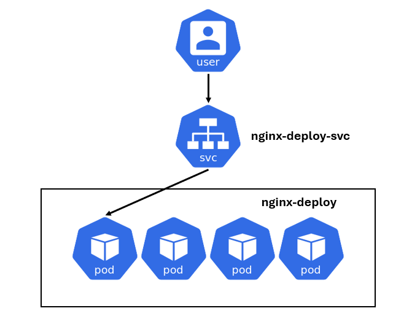
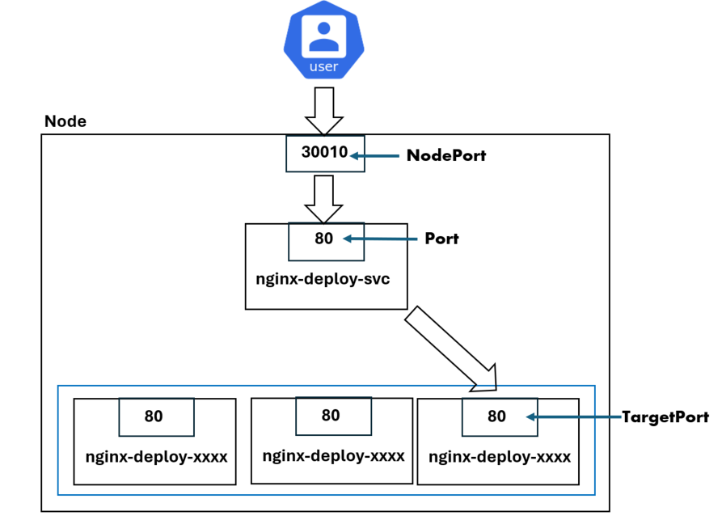

# Day 09 -【Basic Concept】：Service

### 今日目標

* Service 的用途

* Service 的種類
  * ClusterIP
  * NodePort
  * LoadBalancer
  * ExternalName

* 特殊的 Service：Multi-Port Service & Headless Service

* kubectl port-forward
### 為什麼需要 Service

在 [Day 03](https://ithelp.ithome.com.tw/articles/10345660) 中，我們使用 flannel 或 calico 來作為 CNI，作用是建立**虛擬網路**供 cluster 內部溝通使用。

當 Pod 被建立時，就會被分配一個**虛擬IP**，但是這個虛擬IP有兩個致命傷：

   1. Pod 的生命週期短，當 Pod 重啟時，IP 也會跟著改動。讓使用者隨時注意 IP 的變動顯然是不切實際的。
   2. 這個虛擬 IP 只能在 cluster 內部使用，無法從外部存取。

為了解決這兩個問題，就需要 Service 的幫忙了。

### Service

Service 的功用，就是代理 Pod 對外的溝通，作為外部存取的**統一介面**。

Service 會有自己的 IP 與 domain name，當第三者想存取 Service 背後代理的 Pod 時，只需要透過 Service 的 IP 或 domain name 即可，而 kube-proxy 會幫忙轉發流量到背後的 Pod。這樣一來，就可以透過**穩定**的 Service IP 來存取服務，而不用擔心 Pod 的 IP 因重啟而改變。

另外，我們知道單單用一個 Pod 來部署服務是不可行的，所以我們使用一群 Pod (ReplicSet、Deployment) 來部署服務，而 Service 不只能代理一個 Pod，也可以代理一群 Pod，例如：



**補充：Endpoint**

一般來說，當 K8s 建立一個 Service 時，會順帶建立 Endpoint 物件來指向 Service 背後的 Pod：

```
User <---> Service <---> Endpoint <---> Pod
```

那麼，Service 該如何識別它背後代理的 Pod？當 Service 接收到流量，它怎麼知道個流量的目的是誰？沒錯，一樣也是透過 Label 和 Selector 的功能。

### Service 的 domain name

當你建立一個 Service 時， k8s 會建立相對應的 DNS entry 供 **cluster 內部**存取。這個 DNS entry 的格式為：

```text
  <service-name>.<namespace>.svc.cluster.local
 ```
 > 最後的 .cluster.local 是 cluster 預設的 domain name，而 svc 則是代表為service 的 sub-domain

例如今天在 **dev** namespace 之下有一個 Service 叫做 **web-service**，那麼其他 namespace 的 Pod 就可以透過 **web-service** 的 DNS entry 來存取，例如：

```bash
kubectl exec -it <pod-name> -n <other-namespace> -- curl web-service.dev.svc.cluster.local
```
(底下實作時會實際測試看看)

> 關於 k8s 的 DNS 如何將 Servie 與 domain name 對應，會等到「Services & Networking」章節中再介紹。

### Service 的種類

根據用途的不同，Service 可以分為四種：
   1. ClusterIP
   2. NodePort
   3. LoadBalancer
   4. ExternalName

#### ClusterIP

這是 K8s 預設的 Service 類型，它只提供 cluster 內部的溝通，無法供外界存取。常見的應用場景是保護敏感資料或通訊，確保這些資料只在內部流通。

#### NodePort

這種 Service 類型，會在**每個** Node 開放一個相同的 port，當外界有流量經過這個 port 時，就會被轉發到 Service，再經由 Service 轉發到 Pod：



在這張圖中，有一些名詞需要注意：

   * NodePort: 就是 Node 監聽的Port，NodePort 的範圍在 30000~32767，圖中為30010。

   * Port：是 Service 本身監聽的Port。當 Node 的 30010 port有流量進來時，就會轉到 Service 的 80 port。

   * TargetPort：是 Pod ，也就是服務本身監聽的 port。Service會會把流量轉到這個 80 port，這樣外界就存取到服務了。

#### ExternalName

這種類型的 Service 背後代理的不是 Pod，而是我們指定的 DNS name。

也就是說，當我們存取 ExternalName Service 的 domain name 時，Service 會將流量轉發到我們指定的 DNS name，然後回應該 DNS name 的 CNAME 記錄。

我們來看一個官網的[範例](https://kubernetes.io/docs/concepts/services-networking/service/#externalname)：

```yaml
apiVersion: v1
kind: Service
metadata:
  name: my-service
  namespace: prod
spec:
  type: ExternalName
  externalName: my.database.example.com
```

這時，如果有流量存取 my-service 的 domain name，Service 就會將流量轉發到 my.database.example.com，然後回應 my.database.example.com 的 CNAME 記錄。

> 什麼是 CNAME 記錄？ 可以參考[這篇文章](https://medium.com/%E4%B8%80%E5%80%8B%E4%BA%BA%E7%9A%84%E6%96%87%E8%97%9D%E5%BE%A9%E8%88%88/pm%E7%AD%86%E8%A8%98-https-a%E7%B4%80%E9%8C%84%E8%88%87cname-91f6f2a1ee2f)

#### LoadBalancer

這種類型的 Service type，顧名思義會把外界的流量做附載平衡。這會使用到 cluster 外部實際存在的負載平衡設備，例如  AWS ELB 或 GCP Load Balancer。所以這種 Service type 很常被應用在雲端上。

### Service 的基本實作

* 首先，建立一個 nginx 的 Deployment：

```bash
kubectl create deploy nginx-deploy --image nginx --port 80  --replicas 3 
```

* 查看 Pod 的 Label，等等要設定 service 的 selector：
```bash
kubectl get pod --show-labels | grep nginx
```
```text
nginx-deploy-7d54cf5979-q5fvt   1/1     Running   0          57s   app=nginx-deploy,pod-template-hash=7d54cf5979
nginx-deploy-7d54cf5979-xfhtx   1/1     Running   0          57s   app=nginx-deploy,pod-template-hash=7d54cf5979
nginx-deploy-7d54cf5979-zrfdz   1/1     Running   0          57s   app=nginx-deploy,pod-template-hash=7d54cf5979
```
> Label 是 「app=nginx-deploy」

* 建立一個 yaml，為 nginx-deploy 建立一個 Service，名稱為 nginx-deploy-svc ，使用預設的 ClusterIP：

```yaml
# nginx-deploy-svc.yaml
apiVersion: v1
kind: Service
metadata:
  name: nginx-deploy-svc
spec:
  selector:
    app: nginx-deploy # Label selector
  ports:
    - port: 80        # Service開放的Port
      targetPort: 80  # Pod 開放的Port。沒有指定時，預設與 port 欄位的值相同
```
```bash
kubectl apply -f nginx-deploy-svc.yaml
```

* 建立 Service 後，觀察一下 Service 的狀態：
```bash
kubectl describe service nginx-deploy-svc
```
```text
Name:              nginx-deploy-svc
Namespace:         default
Labels:            <none>
Annotations:       <none>
Selector:          app=nginx-deploy
Type:              ClusterIP
IP Family Policy:  SingleStack
IP Families:       IPv4
IP:                10.103.238.21
IPs:               10.103.238.21
Port:              <unset>  80/TCP
TargetPort:        80/TCP
Endpoints:         192.168.0.4:80,192.168.1.4:80,192.168.1.5:80
Session Affinity:  None
Events:            <none>
```

* 我們可以從輸出結果中看出以下訊息:

  * Service 的種類為 ClusterIP
  * Service 的 IP 為 10.103.238.21，並開啟了 80 port
  * 有三個 IP 被列在 Endpoints 底下，這代表這個 Service 會將流量轉發到這三個 IP

* 也可以用指令觀察 Service 相對應的 Endpoints：
```bash
kubectl get endpoints nginx-deploy-svc
```
```text
NAME               ENDPOINTS                                      AGE
nginx-deploy-svc   192.168.0.4:80,192.168.1.4:80,192.168.1.5:80   56s
```

* 上述三個 Endpoints 就是 nginx-deploy 中的 Pod IP，我們可以驗證一下：
```bash
kubectl get pods -l app=nginx-deploy -o jsonpath='{.items[*].status.podIP}'
```
```text
192.168.0.4 192.168.1.4 192.168.1.5
```
> 關於 jsonpath 的用法可參考[附錄](https://github.com/michaelchen1225/CKA-note/blob/main/%E9%99%84%E9%8C%84/%E9%99%84%E9%8C%841-jsonpath.md)。

* 測試一下 Service 是否正常運作：

```bash
export SERVICE_IP=$(kubectl get svc nginx-deploy-svc -o jsonpath='{.spec.clusterIP}')
curl $SERVICE_IP:80 --max-time 2
```
> 會回應一個 nginx 的初始歡迎頁面

* 在其他 namespace 建立一個 Pod，來嘗試用 domain name 存取在 default namespace 裡的 nginx-deploy-svc：
```bash
kubectl run test --image nginx -n kube-system -- curl nginx-deploy-svc.default.svc.cluster.local
```

* 等 test Pod 跑起來後查看 log，也能看到抓到了一個 nginx 初始歡迎頁面：
```bash
kubectl logs -n kube-system test
```

但因為是 clusterIP，所以 Service 的 IP 僅在 cluster 內部有效，如果我們想讓外部存取服務，可以重新編輯剛才的 yaml，使用 NodePort 類型的 Service：

```yaml
# nginx-deploy-svc.yaml
apiVersion: v1
kind: Service
metadata:
  name: nginx-deploy-svc
spec:
  type: NodePort
  selector:
    app: nginx-deploy
  ports:
    - port: 80 # Service開放的Port
      targetPort: 80 
      nodePort: 30010 # Node開放的Port
```
```bash
kubectl apply -f nginx-deploy-svc.yaml
```

* 重新 apply yaml 後，查看 Service 的狀態：
```bash
kubectl describe service nginx-deploy-svc
```
```text
......
NodePort:                 <unset>  30010/TCP
......
```

* 於是我們就可以透過 NodePort 來存取服務了：
```bash
export NODE_PORT=$(kubectl get svc nginx-deploy-svc -o jsonpath='{.spec.ports[0].nodePort}')

curl localhost:$NODE_PORT --max-time 2
```

---
> **Tips：使用指令創建 Service**

使用指令的方式創建 Service：

1. kubectl expose：為現有的 Pod 或 Deployment 建立 Service：

* 語法：
```bash
kubectl expose <pod or deploy> <deployment-name> --type=<service-type> --name=<service-name> --port=<service-port> --target-port=<target-port>
# --type 可以不指定，預設為 ClusterIP。另外這種方式無法指定 NodePort number。
```

* 範例：
```bash
kubectl expose deploy nginx-deploy --type=NodePort --name=nginx-deploy-svc --port=80 --target-port=80
```


2. kubectl create：建立一個新的 Service 並指定 NodePort
```bash
kubectl create service nodeport my-service --tcp=80:80 --node-port=30010
# 注意: 建立後預設的 selector 不見得會符合你的需求，所以可以用 --dry-run=client -o yaml 先建立yaml檔，再修改。
```
***

### Multi-port Service

當 Pod 開啟多個 port 來提供不同服務時，建立一個 Service 即可代理這些 port。我們來看一個[範例](https://kubernetes.io/docs/concepts/services-networking/service/#multi-port-services)：

> 有一個 Pod 的 Label 為 `app.kubernetes.io/name: MyApp`，並且開放了 9377 port 與 9376 port。我們可以建立一個 Service 來代理這兩個 port：

```yaml
apiVersion: v1
kind: Service
metadata:
  name: my-service
spec:
  selector:
    app.kubernetes.io/name: MyApp
  ports:
    - name: http
      protocol: TCP
      port: 80
      targetPort: 9376
    - name: https
      protocol: TCP
      port: 443
      targetPort: 9377
```

當有流量打到 my-service 的 80 port 時，Service 會將流量轉發到 Pod 的 9376 port；同理，當有流量打到 my-service 的 443 port 時，Service 會將流量轉發到 Pod 的 9377 port。

### Headless Service

Headless Service 是一種特殊的 Service，它沒有 ClusterIP，所以流量的轉發並不會經過 kube-proxy 或任何 load-balancing，第三方可以直接透過存取 Headless Service 的 domain name **直接存取**背後代理的 Pod。

那什麼時候會用到 Headless Service？我們用一個資料庫的例子來說明：

在「[Day 06](https://ithelp.ithome.com.tw/articles/10346089)」有提到，我們會用 StatefulSet 來跑資料庫，但如果每個資料庫的 template 都可以被讀寫，可能會發生同時寫入的情況，造成資料同步的衝突。

因此，通常會讓一個 template 作為 Master Pod，Master Pod 具有讀寫功能，並負責將資料同步到其他 template。而其餘的 template 則儲存資料副本，僅提供 client 讀取。 

但是如果用普通的 Service 代理 StatefulSet 資料庫，client 無法直接指定 Master Pod 的 **IP** 來存取，因為 clinet 只能存取 Service 的 IP 或 domain name，流量要發到哪個 template 是由 kube-proxy 決定的。

因此我們可以透過 Headless Service 解決此問題，我們直接看一個實際例子：

* 在一個 yaml 中同時定義 Headless Service 與 StatefulSet：

```yaml
# headless-demo.yaml
apiVersion: v1
kind: Service
metadata:
  name: nginx
  labels:
    app: nginx
spec:
  ports:
  - port: 80
    name: web
  clusterIP: None # clusterIP 為 Node 就是 Headless Service
  selector:
    app: nginx
---
apiVersion: apps/v1
kind: StatefulSet
metadata:
  name: nginx
spec:
  serviceName: "nginx"
  replicas: 3
  selector:
    matchLabels:
      app: nginx
  template:
    metadata:
      labels:
        app: nginx
    spec:
      containers:
      - name: nginx
        image: nginx
        ports:
        - containerPort: 80
          name: web
```

* 建立 Headless Service 與 StatefulSet：
```bash
kubectl apply -f headless-demo.yaml
```

* 查看 Headless Service 抓到的 Endpoints：
```bash
kubectl get ep nginx
```
```text
NAME    ENDPOINTS                                      AGE
nginx   192.168.0.5:80,192.168.1.6:80,192.168.1.7:80   12s
```

* 嘗試存取 Headless Service 的 domain name
```bash
kubectl run test2 --image busybox:1.28 --restart=Never -- nslookup nginx.default.svc.cluster.local
```

* 查看 nslookup 的結果，看看這個 domain name 解析出來的 IP 為何？
```bash
kubectl logs test2
```
```text
Server:    10.96.0.10
Address 1: 10.96.0.10 kube-dns.kube-system.svc.cluster.local

Name:      nginx.default.svc.cluster.local
Address 1: 192.168.0.5 nginx-1.nginx.default.svc.cluster.local
Address 2: 192.168.1.7 nginx-2.nginx.default.svc.cluster.local
Address 3: 192.168.1.6 nginx-0.nginx.default.svc.cluster.local
```

如果是普通的 Service，我們只會看到 Service 的 ClusterIP，但透過 Headless Service，我們能夠直接看到背後的 Pod IP 以及 Pod 的 domain name，client 就可以直接用這個 domain name 對 Pod 進行直接的存取。

> 總之，Headless Service 的功能就是告訴 clinet 它背後代理的 Pod IP 與 Pod domain name，讓 clinet 可以自己指定要存取到哪個 Pod。

### kubectl port-forward

前面提到，為了安全起見，我們會採用 clusterIP 的方式來 expose 某些服務，不過如果這些服務的 Pod 出了一些問題，作為管理員的我們就需要在對這個資料庫做一些 debug。這時候，直接在本機開一個終端來操作是最方便的辦法，但是這又不是 nodePort，該怎麼辦呢？

這時可以使用一個指令叫做「port-forward」，這個指令可以將 cluster 內部的 Pod 暫時監聽來自 local port 的請求 ，讓我們可以直接透過本地端的 port 來存取 cluster 內部的 Pod。指令格式如下：

```bash
kubectl port-forward <type>/<name> <local-port>:<target-port>
```

我們來簡單操作一下：

* 建立一個 nginx 的 Pod，並且開放 80 port：
```bash
kubectl run nginx --image=nginx --port=80
```

* 為這個 Pod 建立一個 clusterIP 的 Service：
```bash
kubectl expose pod nginx --port=80 --target-port=80 --name=nginx-svc
```

* 使用 port-forward 指令，將 Pod 的 80 port 映射到本地端的 8080 port：
```bash
kubectl port-forward nginx 8080:80
```

或是：

```bash
kubectl port-forward svc/nginx-svc 8080:80
```

> 兩者的效果都一樣，都會將本地 8080 port 的請求導向 Pod 的 80 port。

* 執行完 port-forward 後，這個終端就會暫時不會 return，可以打開其他終端，使用 curl 來測試一下：
```bash
curl localhost:8080
```
```text
nginx welcome page
```

* 測試完後使用 `Ctrl + C` 來結束 port-forward。

最後說明一下，為了讓外部能夠存取到 service ，其實 LoadBalancer 會比 nodePort 來的理想，不過所需的練習環境較複雜，通常在雲端環境才有相對應的資源，有興趣的話可以參考[官方文件](https://kubernetes.io/docs/tasks/access-application-cluster/create-external-load-balancer/)，這裡就不實際演示了。

### 今日小結

今天學習了 Service 的基本概念，以及它的四種類型。並且透過練習，了解了如何建立 Service 以及相關的應用場景。其中我們有提到 Service doman name 的觀念，有關這個部分將會在後續的章節中再介紹。

-----
**參考資料**

* [Service](https://kubernetes.io/docs/concepts/services-networking/service/)

* [[Day 9] 建立外部服務與Pods的溝通管道 - Services](https://ithelp.ithome.com.tw/articles/10194344)

* [Kubernetes Services - by Vladimir Romanov](https://www.kerno.io/learn/kubernetes-services#kubernetes-services-headless-services)
