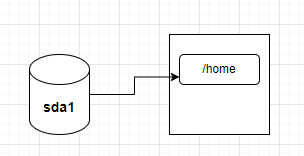
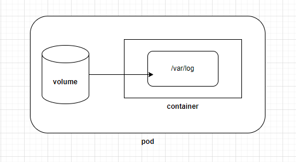
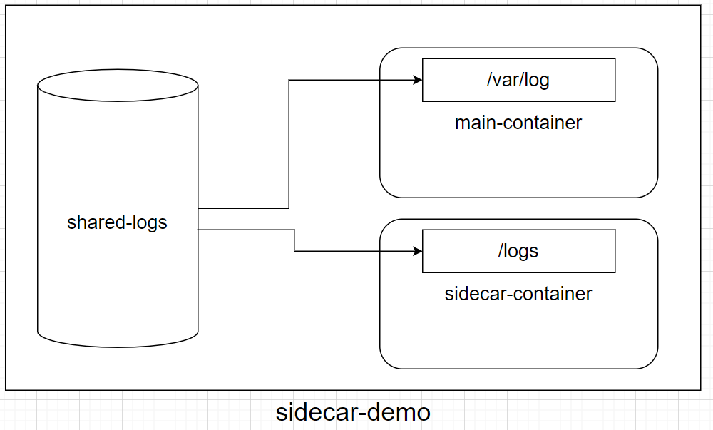
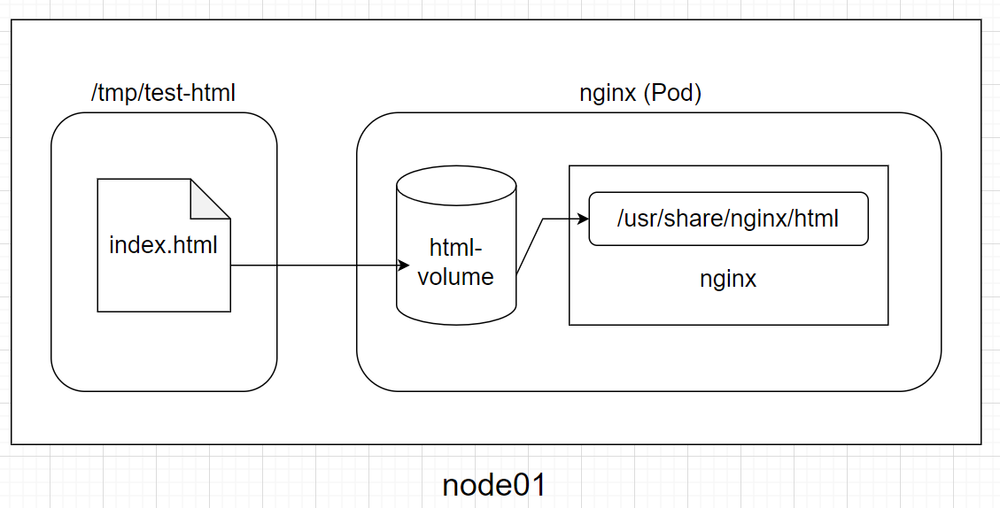
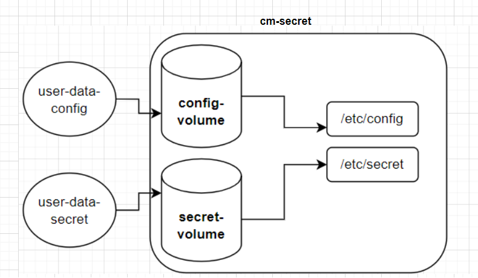

# Day 13 -【Storage】：Volume 的三種基本應用 --- emptyDir、hostPath、configMap & secret

### 今日目標

* Volume 的基本應用
  * emptyDir
  * hostPath
  * configMap & secret

### 什麼是 Volumn？

在一般的電腦中，我們會將某顆硬碟(或分割槽)「掛載」到某個目錄下，例如下圖：



在上圖中，「sda1」是一顆硬碟分割槽，用來保存「/home」中的資料，這種方式就稱為「掛載(mount)」，而/home就稱為「掛載點(mount point)」。

在 k8s 中，上面的「電腦」就是 Pod 中的 container，而「硬碟」就是 Pod 中的「volume」，我們同樣以「掛載」的方式將一個 volume 掛載到 Pod 中的 container：



除了存放資料之外，volume 還有另一個用途: 讓 Pod 中的多個 container 共享資料。例如在 [Day 04](https://ithelp.ithome.com.tw/articles/10345796) 的「sidecar container」範例中，Pod 裡有兩個 container 需共享 log 資料，因此我們使用了一個 volume 來存放 log 資料。

在 Pod yaml 中使用 volume 的格式如下：
```yaml
apiVersion: v1
kind: Pod
metadata:
  name: <pod-name>
spec:
  containers:
  - name: <container-name>
    image: <image-name>
    volumeMounts: 
    - name: <volume-name>
      mountPath: <a path in container> # 就是「掛載點」
  volumes: 
  - name: <volume-name>
    <volume-type>: <volume-configuration>
```

在上面的格式中，volume 是直接定義在 Pod 內部的，而不用事先定義一個 volume 物件，再引入 Pod 中，所以 Pod 與 volume 是共享同一個生命週期的。

> 也就是說，Pod 如果沒了，volume 也會消失。

另外可以注意到有 volume-type 需要設定，你可以依不同需求選擇 volume **類型**，常見的有：

  * emptyDir
  * hostPath
  * configMap & secret

> 關於其他的 volume type，可參考[官網](https://kubernetes.io/docs/concepts/storage/volumes/#volume-types)


### emptyDir

顧名思義，emptyDir 就是一個空的目錄，當 Pod 被刪除時，emptyDir 中的資料也會被刪除，所以它的目的並不是保存資料，而是讓 Pod 中的多個 container **共享**資料。

**範例**

我們再看一次 [Day 04](https://ithelp.ithome.com.tw/articles/10345796)「sidecar container」。範例中，我們使用了 `emptyDir` 來讓兩個 container 共享 log 資料：

```yaml
# sidecar-demo.yaml
apiVersion: v1
kind: Pod
metadata:
  creationTimestamp: null
  labels:
    run: sidecar-demo
  name: sidecar-demo
spec:
  volumes:     
    - name: shared-logs
      emptyDir: {}
  containers:
  - command:
    - sh
    - -c
    - while true; do date >> /var/log/date.log; sleep 1; done
    image: busybox
    name: main-container    
    volumeMounts:           
    - name: shared-logs     
      mountPath: /var/log   
  - command: ["sh", "-c", "tail -f /logs/date.log"] 
    image: busybox
    name: sidecar-container
    volumeMounts:           
    - name: shared-logs
      mountPath: /logs
  dnsPolicy: ClusterFirst
  restartPolicy: Always
status: {}
```

在上面的 yaml 中，我們在「`spec.volumes`」底下定義了一個名為「shared-logs」的 volume，並分別掛載到 main-container  的 /var/log 和 sidecar-container 的 /logs 目錄下：



如此一來，一旦 main-container 寫入log 資料，sidecar-contaienr就能透過讀取掛載在自己 /logs 目錄下的 shared-logs，來收集 main-container 寫入的 data.log 資料。在 [Day 04](https://ithelp.ithome.com.tw/articles/10345796) 有測試過共享的效果，需要的話可以回去翻一下。

> **CKA Tips**：「用 emptyDir 來共享 Pod 中的容器資料」是一種常見的應用，建議多熟悉該應用場景和設定方式。

### hostPath

這裡的「host」指的是執行 Pod 的 Node，所以 hostPath 就是指定 Node 上的某目錄掛載到 Pod 中讓 container 存取。

不過要特別注意的是，指定的 hostPath 並不一定在每個 Node 上都有，如果 scheduler 把 Pod 調度其他 Node 上，就會造成資料無法讀取的情況。

**範例**

> 在這個範例中，我們使用 hostPath 來指定自訂的 html 來取代 nginx 的預設網頁

* 首先，在 **node01** 上建立一個目錄：

(如果是 single-node cluster，就直接在 Master node 上建立即可)

```bash
ssh node01
mkdir /tmp/test-html
```

* 我們寫一個簡單的 html，放在 /tmp/test-html 中：

```bash
cat <<EOF | sudo tee /tmp/test-html/index.html
<!DOCTYPE html>
<html lang="en">
<head>
    <meta charset="UTF-8">
    <meta name="viewport" content="width=device-width, initial-scale=1.0">
    <title>Testing HostPath</title>
</head>
<body>
    <h1>Testing HostPath</h1>
</body>
</html>
EOF

```

* ssh 回到 Master node 上，創建 Pod 的 yaml。為了避免 scheduler 把 Pod 調度到其他 Node 上，我們可以指定「spec.nodeName」來確保 Pod 在 node01 上執行；反之，如果你是 single-node cluster，則不用設定 nodeName，因為 Pod 就只有一個 Node 能去。

```yaml
# nginx.yaml
apiVersion: v1
kind: Pod
metadata:
  creationTimestamp: null
  labels:
    run: nginx
  name: nginx
spec:
  nodeName: node01
  containers:
  - image: nginx
    name: nginx
    ports:
    - containerPort: 80
    volumeMounts:
    - name: html-volume
      mountPath: /usr/share/nginx/html
  volumes:
  - name: html-volume
    hostPath:
      path: /tmp/test-html
```
```bash
kubectl apply -f nginx.yaml
```

> 如此一來，nginx 容器中的「/usr/share/nginx/html」底下就會是「/tmp/test-html」中的「index.html」:




* 創建 Pod 後，透過 curl 來測試是不是有更新成我們自訂的html：
```bash
curl $(kubectl get pod nginx -o jsonpath='{.status.podIP}')
```
輸出如下:
```txt
<!DOCTYPE html>
<html lang="en">
<head>
    <meta charset="UTF-8">
    <meta name="viewport" content="width=device-width, initial-scale=1.0">
    <title>Testing HostPath</title>
</head>
<body>
    <h1>Testing HostPath</h1>
</body>
</html>

```

> 可以看到標題是「Testing HostPath」，成功！

**提醒**

雖然 hostPath 用起來相當簡單，但是會有安全上的疑慮，例如來源不明的寫入會直接影響到 hostPath 的檔案。因此一般建議掛載成「read-only」模式：


```yaml
......
  volumeMounts:
  - name: html-volume
    mountPath: /usr/share/nginx/html
    readOnly: true
......
```

### configMap & secret

[昨天](https://ithelp.ithome.com.tw/articles/10347004)我們介紹過 configMap 和 secret，用來存放「key-value」或「檔案」，而這些資料也可以透過 volume 的方式掛載到 Pod 中。

**範例**

* 首先，我們先建立一個「儲存兩個檔案的 configMap」與「儲存 key-value 的 secret」：

```bash
echo "USER: michael" > user.config
echo "EMAIL: micahel@mail.example" >> mail.config
kubectl create configmap user-data-config --from-file=user.config --from-file=mail.config
kubectl create secret generic user-data-secret --from-literal=PASSWORD=123456
```

* 同樣創建一個 pod 的 yaml，掛載 configMap 和 secret：

```yaml
# cm-secret.yaml
apiVersion: v1
kind: Pod
metadata:
  labels:
    run: cm-secret
  name: cm-secret
spec:
  containers:
  - image: nginx
    name: nginx
    ports:
    - containerPort: 80
    volumeMounts:
    - name: config-volume
      mountPath: /etc/config
    - name: secret-volume
      mountPath: /etc/secret
  volumes:
  - name: config-volume
    configMap:
      name: user-data-config
  - name: secret-volume
    secret:
      secretName: user-data-secret
```
```bash
kubectl apply -f cm-secret.yaml
```

> 其實 configMap 和 secret 的掛載方式基本相同。上面 yaml 中的掛載設定圖解如下：




* 建立 Pod 後，檢查是否有成功掛載 user-data-config：

```bash
kubectl exec cm-secret -- cat /etc/config/user.config /etc/config/mail.config
```
輸出：
```text
USER: michael
EMAIL: micahel@mail.example
```

* 再檢查是否有成功掛載 user-data-secret：
```bash
kubectl exec -it cm-secret -- cat /etc/secret/PASSWORD
# output: 123456
```
> 可以發現，當 key-value 被當作檔案掛載到 Pod 中時，key 就會變成檔案名稱，value 則是檔案內容。

另外，如果我們修改 configMap 的內容，Pod 裡的檔案內容也會跟著改變：

* 把「USER: michael」改成「USER: Alice」:
```bash
kubectl edit configmap user-data-config
```
```yaml
# Please edit the object below. Lines beginning with a '#' will be ignored,
# and an empty file will abort the edit. If an error occurs while saving this file will be
# reopened with the relevant failures.
#
# Please edit the object below. Lines beginning with a '#' will be ignored,
# and an empty file will abort the edit. If an error occurs while saving this file will be
# reopened with the relevant failures.
#
apiVersion: v1
data:
  mail.config: |
    EMAIL: micahel@mail.example
  user.config: |
    USER: Alice 
......
```

* 等待一段時間後，重新查看 Pod 中的檔案內容：
```bash
sleep 60
kubectl exec -it cm-secret -- cat /etc/config/user.config
```
```text
USER: Alice
```

> 之所以更新後須要過一段時間後才會看到變化，可參考[官網說明](https://kubernetes.io/docs/tasks/configure-pod-container/configure-pod-configmap/#mounted-configmaps-are-updated-automatically)。所以如果你看到還是「michael」先別著急，等一下再看。


### 今日小結

* Volume 是 Pod 中的資料儲存的一種方式，今天介紹的 emptyDir、hostPath、configMap & secret 是相當基本的應用。不過一般 Volume 的生命週期與 Pod 是相同的，所以我們明天就來看看 Persistent Volume、Persistent Volume Claim 的相關應用。

-----
**參考資料**

[Volumes](https://kubernetes.io/docs/concepts/storage/volumes/)

[Secrets](https://kubernetes.io/docs/concepts/configuration/secret/#use-case-dotfiles-in-a-secret-volume)

[Configure a Pod to Use a ConfigMap](https://kubernetes.io/docs/tasks/configure-pod-container/configure-pod-configmap/)