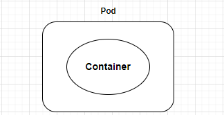

# *Day02 Basic Concept* : `Kubernetes`的架構與組件

> 底下我們會嘗試用一個船隊的比喻，來解釋`Kubernetes`的架構與組件。

讓我們從Kubernetes最基本的**運行單位**談起，也就是`Pod` :

   * 我們常聽到的`容器`(container)，就是運行在”`Pod`”當中。
   * 一個`Pod`能跑多個容器，但一般情況都只會跑一個容器。
   * `Pod`被產生時會賦予一個虛擬IP，用來與其他`Pod`溝通。

我們可以用以下圖片來了解pod與container的關係:

> 如果將cluster想像成一個船隊，那麼Pod就是船上的貨櫃，而容器就是貨櫃裡面的貨物。

那麼這些Pod又是如何被K8s管理呢? 再回答這個問題之前，我們得先了解K8s的基本架構，也就是`cluster`。

# Kubernetes的架構---cluster
當你部署了`Kubernetes`，一個`cluster (叢集)`就形成了。而一個`cluster`由數個`Node (節點)`組成。

對`K8s cluster`來說，這些`Node`的功能如下 :
   * 一個`Node`代表一台伺服器(不論是實體還是虛擬的)，負責運行`Pod`。

> 如果`cluster`想像成一個船隊，那麼其中負責管理、發號施令的主船，就稱為`Control Plane (Master Node)`，負責接收主船命令並執行的小船，就稱為`Worker Node`。

### Control Plane(Master Node)
`Control Plane`身為整個船隊(也就是整個cluster) 的*總指揮*，也可以看成是一個特殊的Node。它負責管理、指派任務給其他的Node，並隨時監控整個cluster的狀況，是一個非常重要的元件。

`Control Plane`的工作，分別由這四個獨特的組件執行 :

1. **kube-apiserver** :
在整個`cluster`中，任何信息的傳遞，都必須經過`kube-apiserver`的轉介。例如管理者對整個`cluster`下的指令、`Node`與`Node`之間的溝通等等。訊息傳遞者的身分與授權，也屬於`kube-apiserver`的管轄範圍。
萬一`kube-apiserver`發生故障，就相當於`cluster`的通訊系統的喪失，導致管理者就無法操作`cluster` (無法部署應用等等)，所以`kube-apisever`是整個`cluster`中極為重要的組件。

2. **etcd** : 
用來存放`cluster`中的資料，例如`cluster`的狀態、目前存在的資源等等。所以備份etcd是一項重要的工作，因為當整個`cluster`壞掉時，我們可以就由還原`etcd`備分來重建。

3. **kube-scheduler**:
負責`cluster`中資源的調配，例如哪些`Pod`該放到哪個`Node`上。

4. **kube-controller-manager**:
是`cluster`中的管理者，是許多控制器(`Controller-Manager`、`Node-Controller`
`Replication-Controller`)的集合體，負責管理與控制`cluster`中的資源，並監控整個`cluster`的狀態。

以上的四個組件，`kube-apiserver`、`etcd`、`kube-scheduler`、`kube-controller-manager`，是`Control Plane` 這個特別的`Node`獨有的。

那麼哪些組件是`Woker Node`擁有的呢?

相對於獨特的`Control Plane`的四個特組件，`Woker Node`的工作由這三個組件執行:

1. **Kubelet** :
相當於每艘船(也就是`Worker Node`)上的**船長**，負責執行總指揮(`Control Plane`)傳遞的命令。例如運行、刪除`Pod`等等。

2. **Container Runtime**: 
`Cluster`中所有`Pod`當中的容器，都需要容器的執行引擎才能跑起來，這就是`container runtime`的角色---**容器引擎**。常見的容器引擎有 : `Docker`、`Containerd`、`CRI-O`等。

3. **Kube-porxy**:
負責維護`Node`之間的**網路規則**，並提供了容器之間對話的通道。

以上就是關於Node以及其組件的大致介紹。如果還是覺得有些混亂的話，這裡我們再次用船隊的比喻總結一下:

> 如果想像整個`cluster`是一個船隊，那麼`Node`就是船、`Pod`就是船上的貨櫃(裡面裝著貨物`container`)。

> 而在船隊中擔任總指揮的主船，就是`Control Plan`(Master Node)。不同於其他普通的Node(`Worker Node`)，它另外擁有這四個元件 : **kube-apiserver**、**etcd**、**kube-scheduler**、**kube-controller-manager**。

> 其餘的普通小船(`Worker Node`)上，則擁有這三個元件: **kubelet**、**kube-proxy**、**Container Runtime**。

這裡提供一張圖示:

# 今日小節
今天用船隊的比喻，介紹了K8s cluster中的基本組件，以及這些組件的功能究竟為何。在下一章中，我們將開始準備往後練習的環境。

-----
**參考資料**
* [Kubernetes Components](https://kubernetes.io/docs/concepts/overview/components/)
