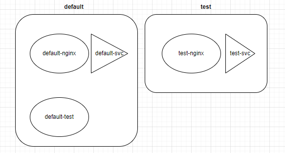

### 今日目標

* 了解 k8s 中的網路架構
  * CNI
  * Service
  * kube-proxy
  * CoreDNS


一般在建立一個網域時，最基本的設定不外乎是以下幾個：設定IP、路由規則、DNS

在 [Day 03](https://ithelp.ithome.com.tw/articles/10345660) 使用 kubeadm 安裝 cluster 與介紹 Service 時，我們知道 cluster 在建立後，會有一個**虛擬網路**供 cluster 內部溝通使用，例如我們能透過 Cluster IP 存取到 Pod 或 Service，而 Pod 之間也可以透過這個虛擬網路來溝通。

虛擬網路同樣也需要搞定上面三大設定，今天我們就來探討一下 k8s 是如何處理這些設定的。

### Kubernetes 的網路基礎：CNI

**CNI** 的全名是「Container Network Interface」，目的是搞定 cluster 中的**網路基本需求**。

所謂的「基本需求」k8s有明確的定義：

  * 讓整個 cluser 中的所有 **Pod** 能不靠 NAT 即可互相溝通

  * 部署在每個 Node 上的 agent(例如:daemonset、kubelet)能與該 Node 上的 **Pod** 溝通

> 也就是說，需要在 clsuter 內部搭建一個網路，把 k8s 中的種種元件、資源串起來，這個「內部的網路」就是我們之前所提及的虛擬網路。

要滿足上述需求並搭建出虛擬網路，cluster 中的 Pod 就必須有「最基本的」網路配置，例如：

  * 每個 Pod 要有自己獨立的 IP

  * 虛擬網路介面

其實就像是在現實中處理多台電腦的網路連線一樣，我們會幫電腦配置網路卡、規劃網段，並手動設定IP。

只不過，cluster 中的「電腦」不是普通的多，一個 cluster 所擁有的 Pod 可能就有上百、上千個，而且又隨時會刪除或重啟，直接人工處理這些配置實在是強人所難。透過 CNI，我們就可以將這些繁雜的工作通通交給它來處理。

不過，k8s 並沒有提供預設的 CNI，而是定義出 CNI「該做甚麼、該如何做」，只要滿足這些規範，人人都可以按照這些規範來開發 CNI，並且以「插件(**Plugins**)」的形式讓使用者**彈性**的挑選，最終部署在 cluster 中。

常見的 CNI 例如：
  
  * Calico

  * Flannel

  * Weave

  * Cilium

> CNI 是 CNCF 的一個開源專案，可以在他們的 [Github](https://github.com/containernetworking/cni) 或是 [k8s 官方文件](https://kubernetes.io/docs/concepts/cluster-administration/networking/#how-to-implement-the-kubernetes-network-model)上找到更多關於 CNI 的資訊。

### CNI 的相關設定檔

CNI 相關的設定檔通常會放在以下兩個重要目錄：

1. **/opt/cni/bin/**：放置目前系統所支援的 CNI 執行檔

```bash
ls /opt/cni/bin/
```
```text
andwidth  calico       dhcp   firewall  host-device  install  loopback  portmap  sbr     tap     vlan
bridge     calico-ipam  dummy  flannel   host-local   ipvlan   macvlan   ptp      static  tuning  vrf
```

2. **/etc/cni/net.d/**：存放「目前正在使用」的 CNI 設定檔：
```bash
ls /etc/cni/net.d/
```
```text
10-canal.conflist  calico-kubeconfig
```

來看一下 10-canal.conflist 設定檔：
```yaml
{
  "name": "k8s-pod-network",
  "cniVersion": "0.3.1",
  "plugins": [
    {
      "type": "calico", # 使用 calico 作為 cni
      "log_level": "info",
      "log_file_path": "/var/log/calico/cni/cni.log", # log檔位置
      "datastore_type": "kubernetes",
      "nodename": "controlplane",
      "mtu": 0,
      "ipam": { # Pod的ip範圍，等一下會解釋
          "type": "host-local",
          "subnet": "usePodCidr"
      },
      "policy": {
          "type": "k8s"
      },
      "kubernetes": {
          "kubeconfig": "/etc/cni/net.d/calico-kubeconfig"
      }
    },
    {
      "type": "portmap",
      "snat": true,
      "capabilities": {"portMappings": true}
    },
    {
      "type": "bandwidth",
......
```

為了更有效率的管理每個 Node 上的網路工作，以及 Node 之間的封包傳遞，每個 Node 都會有一個 CNI 的 agent，通常以 daemonset 的方式部署：

```bash
kubectl get daemonset -n kube-system
NAME         DESIRED   CURRENT   READY   UP-TO-DATE   AVAILABLE   NODE SELECTOR            AGE
canal        2         2         2       2            2           kubernetes.io/os=linux   18d
kube-proxy   2         2         2       2            2           kubernetes.io/os=linux   18d
```

## 有了網路的基礎，然後呢？

有了網路基礎後，當然就是互相連線嘛。和現實中的網路連線一樣，cluster 中的網路也會有「路由設定」，而這是透過 kube-proxy 來達成。另外因為 Pod 的生命週期短而導致 IP 經常變動，因此用了 Service 來統一代理 Pod 的流量。

我們來看一下目前為止提到的三種網路元件：

  * **CNI**：cluster 中的**網路基礎**，注重的是「**如何配置pod的基本網路**」，例如設定 Pod 的 IP、虛擬網路卡設定。

  * **Service**：提供了穩定的**統一介面**讓外界來訪問 Pod，例如 NodePort、ClusterIP、LoadBalancer。

  * **kube-proxy**：負責處理 cluster 中的**路由規則**，注重的是「**如何轉發流量**」，例如iptables、ipvs。

當一個 Pod 被建立，然後再為其產生一個 service 後，會發生：

* **CNI**：分配一個 IP 給 Pod，並完成虛擬網路介面等基礎設定。

* **Service**：k8s 並不會自動的建立 service。如果使用者依需求自行幫 Pod 建立 service 後，kube-apiserver 會為這個 service 分配一個 IP。

* **kube-proxy**：隨時的觀察 service 與 endpoints 的狀態，當新的 service 被建立後，kube-proxy 會配置相對應的路由規則，讓整個 cluster 都能夠存取這個 service。當 service 被刪除後，kube-proxy 也會刪除相對應的路由規則。

有了以上三者的配合後，「IP分配」、「路由規則」基本上就搞定了。(還有 DNS 的部分，我們後面會提到)

> 至於建立 service 的介紹這裡就不再贅述，可以參考之前的[Day06](06-1-svc.md)

---
> **Tips：kube-proxy 的種類**

kube-proxy 有兩種 proxy mode 可選：

* **iptables**：kube-proxy 負責維護 iptables 規則，封包轉送由 Kernel 處理。(還記得 [Day 03](https://ithelp.ithome.com.tw/articles/10345660) 開啟的 Kernel 模組 netfilter 嗎？)

* **ipvs**：類似 iptables，但是封包轉送由 ipvs 處理，效率較高。

> 兩者的詳細比較可以參考[這篇文章](https://www.hwchiu.com/docs/2018/kubernetes-service-ii)

可以透過以下指令查看現在使用的 proxy mode，預設是 iptables：

```bash
logs -n kube-system daemonsets/kube-proxy | head -n 1
```
```text            
I0325 09:25:49.947640       1 server_others.go:72] "Using iptables proxy"
```
***


### Pod 與 service 的 IP 範圍

了解網路元件之間的關係與作用後，我們來看看 CNI 為 Pod 或 Servie 分配的 IP，究竟是從哪個「網段」中取得的？

* 查看「整個 cluster」的 Pod IP 範圍：
```bash
kubectl cluster-info dump | grep -i cluster-cidr
```
```text
"--cluster-cidr=192.168.0.0/16",
```

* 查看單一 Node 的 Pod IP 範圍：

```bash
kubectl get node node01 -o yaml | grep -i podcidr
```
```text
    podCIDR: 192.168.1.0/24
    podCIDRs:
```
>  node01 的 Pod IP 範圍是 192.168.1.1 ~ 192.168.1.254


至於 service 的 IP 範圍則是由 kube-apiserver 決定：
```bash
cat /etc/kubernetes/manifests/kube-apiserver.yaml | grep -i range
```
```text
 - --service-cluster-ip-range=10.96.0.0/12
```

> 所以 service 的 IP 範圍是 10.96.0.1 ~ 10.111.255.254

底下提供了一個簡單的範例，來測試測試上述的 IP 範圍：

**範例**

* 建立了一個 Pod 叫做 nginx，並幫它建立一個 service：

```bash
kubectl run nginx --image nginx --port 80
kubectl expose pod nginx --port 80 --type NodePort --name nginx-svc
```

* 檢查一下：
```bash
kubectl get po,svc
```
```text
NAME        READY   STATUS    RESTARTS   AGE   IP            NODE     NOMINATED NODE   READINESS GATES
pod/nginx   1/1     Running   0          22s   192.168.1.4   node01   <none>           <none>

NAME                 TYPE        CLUSTER-IP      EXTERNAL-IP   PORT(S)        AGE   SELECTOR
service/kubernetes   ClusterIP   10.96.0.1       <none>        443/TCP        21d   <none>
service/nginx-svc    NodePort    10.99.165.171   <none>        80:32455/TCP   8s    run=nginx
```

* 查看預設的 proxy mode：
```bash
kubectl logs -n kube-system daemonsets/kube-proxy | head -n 1 
```
```text
I0907 06:01:08.374323       1 server_linux.go:69] "Using iptables proxy"
```

因此，我們可以整理出以下資訊：

  * **Pod 的 IP**：192.168.1.4
  * **Pod 所在的 Node**：node01
  * **Service 的 IP**：10.99.165.171
  * **nodePort**：32455
  * 預設的 **proxy mode**：iptables

因為 kube-proxy 的處理，我們可以從 iptables 看到關於 nginx-svc 的規則：
```bash
iptables -L -t nat | grep nginx
```
```
KUBE-MARK-MASQ  all  --  anywhere             anywhere             /* masquerade traffic for default/nginx-svc external destinations */

KUBE-EXT-HL5LMXD5JFHQZ6LN  tcp  --  anywhere             anywhere             /* default/nginx-svc */ tcp dpt:32455

KUBE-MARK-MASQ  all  --  192.168.1.4          anywhere             /* default/nginx-svc */

DNAT       tcp  --  anywhere             anywhere             /* default/nginx-svc */ tcp to:192.168.1.4:80
```

### CoreDNS

> 講完 k8s 如何實現「IP分配」、「路由規則」，接下來我們來談談「DNS」。

那究竟什麼是 DNS？

如果想要使用 fackbook 的網頁，我們不需要知道 fackbook server 的 IP，而是輸入「www.facebook.com」 就可以了，這是因為 DNS server 幫我們將這個網址轉換成 IP。

以下提供一些有關 DNS 的指令：

 * 想知道某個 URL 的 IP：
```bash
host www.google.com
```
```text
www.google.com has address 142.250.185.132
www.google.com has IPv6 address 2a00:1450:4001:810::2004
```

 * 想知道某 URL 的 IP，以及顯示使用的 DNS IP：
```bash
nslookup www.google.com
```
```text
Server:         8.8.8.8
Address:        8.8.8.8#53

Non-authoritative answer:
Name:   www.google.com
Address: 142.250.70.100
Name:   www.google.com
Address: 2404:6800:4009:830::2004
```

通常系統預設的 DNS server 與相關設定會寫在 /etc/resolv.conf 中：
```bash
cat /etc/resolv.conf
```
```text
nameserver 8.8.8.8
nameserver 1.1.1.1
```

> 簡而言之，「DNS」的任務就是「完成 domain name 與 IP 的對應」

在 k8s 中，也有 DNS server 來完成相同的任務。我們不需要知道 service 的 IP，只要知道 service 的「domain name」即可存取，而 k8s 預設的 DNS server 是 **CoreDNS**，會在 53 port 上監聽需求。

[CoreDNS](https://coredns.io/)是一個用 Go 語言寫的 DNS server，高度的靈活性使它能在多種環境中部署，其中一種就是 k8s cluster。

**CoreDNS** 以 Deployment 的方式部署在 cluster 中，會不斷的與 Master Node 溝通來取得 service 的資訊，並依照這些資訊建立 DNS 對應，然後 Pod 就可以透過存取「**CoreDNS** 的 Service」來取得 DNS 對應。

底下來探索一下 cluster 中的 CoreDNS：

* 安裝完 cluster 後，查看一下 CoreDNS 的狀況：

```bash
kubectl get deployments.apps -n kube-system coredns
```
```text
NAME      READY   UP-TO-DATE   AVAILABLE   AGE
coredns   2/2     2            2           23d
```

* 在cluster 中，可以透過 service 來存取 CoreDNS：
```bash
kubectl get svc -n kube-system
```
```text
NAME       TYPE        CLUSTER-IP   EXTERNAL-IP   PORT(S)                  AGE
kube-dns   ClusterIP   10.96.0.10   <none>        53/UDP,53/TCP,9153/TCP   23d
```

* 查看一下 CoreDNS 的設定檔相關訊息：

```bash 
kubectl describe deploy -n kube-system coredns
```
```yaml
    Args:
      -conf
      /etc/coredns/Corefile # 設定檔位置
......
    Mounts:
      /etc/coredns from config-volume (ro)
  Volumes: # 透過configMap導入設定檔
   config-volume:
    Type:               ConfigMap (a volume populated by a ConfigMap)
    Name:               coredns
    Optional:           false
```


### k8s中的 domain name

前面提到，CoreDNS 的任務是將 service 的 domain name 轉換成IP，那在 k8s 中，service 的 domain name 格式為：
```text
<service-name>.<namespace>.svc.cluster.local
```

而 Pod 的 domain name 格式為：
```text
<pod-ipv4-address>.<namespace>.pod
```

底下我們用實際例子來測試一下：

> 我們會建立出三個 Pod 與兩個 service，分別是：



> 實作目的：用 default-test 這個 Pod 來存取不同的 service，看看 DNS 的解析成果。

* 首先，將上圖中的環境建立起來：

```yaml
# day20-lab.yaml
# Namespace: test
apiVersion: v1
kind: Namespace
metadata:
  name: test

---
# Pod: default-nginx in default namespace
apiVersion: v1
kind: Pod
metadata:
  name: default-nginx
  namespace: default
spec:
  containers:
  - name: nginx
    image: nginx
    ports:
    - containerPort: 80

---
# Service: default-svc in default namespace
apiVersion: v1
kind: Service
metadata:
  name: default-svc
  namespace: default
spec:
  selector:
    app: default-nginx
  ports:
    - protocol: TCP
      port: 80
      targetPort: 80

---
# Pod: default-test in default namespace (without service)
apiVersion: v1
kind: Pod
metadata:
  name: default-test
  namespace: default
spec:
  containers:
  - name: busybox
    image: busybox:1.28
    command: ['sleep', '1d']

---
# Pod: test-nginx in test namespace
apiVersion: v1
kind: Pod
metadata:
  name: test-nginx
  namespace: test
spec:
  containers:
  - name: nginx
    image: nginx
    ports:
    - containerPort: 80

---
# Service: test-svc in test namespace
apiVersion: v1
kind: Service
metadata:
  name: test-svc
  namespace: test
spec:
  selector:
    app: test-nginx
  ports:
    - protocol: TCP
      port: 80
      targetPort: 80
```
```bash
kubectl apply -f day20-lab.yaml
```

等所有 Pod 跑起來後，先測試 default-test 能不能 ping 到另外兩個 Pod 的 Cluster-IP ：

* 測試 default-test 能不能 ping default-nginx：
```bash
kubectl exec default-test -- ping -c 4 $(kubectl get po -n default default-nginx -o jsonpath='{.status.podIP}')
```
```text
64 bytes from 192.168.1.4: seq=0 ttl=63 time=0.096 ms
64 bytes from 192.168.1.4: seq=1 ttl=63 time=0.070 ms
64 bytes from 192.168.1.4: seq=2 ttl=63 time=0.122 ms
64 bytes from 192.168.1.4: seq=3 ttl=63 time=0.092 ms
```

* 測試 default-test 能不能 ping test-nginx：
```bash
kubectl exec default-test -- ping -c 4 $(kubectl get po -n test test-nginx -o jsonpath='{.status.podIP}')
```
```text
64 bytes from 192.168.1.6: seq=0 ttl=63 time=0.096 ms
64 bytes from 192.168.1.6: seq=1 ttl=63 time=0.089 ms
64 bytes from 192.168.1.6: seq=2 ttl=63 time=0.084 ms
64 bytes from 192.168.1.6: seq=3 ttl=63 time=0.084 ms
```

然後，我們來測試一下 DNS 的解析：

> 為了驗證 DNS 的解析結果，我們先將兩個 Service 的 Cluster-IP 記錄在變數中：

* 紀錄兩個 Service 的 Cluster-IP：

```bash
default_svc_ip=$(kubectl get svc -n default default-svc -o jsonpath='{.spec.clusterIP}')
test_svc_ip=$(kubectl get svc -n test test-svc -o jsonpath='{.spec.clusterIP}')
```

* 然後也把 CoreDNS Service 的 Cluster-IP 記錄下來：

```bash
coredns_svc_ip=$(kubectl get svc -n kube-system kube-dns -o jsonpath='{.spec.clusterIP}')
```

接下來，我們來測試一下這些 service 的 domain name：


* 嘗試用 default-test 存取**相同** namespace 的 service：
```bash
kubectl exec default-test -- nslookup default-svc.default.svc.cluster.local
```
```text
Server:    10.96.0.10
Address 1: 10.96.0.10 kube-dns.kube-system.svc.cluster.local

Name:      default-svc.default.svc.cluster.local
Address 1: 10.96.71.181 default-svc.default.svc.cluster.local
```

* 驗證一下「10.96.71.181」是否為 default-svc 的 IP：
```bash
echo $default_svc_ip
```
```bash
# 沒錯！
10.96.71.181
```

* 驗證一下 default-test 使用的 DNS server 是否為 10.96.0.10，也就是 CoreDNS Service 的 Cluster IP：
```bash
echo $coredns_svc_ip
```
```bash
# 沒錯！
10.96.0.10
```

再來，我們用 default-test 存取**不同** namespace 的 service：
```bash
kubectl exec default-test -- nslookup test-svc.test.svc.cluster.local
```
```text
Server:    10.96.0.10
Address 1: 10.96.0.10 kube-dns.kube-system.svc.cluster.local

Name:      test-svc.test.svc.cluster.local
Address 1: 10.111.38.112 test-svc.test.svc.cluster.local
```

* 驗證一下：
```bash
echo $test_svc_ip
```
```bash
# 沒錯！
10.111.38.112
```


不過整個 domain name 似乎有點長，我們換成比較簡短的寫法 ---「只寫 service-name」來測試看看：

* 嘗試用 default-test 存取**相同** namespace 的 service：
```bash
kubectl exec default-test -- nslookup default-svc
```
```text
Server:    10.96.0.10
Address 1: 10.96.0.10 kube-dns.kube-system.svc.cluster.local

Name:      default-svc
Address 1: 10.96.71.181 default-svc.default.svc.cluster.local
```

* 然後嘗試用 default-test 存取**不同** namespace 的 service：

```bash
kubectl exec default-test -- nslookup test-svc
```
```text
nslookup: can't resolve 'test-svc'
Server:    10.96.0.10
Address 1: 10.96.0.10 kube-dns.kube-system.svc.cluster.local

command terminated with exit code 1
```

> 可以發現無法跨 namespace 解析較短的 domain name。 

原因是，跨 namespace 就不能只寫「service-name」，至少要寫到「\<service-name>.\<namespace>」:

```bash
kubectl exec default-test -- nslookup test-svc.test
```
```text
Server:    10.96.0.10
Address 1: 10.96.0.10 kube-dns.kube-system.svc.cluster.local

Name:      test-svc.test
Address 1: 10.111.38.112 test-svc.test.svc.cluster.local
```

其實從輸出結果來看，就算使用簡寫，DNS 仍然會還原出全名來查找，這可以在 default-test 中的 /etc/resolv.conf 中看到：

```bash
kubectl exec default-test -- cat /etc/resolv.conf
```
```text
search default.svc.cluster.local svc.cluster.local cluster.local
nameserver 10.96.0.10
options ndots:5
```

> **search** 用來告訴 DNS server，如果找不到 domain name，就自動加上這些後綴來查找。

至於 Pod 的 domain name，我們得先知道 Pod 的 IP，然後再查找：

```bash
kubectl get po -n test test-nginx -o jsonpath='{.status.podIP}'
```
```text
192.168.1.6
```

* 將 IP 中的「.」換成「-」，再加上\<namespace>.pod，就是 Pod 的 domain name：
```bash
kubectl exec default-test -- nslookup 192-168-1-6.test.pod
```
```text
Server:    10.96.0.10
Address 1: 10.96.0.10 kube-dns.kube-system.svc.cluster.local

Name:      192-168-1-6.test.pod
Address 1: 192.168.1.6 192-168-1-6.test-svc.test.svc.cluster.local
```


### 今日小結

今天介紹了 k8s 中的網路架構，以及如何透過 CNI、Service、kube-proxy、CoreDNS 來滿足建立網路的三大需求：IP、路由、DNS。

另外，也透過實作了解到如果一個 Pod 如果要跨 namespace 存取 service，就必須至少寫到「\<service-name>.\<namespace>」才能成功解析。

-----
**參考資料**

[Network Plugins](https://kubernetes.io/docs/concepts/extend-kubernetes/compute-storage-net/network-plugins/)

[The Kubernetes network model](https://kubernetes.io/docs/concepts/services-networking/#the-kubernetes-network-model)

[kube-proxy](https://kubernetes.io/docs/reference/command-line-tools-reference/kube-proxy/)

[CoreDNS簡單除錯：解決你遇到的一般問題](https://weng-albert.medium.com/coredns%E7%B0%A1%E5%96%AE%E9%99%A4%E9%8C%AF-%E8%A7%A3%E6%B1%BA%E4%BD%A0%E9%81%87%E5%88%B0%E7%9A%84%E4%B8%80%E8%88%AC%E5%95%8F%E9%A1%8C-71d255e39548)

[[Kubernetes / K8s] Service之間互相溝通？namespace和介紹kube-dns](https://medium.com/k8s%E7%AD%86%E8%A8%98/kubernetes-k8s-service%E4%B9%8B%E9%96%93%E4%BA%92%E7%9B%B8%E6%BA%9D%E9%80%9A-namespace%E5%92%8C%E4%BB%8B%E7%B4%B9kube-dns-b2fff7757900)


[7-k8s笔记-网络原理](https://www.cnblogs.com/BradMiller/p/12228264.html)

[整合 CNI 的常見問題 — 坑就是挖給人踩的！](https://medium.com/starbugs/%E6%95%B4%E5%90%88-cni-%E7%9A%84%E5%B8%B8%E8%A6%8B%E5%95%8F%E9%A1%8C-%E5%9D%91%E5%B0%B1%E6%98%AF%E6%8C%96%E7%B5%A6%E4%BA%BA%E8%B8%A9%E7%9A%84-fd5d42b2ff2d)


