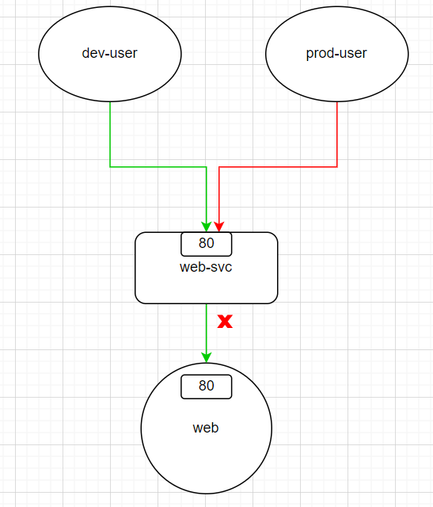
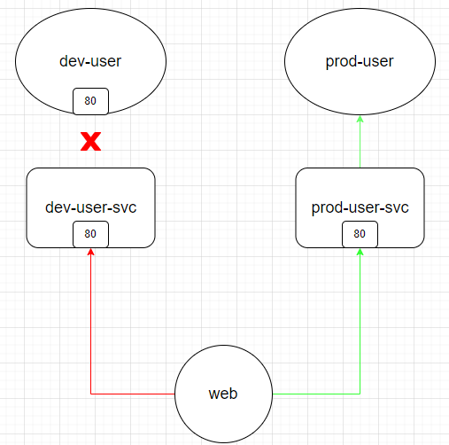

### 今日目標

* 了解 Network Policy 的基本概念
* 實作 Network Policy
  * Ingress
  * Egress
  * matchExpressions
  * Default Policy
  * 對特定的 port 開放所有流量

* 問題探討：Network Policy 會彼此衝突嗎？

今天是「Services & Networking」章節的最後一篇，前面介紹了 k8s 是如何實作 cluster 的內部網路，讓 cluster 中的 Pod 可以互相通訊。今天來講講該如何透過 **Network Policy** 來管理這些網路流量。

### Network Policy的基本概念

你有一個資料庫以 Pod 的形式跑在 cluster 中，裡面存放了一些敏感資料，但是由於預設上 Pod 會對所有網路流量開放，這樣的設計就有可能讓資料庫受到不明來源的請求，或是因為收到太多的存取而導致效能下降。

於是你可能就會想制定一些規則，例如「只有特定的 Pod 才能存取資料庫」、「資料庫只能提供資料給特定的 Pod」等等。

而這就是 Network Policy 的用途：「針對 **Pod** 連線進行管制」。

Network Policy 可以針對以下三種傳輸協定(Protocol)來設定規則：
  
  * TCP
  * UDP
  * SCTP

而可設定的規則又分為兩大類：

  * **egress**：控制 Pod 對外的網路流量 (可以出去連到誰？)
    
    預設上，Pod 可以對外連到任何地方，當 network policy 設定 egress 清單後，Pod 只能連到清單中指定的對象。
    
  * **ingress**：控制外部對 Pod 的網路流量 (誰可以連進來?)

    預設上，任何流量都可以連進來，當 network policy 設定 ingress 清單後，只有清單中指定的對象可以連到你的 Pod。

> 可以這樣理解：egress 與 ingress 就是一個「白名單」的概念，只有在白名單內的對象才可以進行連線。

而這些規則適用的「對象」有：

  * **Pod**：使用 podSelector 指定

  * **Namespace**：使用 namespaceSelector 指定，意指「*對該 namespace 下的所有 Pod 生效*」

  * **IP Block**：使用 ipBlock 指定，意指「*對特定的 IP 範圍(CIDR)生效*」。(通常會設定為 cluster **外部**的 IP，因為 cluster 內部的 Pod IP 是短暫與隨機的)

最後，要讓 Network Policy 生效，需要在 cluster 中安裝支援 Network Policy 的 CNI。

> 支援  Network Policy 的CNI有很多，例如 Calico、Cilium、Weave Net 等等。不支援的 CNI 例如 Flannel。


### 問題思考

**Q**：假設我設定了 egress 或 ingress，需要為該流量的回應設定*相對應*的規則嗎？例如我在「資料庫」中設定 ingress，允許「pod A」連進來，那麼「資料庫」對「pod A」response 的流量是否需要設定 egress？ 

Ans：不需要。不論是 egress 或 ingress，k8s 會自動幫你處理這些 response 的流量，不需要另外設定規則。

**Q**：假設「pod A」設定了到「資料庫」的 egress，允許「pod A」對外連到「資料庫」，但是「pod A」不在資料庫的 ingress 白名單中，這樣「pod A」的請求會成功嗎？

Ans：不會成功。Network Policy 是雙向的，如果你設定了 egress，那麼目的地也需要開放你連近來才行。
***

OK，了解了 Network Policy 的基本概念後，我們來玩玩看第一個實作：設定 Ingress。

### 實作 - 設定 ingess

> 白名單：「誰可以連進來？」

在開始範例之前，我們先布置一個簡單的環境：

> 總共有三個 namespace：default、dev、prod，並在三者之內都各部署一個 Pod，讓這些 Pod 之間互相連線來測試 Network Policy 的效果。

* 建立兩個 namespace：dev 與 prod
```bash
kubectl create ns dev
kubectl label ns dev env=dev
kubectl create ns prod
kubectl label ns prod env=prod
```

* 在 dev 與 prod 各建立一個 Pod，做為測試用的「使用者」：
```bash
kubectl run dev-user --namespace=dev --image=nginx --labels="role=dev-user" --port=80
kubectl expose pod dev-user --namespace=dev --port=80 --name=dev-user-svc
kubectl run prod-user --namespace=prod --image=nginx --labels="role=prod-user" --port=80
kubectl expose pod prod-user --namespace=prod --port=80 --name=prod-user-svc
```

* 等 dev-user 與 prod-user 建立完成後，自訂一下 index.html，讓測試效果明顯：
```bash
echo "Hello, this is dev-user" > index.html
kubectl cp -n dev index.html dev-user:/usr/share/nginx/html/index.html 
echo "Hello, this is prod-user" > index.html
kubectl cp -n prod index.html prod-user:/usr/share/nginx/html/index.html
```

  * 在 default namespace 建立一個 Pod，做為測試用的「網站」:
```bash
kubectl run web --image=nginx --port=80 --labels="role=web"
kubectl expose pod web --port=80 --name=web-svc
```

  * 等 web 建立完成後，同樣自訂一下 index.html：
```bash
echo "Hello, this is web" > index.html
kubectl cp index.html web:/usr/share/nginx/html/index.html
```

這樣事前準備就建置好了。我們先測試一下在沒有 Network Policy 的情況下，dev-user 與 prod-user 是否可以連到 web：

* dev-user：
```bash
kubectl exec -it dev-user -n dev -- curl web-svc.default --max-time 1
```

* prod-user：
```bash
kubectl exec -it prod-user -n prod -- curl web-svc.default --max-time 1
```

兩者都存取的到 web：
```text
Hello, this is web
```

而 web 也可以連到 dev-user 與 prod-user：

* 連到 dev-user：
```bash
kubectl exec -it web -- curl dev-user-svc.dev --max-time 1
```
```text
Hello, this is dev-user
```

* 連到 prod-user：
```bash
kubectl exec -it web -- curl prod-user-svc.prod --max-time 1
```
```text
Hello, this is prod-user
```

我們的目標是：只有 dev-user 可以連到 web 的 80/TCP，而 prod-user 不行，如下圖：



因此我們設計了以下的 Network Policy：

```yaml
# web-policy.yaml
apiVersion: networking.k8s.io/v1
kind: NetworkPolicy
metadata:
  name: web-policy
  namespace: default
spec:
  podSelector:
    matchLabels:
      role: web
  policyTypes:
  - Ingress
  ingress:
  - from:
    - podSelector:
        matchLabels:
          role: dev-user
      namespaceSelector:
        matchLabels:
          env: dev
    ports:
    - protocol: TCP
      port: 80
```

---
**重點欄位解釋**

* **metadata**
  * namespace：
     
    設定 Network Policy 生效的 namespace

* **spec**
  * podSelector： 
  
    設定 Network Policy 生效的**對象**，這裡是 label 為 `role=web` 的 Pod。
  
    所以結合上面的 metadata.namespace，這個 Network Policy 會對「default namespace之下，所有 label 為 role=web 的 Pod」生效。

  * policyTypes：
  
    指定 Network Policy 的規則類型，可設定為 Ingress 或 Egress。


  * ingress：

    * from：列出「誰可以連進來(白名單)」，這裡是「在 label 為 env=dev 的 namespace 之下，所有 label 為 role=dev-user 的 Pod」可以連進來。
    
    * ports：允許「白名單」內的 Pod經由 TCP 的 80 port 連到「default namespace 之下，所有 label 為 role=web 的 Pod」
  
---
**注意 !**

> 在上面範例中，若 `spec.ingress.from` 設定為:

```yaml
...
  ingress:
  - from:
    - podSelector:
        matchLabels:
          role: dev-user
    - namespaceSelector:
        matchLabels:
          env: dev
    ports:
    - protocol: TCP
      port: 80
...
```
這裡的設定與上面的範例看起來很像，但是意義卻截然不同：

  * **範例設定**
    
    只有「在 label 為 env=dev 的 namespace 之下，所有 label 為 role=dev-user 的 Pod」可以連進來。(只有一個陣列元素)

  * **這裡的設定** 
  
    只有「在 default namespace 之下，所有 label 為 role=dev-user 的 Pod」**或**「在 label 為 env=dev 的 namespace 之下的所有 Pod」可以連進來。(有兩個陣列元素)

***

設定好 Network Policy 後，我們來測試一下 dev-user 與 prod-user 是否可以連到 web：


* 部署 Network Policy：
```bash
kubectl apply -f web-policy.yaml
```

* 查看一下 Network Policy 的設定情況：
```bash
kubectl describe networkpolicy web-policy
```
```text
Name:         web-policy
Namespace:    default
Created on:   2024-04-30 08:18:08 +0000 UTC
Labels:       <none>
Annotations:  <none>
Spec:
  PodSelector:     role=web
  Allowing ingress traffic:
    To Port: 80/TCP
    From:
      NamespaceSelector: env=dev
      PodSelector: role=dev-user
  Not affecting egress traffic
  Policy Types: Ingress
```

> 用 describe 看 Network Policy 的設定會清楚許多。

* 來測試一下 dev-user 是否可以連到 web：
```bash
kubectl exec -it dev-user --namespace=dev -- curl web-svc.default --max-time 1
```
輸出：
```text
Hello, this is web
```

* 再來測試一下 prod-user:
```bash
kubectl exec -it prod-user --namespace=prod -- curl web-svc.default --max-time 1
```
```yaml
# output
curl: (28) Connection timed out after 1000 milliseconds
command terminated with exit code 28
```
prod-user 執行 curl 後，卻無法連到 web，符合預期狀況。

## 實作 - 設定 egress

接下來我們來看看 egress 的例子：

> 保留原本 ingress 的設定，並且讓 web 只能對外連到 prod-user 的 80/TCP，但不能連到 dev-user。egress 的圖示如下：



* 修改一下剛才的 Network Policy：
```yaml
apiVersion: networking.k8s.io/v1
kind: NetworkPolicy
metadata:
  name: web-policy
  namespace: default
spec:
  podSelector:
    matchLabels:
      role: web
  policyTypes:
  - Ingress
  - Egress
  ingress:
  - from:
    - podSelector:
        matchLabels:
          role: dev-user
      namespaceSelector:
        matchLabels:
          env: dev
    ports:
    - protocol: TCP
      port: 80
  egress:
  - to:
    - podSelector:
        matchLabels:
          role: prod-user
      namespaceSelector:
        matchLabels:
          env: prod
    ports:
    - protocol: TCP
      port: 80
```

> 其實設定起來和 Ingress 差不多，不過要把 from 換成 to，同樣在底下設定「白名單」。

* 部署修改後的 Network Policy：
```bash
kubectl apply -f web-policy.yaml
```

* 查看一下 Network Policy 的設定情況：
```bash
kubectl describe networkpolicy web-policy
```
```text
Name:         web-policy
Namespace:    default
Created on:   2024-09-10 08:34:13 +0000 UTC
Labels:       <none>
Annotations:  <none>
Spec:
  PodSelector:     role=web
  Allowing ingress traffic:
    To Port: 80/TCP
    From:
      NamespaceSelector: env=dev
      PodSelector: role=dev-user
  Allowing egress traffic:
    To Port: 80/TCP
    To:
      NamespaceSelector: env=prod
      PodSelector: role=prod-user
  Policy Types: Ingress, Egress
```

* 來測試一下 web 是否可以連到 prod-user：
```bash
kubectl exec -it web -- curl prod-user-svc.prod --max-time 1
```
```text
curl: (28) Resolving timed out after 1000 milliseconds
command terminated with exit code 28
```
> 竟然行不通！為甚麼呢？

原因是，我們在 curl 中用 prod-user-svc 的 **domain name** 去呼叫服務，要使用 domain name 則需要 cluster 中的 **coreDNS** 來解析，而 coreDNS 位於 kube-system namespace 下，但我們的 Network Policy 並沒有設定允許 web 連到 kube-system namespace，所以才會測試失敗。

* 既然無法解析 domain name，我們直接改用 prod-user-svc 的 **IP** 去嘗試看看：
```bash
prod_svc_ip=$(kubectl get svc prod-user-svc -o jsonpath="{.spec.clusterIP}" -n prod)
kubectl exec -it web -- curl $prod_svc_ip --max-time 1
```
```text
Hello, this is prod-user
```

雖然會成功，不過使用 IP 的確不太理想，所以底下修改一下 Network Policy，來解決 coreDNS 的連線問題：


* 查看 kube-dns 走的 port 與 protocol：
```bash
kubectl get svc kube-dns -n kube-system
```
```text
NAME       TYPE        CLUSTER-IP   EXTERNAL-IP   PORT(S)                  AGE
kube-dns   ClusterIP   10.96.0.10   <none>        53/UDP,53/TCP,9153/TCP   18d
```

* 將 Network Policy 修改一下，額外允許「web 對外連到**任何** Pod 的 53/UDP」:

```yaml
apiVersion: networking.k8s.io/v1
kind: NetworkPolicy
metadata:
  name: web-policy
  namespace: default
spec:
  podSelector:
    matchLabels:
      role: web
  policyTypes:
  - Ingress
  - Egress
  ingress:
  - from:
    - podSelector:
        matchLabels:
          role: dev-user
      namespaceSelector:
        matchLabels:
          env: dev
    ports:
    - protocol: TCP
      port: 80
  egress:
  - to:
    - podSelector:
        matchLabels:
          role: prod-user
      namespaceSelector:
        matchLabels:
          env: prod
    ports:
    - protocol: TCP
      port: 80

  - ports:  # 新增的部分，允許 web 對外連到任何 Pod 的 53/UDP
    - protocol: UDP
      port: 53
```

* 重新部署修改後的 Network Policy：
```bash
kubectl apply -f web-policy.yaml
```

* 確認一下新的 Network Policy：
```bash
kubectl describe networkpolicy web-policy
```
```text
Name:         web-policy
Namespace:    default
Created on:   2024-09-10 08:34:13 +0000 UTC
Labels:       <none>
Annotations:  <none>
Spec:
  PodSelector:     role=web
  Allowing ingress traffic:
    To Port: 80/TCP
    From:
      NamespaceSelector: env=dev
      PodSelector: role=dev-user
  Allowing egress traffic:
    To Port: 80/TCP
    To:
      NamespaceSelector: env=prod
      PodSelector: role=prod-user
    ----------
    To Port: 53/UDP
    To: <any> (traffic not restricted by destination)
  Policy Types: Ingress, Egress
```
> 可以看到有一條「-------」的線，表示設定了兩個不同的 egress 規則。

* 再次測試 web 是否可以連到 prod-user：
```bash
kubectl exec -it web -- curl prod-user-svc.prod --max-time 1
```
```yaml
# 成功!
Hello, this is prod-user
```

* 測試看看 web 是否可以連到 dev-user：
```bash
kubectl exec -it web -- curl dev-user-svc.dev --max-time 1
```
```text
curl: (28) Connection timed out after 1000 milliseconds
command terminated with exit code 2
```

> 因為現在 web 可以連到**任何** Pod 的 53/UDP，而這就包含了 coreDNS，所以 web 就能使用 domain name 連到 prod-user。


## 實作 - matchExpressions

如果今天想讓 web 可以對外連到 prod 與 dev namespace 下所有 Pod 的 80/TCP，在設定規則時可以用「兩個」 namespaceSelector 來達成，不過這樣的設定會讓  Network Policy 變得冗長且沒彈性。

這時候可以使用「matchExpressions」來簡化設定：

* 刪掉 Ingress 的規則，並且修改 Egress，讓 web 只能對外連到：
  * prod、dev namespace下所有 Pod 的 80/TCP
  * 任意 Pod 的 53/UDP。 

```yaml
apiVersion: networking.k8s.io/v1
kind: NetworkPolicy
metadata:
  name: web-policy
  namespace: default
spec:
  podSelector:
    matchLabels:
      role: web
  policyTypes:
  - Egress
  egress:
  - to:
    - namespaceSelector:
        matchExpressions:
        - key: env
          operator: In
          values: ["dev", "prod"]
    ports:
    - protocol: TCP
      port: 80
  - ports:
    - protocol: UDP
      port: 53
```


* 重新部署修改後的 Network Policy：
```bash
kubectl apply -f web-policy.yaml
```

* 測試一下 web 是否可以連到 prod-user:
```bash
kubectl exec -it web -- curl prod-user-svc.prod --max-time 1
```
```text
Hello, this is prod-user
```

* 再來測試一下 web 是否可以連到 dev-user:
```bash
kubectl exec -it web -- curl dev-user-svc.dev --max-time 1
```
```text
Hello, this is dev-user
```

### 範例 - Default Policy

我們可以為某個namespace設定預設的 Network Policy，我們直接看[官網](https://kubernetes.io/docs/concepts/services-networking/network-policies/#default-policies)的 yaml 範例：


* 預設**拒絕**所有進來的流量：

```yaml
apiVersion: networking.k8s.io/v1
kind: NetworkPolicy
metadata:
  name: default-deny-ingress
spec:
  podSelector: {}
  policyTypes:
  - Ingress
```
> {}表示「所有」

* 預設**允許**所有進來的流量：
```yaml
apiVersion: networking.k8s.io/v1
kind: NetworkPolicy
metadata:
  name: allow-all-ingress
spec:
  podSelector: {}
  ingress:
  - {}
  policyTypes:
  - Ingress
```

* 預設**拒絕**所有出去的流量：

```yaml
apiVersion: networking.k8s.io/v1
kind: NetworkPolicy
metadata:
  name: default-deny-egress
spec:
  podSelector: {}
  policyTypes:
  - Egress
```

* 預設**允許**所有出去的流量：

```yaml
apiVersion: networking.k8s.io/v1
kind: NetworkPolicy
metadata:
  name: allow-all-egress
spec:
  podSelector: {}
  egress:
  - {}
  policyTypes:
  - Egress
  ```

### Network Policy會彼此衝突嗎？

先說結論：Network Policy 並不會彼此衝突，而是會將所有的「白名單」相加形成「白名單**聯集**」，我們來實驗看看。

* 建立三個看似彼此衝突的 Network Policy：

1. 允許所有流量進到 default namespace 下的所有 Pod：
```yaml
apiVersion: networking.k8s.io/v1
kind: NetworkPolicy
metadata:
  name: allow-all-ingress
  namespace: default
spec:
  podSelector: {}
  ingress:
  - {}
  policyTypes:
  - Ingress
  ```

2. 拒絕所有流量進到 default namespace 下的所有 Pod：
```yaml
apiVersion: networking.k8s.io/v1
kind: NetworkPolicy
metadata:
  name: default-deny-ingress
  namespace: default
spec:
  podSelector: {}
  policyTypes:
  - Ingress
```

3. 修改 web-policy，只有 dev-user 可以連到 web 的 80/TCP ：
```yaml
apiVersion: networking.k8s.io/v1
kind: NetworkPolicy
metadata:
  name: web-policy
  namespace: default
spec:
  podSelector:
    matchLabels:
      role: web
  policyTypes:
  - Ingress
  ingress:
  - from:
    - podSelector:
        matchLabels:
          role: dev-user
      namespaceSelector:
        matchLabels:
          env: dev
    ports:
    - protocol: TCP
      port: 80
```
  
* 部署這三個 Network Policy：
```bash
kubectl apply -f allow-all-ingress.yaml
kubectl apply -f default-deny-ingress.yaml
kubectl apply -f web-policy.yaml
```

這三個 network policy 的「白名單」如下：

* allow-all-ingress 白名單：所有流量

* default-deny-ingress 白名單：無

* web-policy 白名單：dev-user

而真正的 Ingress 效果是這三個的聯集，也就是：

> **「白名單聯集」效果**：允許所有流量進到 default namespace下的所有 Pod

來驗證一下：

* dev-user 連到 web：
```bash
kubectl exec -it dev-user --namespace=dev -- curl web-svc.default --max-time 1
```
```text
Hello, this is web
```

* prod-user 連到 web：
```bash
kubectl exec -it prod-user --namespace=prod -- curl web-svc.default --max-time 1
```
```text
Hello, this is web
```

然後，我們移除 allow-all-ingress 的 Network Policy：
```bash
kubectl delete networkpolicy allow-all-ingress
```

此時的「白名單」就變成了：

* default-deny-ingres`s 白名單：無

* web-policy 白名單：dev-user


> **「白名單聯集」效果**：只有 dev-user 可以走 TCP 的 80 port 連到 web

驗證一下：

* dev-user 連到 web：
```bash
kubectl exec -it dev-user --namespace=dev -- curl web-svc.default --max-time 1
```
```text
Hello, this is web
```

* prod-user 連到 web：
```bash
kubectl exec -it prod-user --namespace=prod -- curl web-svc.default --max-time 1
```
```text
curl: (28) Connection timed out after 1001 milliseconds
command terminated with exit code 28
```

這就是 Network Policy 的「白名單聯集」效果，所以不用擔心 Network Policy 會彼此衝突。

### 對特定的 port 開放所有流量

假如我想要開放讓**所有**從 80/TCP 進到 web 的流量，可以這樣設定：

```yaml
apiVersion: networking.k8s.io/v1
kind: NetworkPolicy
metadata:
  name: web-policy
  namespace: default
spec:
  podSelector:
    matchLabels:
      role: web
  policyTypes:
  - Ingress
  ingress:
  - ports:  # 只需設定 spec.ingress.ports，不用設定 from
    - protocol: TCP
      port: 80
```


### 今日小結

今天介紹了 Network Policy 的基本概念，其實 Network Policy 就是一個「白名單」的概念，是 Pod 對內或對外連線的守門員，通常用 describe 來查看就會對 Network Policy 一目瞭然。 

明天我們進入下一個章節：「Cluster Architecture, Installation & Configuration」，來看如何升級 cluster。

-----
**參考資料**

[Network Policies](https://kubernetes.io/docs/concepts/services-networking/network-policies/)

[[Kubernetes] Network Policy Overview](https://godleon.github.io/blog/Kubernetes/k8s-Network-Policy-Overview/)
