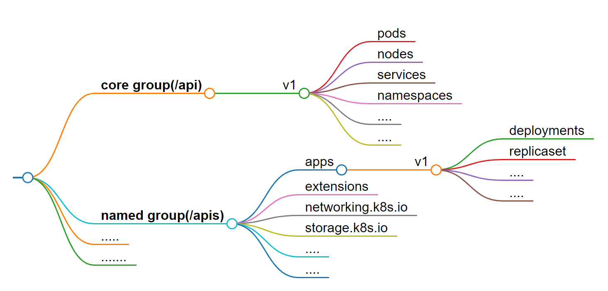

### 今日目標

---
* 了解 k8s 中的授權機制

* 了解 API group 與 verbs

* 實作 RBAC
  * Role & Rolebinding
  * ClusterRole & ClusterRoleBinding
  * ClusterRole & RoleBinding 

* 測試權限
  * 使用 `kubectl auth can-i` 指令
  * 使用 `kubectl` 指令並加上 `--as` 選項

* Verbs 的區別：get、list、watch

***

看完如何升級、備份 cluster 後，我們來談談 cluster 中的權限管理，今天的重點是 cluster 中的「授權」機制。

在 [Day 22](https://ithelp.ithome.com.tw/articles/10348787) 介紹的 cert、 key 和 kubeconfig，規定了「誰可以**進到** cluster」，例如我們幫 Bob 簽署了一張憑證，讓他可以進入到 cluster。這就是所謂的 **Authentication**(認證)。

不過，為了不讓 Bob 亂來，我們也在 Day 22 的範例中透過 **RBAC** 讓 Bob 只能操作 default namespace 的 Pod ，而 RBAC 就是 k8s中的一種 **Authorization** ( 授權 )機制。

在 k8s 中， Authorization 的常見模式有以下幾種：

 * **Node**：對 kubelet 能進行的 API 操作進行控制。

 * **ABAC**: Attribute-based access control ( ABAC )。在一份 policy 檔中，針對不同使用者(或群組)「個別」設定權限。

 * **RBAC**：Role-based access control ( RBAC )。先設定好「role 物件」的權限，再將使用者(或群組)與這個 role 物件「綁定」。

 * **Webhook**：使用第三方的授權機制，透過 HTTP POST 的方式來進行授權。

 > 關於其他授權模式，可以參考[官方文件](https://kubernetes.io/docs/reference/access-authn-authz/authorization/#authorization-modules)。

要查看目前 cluster 啟用的授權模式，可以使用以下指令：
```bash
kubectl -n kube-system describe po kube-apiserver-controlplane | grep auth
```
```text
      --authorization-mode=Node,RBAC
      --enable-bootstrap-token-auth=true
```
> 於 /etc/kubernetes/manifests/kube-apiserver.yaml 中的 --authorization-mode 進行設定


### ABAC vs RBAC

與 ABAC 相比，RBAC 更加的方便與靈活，舉例來說：

 * 有三個使用者，都只能對 Pod 進行操作：

   * ABAC：需要再 policy 檔中設寫 **3** 條「只能操作 Pod」的規則，一人一條。
   * RBAC：需要 **1** 個「只能操作 Pod 」的 role 物件，再將三個使用者綁定到這個 role 物件上即可。

> 如果後續須變更規則時，RBAC 這種「規則數量」上的優勢就會更加明顯。例如要讓這三人改成只能操作 Deployment，ABAC 需更改三條規則，而 RBAC 只需更改一個 role 物件即可。

今天我們會實際動手來實作 RBAC，不過在此之前，得先了解一下 k8s 中的「API group」。

### API Group

其實這個概念在我們建立 Pod 與 Deployment 時就已經接觸過了。

如果看 yaml 檔的話，會發現 Pod 的 apiVersion 是 `v1`，而 Deployment 的 apiVersion 是 `apps/v1`。

在 k8s 中，所有物件都有屬於自己的 API group，而這樣的分類讓 k8s 的 API更加容易管理或擴充。

這裡介紹兩種常見的 API group：

* **core group**: cluster 中的核心物件，例如 Pod 、 service、 namespace 等等。
* **named group**: cluster 中的擴充物件，例如 Deployment、 replicasete 等等。

> API group 的總列表，可以參考[官方文件](https://kubernetes.io/docs/reference/generated/kubernetes-api/v1.31/#api-overview)

以下是兩者的比較關係：

API group | RESTful API路徑 | yaml 的 apiVersion
--- | --- | ---
core group(/api) | /api/v1 | v1
named group(/apis) | /apis/$GROUP_NAME/$VERSION | $GROUP_NAME/$VERSION

例如：

  * Pod 屬於 **core group**，所以 RESTful API 路徑是「/api/v1」，而 yaml 檔中的 apiVersion 是「v1」。

  * Deployment 屬於 **named group** 中的「apps群組」，所以 RESTful API 路徑是「/apis/apps/v1」，而 yaml 檔中的 apiVersion 是「apps/v1」。

這裡是 k8s 的 API group 架構圖：


但如果真的不知道某個物件屬於哪個 API group，可以使用 `kubectl api-resources` 指令：

* 查看所有物件的 API group：
```bash
kubectl api-resources
# 在輸出結果的 APIVERSION 欄位
```

* 如果要找到特定物件的 API group，可以：
```bash
kubectl api-resources | grep <object-name>
```

例如:
```bash
kubectl api-resources | grep deployments
``` 
```text
deployments                       deploy       apps/v1                           true         Deployment
```
> apiVersion 是「apps/v1」，所以 Deployment 屬於 apps 群組。

### Verbs

OK，現在我們知道每個物件都有自己的 API group，而使用者能對這些物件「做什麼」，則取決於該物件的 **verbs**。

常見的 verbs 有以下幾種：

  * **get**：取得特定物件的資訊
  * **list**：取得物件清單
  * **watch**：持續監聽物件的變化
  * **create**：建立物件
  * **delete**：刪除物件
  * **update**：更新物件

> get、list 是不是看起來很像？但其實是有差異的，後面會有測試來說明。

不過，每個物件對應的 verbs 或多或少會有些差異，可以透過以下方法查看特定物件的 verbs：
```bash
kubectl api-resources -o wide | grep <object-name>
```

### RBAC：Role & Rolebinding

了解了 API group 與 verbs 之後，我們就可以來設定 RBAC 了。

針對某個 namespace 的 RBAC 設定其實很簡單，只需要兩個步驟：

1. **建立 Role 物件**：賦予這個 Role 在「某個 namespace 」中的權限，例如能對 default namespace 的 Pods 進行 get、watch、list 的操作。

2. **建立 Rolebinding 物件**：將使用者(或群組)綁定到剛剛建立的「Role」上，這樣這個使用者就擁有了這個「Role」的權限。

底下我們直接來實作一個 RBAC 的範例：

#### STEP 1: 建立 role 

這是一個 role 的yaml範例：

> 這個 role 的名稱是「pod-reader」，只能對 default namespace 的 Pods 進行 get、watch、list 的操作。

```yaml
# pod-reader.yaml
apiVersion: rbac.authorization.k8s.io/v1
kind: Role
metadata:
  namespace: default # role 權限的生效範圍
  name: pod-reader
rules:  
- apiGroups: [""] # 空值，代表是core group
  resources: ["pods"]
  verbs: ["get", "watch", "list"]
```
---
> **Tips**：用 `kubectl create` 建立 role

我們可以用指令建立一個一模一樣的 role：

```bash
kubectl create role pod-reader --verb=get,watch,list --resource=pods
```
不過使用 `kubectl create` 就只能設定一個 rule，如果設定多個 rule 可以先使用「--dry-run=client -o yaml」將 yaml 輸出，再進行編輯。

***

設定好 role 的權限後，建立之後來查看一下：
```bash
kubectl apply -f pod-reader.yaml
kubectl describe role pod-reader
```
```text
Name:         pod-reader
Labels:       <none>
Annotations:  <none>
PolicyRule:
  Resources  Non-Resource URLs  Resource Names  Verbs
  ---------  -----------------  --------------  -----
  pods       []                 []              [get watch list]
```

使用 `describe` 來查看 role 的權限其實就一目瞭然了。底下再來看看其他 rules 的設定方式：

* 如果要在**同一個** apiGroup 底下指定多個 resource，可以用逗號分隔：
```yaml
rules:
- apiGroups: [""]
  resources: ["pods", "configmaps"]
  verbs: ["get", "watch", "list"]

```

* 可用「*」來指定「所有」，例如：
```yaml
# 可以對 core gruop 中的所有 resource 進行 get、watch、list 的操作。
rules:
- apiGroups: [""]
  resources: ["*"]
  verbs: ["get", "watch", "list"]
```

* 使用「`resource/subresource`」的方式來指定特定的資源的子資源，例如：
```yaml
# 只能對 Pod 與 Pod 中的 log 進行 get、list 的操作。
rules:
- apiGroups: [""]
  resources: ["pods", "pods/log"]
  verbs: ["get", "list"]
```

* 還可以直接指定特定的物件**名稱**，例如：
```yaml
# 只能對「nginx」這個 Pod 進行 get、watch、list 的操作，而非該 namespace 中的所有 Pod 
rules:
- apiGroups: [""]
  resources: ["pods"]
  resourceNames: ["nginx"]
  verbs: ["get", "watch", "list"]
``` 

---

> **Tips**：apiGroups 的寫法 

如果使用 kubectl api-resources 查看 Deployment 的 apiGroup：
```bash
kubectl api-resources | grep deployments
deployments                       deploy       apps/v1                           true         Deployment
```

會發現是 apps/v1，這時你可能會在 role 的 yaml 中這樣定義關於 Deployment 的 rule：

```yaml
rules:
- apiGroups: ["apps/v1"]
  resources: ["deployments"]
  verbs: ["get", "watch", "list"]
```

這樣是錯誤的，因為 apps/v1 是「apiVersion」的寫法，其格式為「$GROUP_NAME/$VERSION」。

所以在寫 role 的 yaml 時。apiGroups 欄位，只需填入 $GROUP_NAME 即可：
```yaml
rules:
- apiGroups: ["apps"]
  resources: ["deployments"]
  verbs: ["get", "watch", "list"]
```

***


#### STEP 2: 建立 rolebinding

建立好 role 之後，就可以把「使用者(或群組)」**綁定**到這個 role 上，這個動作稱為「Role Binding」。

例如我們剛剛創建了一個 role 物件叫 pod-reader，現在我們想要將使用者「bob」綁定到這個 role：

```yaml
# rolebinding.yaml
apiVersion: rbac.authorization.k8s.io/v1
kind: RoleBinding
metadata:
  name: read-pods
  namespace: default
subjects:
- kind: User
  name: bob # user的名稱
  apiGroup: rbac.authorization.k8s.io
roleRef:
  kind: Role
  name: pod-reader # 剛剛創建的role物件
  apiGroup: rbac.authorization.k8s.io
```
```bash
kubectl apply -f rolebinding.yaml
```

這樣一來，Bob 就能在 default namespace 中對 Pod 進行 get、watch、list 的操作。

如果要一次綁定多個使用者，可以在 subjects 底下加入多個「kind: User」：
```yaml
subjects:
- kind: User
  name: bob 
  apiGroup: rbac.authorization.k8s.io
- kind: User
  name: alice
  apiGroup: rbac.authorization.k8s.io
```
---
> **Tips**：用 `kubectl create` 建立 rolebinding

我們同樣能用指令來建立 rolebinding：
```bash
kubectl create rolebinding read-pods --role=pod-reader --user=bob
```

用指令綁定多個使用者：
```bash
kubectl create rolebinding read-pods --role=pod-reader --user=bob --user=james
```

***


### RBAC：ClusterRole & ClusterRoleBinding

在上面建立的 role 與 rolebinding 都需要指定 namespace，代表這些設定只存在於特定的 namespace。例如上面的例子中，bob 只能在 default namespace 中對 Pod 進行 get、watch、list 的操作。

假如今天我要讓 bob 在整個 cluster 都能對 Pod 進行相同的操作，難到需要在每個 namespace 中都建立一次 role 與 rolebinding？另外，有些物件不能用 namespace 來區分，例如 namespace 本身、Node、storageclass 等等，這些物件的 role 與 rolebinding 又該如何設定？

這時候就可以用 `ClusterRole` 與 `ClusterRoleBinding` 來設定。兩者的概念與 role 與 rolebinding 是一樣的，只是權限的作用**範圍**涵蓋了整個 cluster。

---
> **Tips**：如何查看能被 namespace 區分的物件？

哪些物件能不能被 namespace 區分，可以用以下指令查看：

* 查看「能」被 namespace 區分的物件：
```bash
kubectl api-resources --namespaced=true
```

* 查看「不能」被 namespace 區分的物件：
```bash
kubectl api-resources --namespaced=false
```
***

#### 實作 ClusterRole & ClusterRoleBinding 

我們直接拿上面的 pod-reader.yaml 來修改一下：

```yaml
apiVersion: rbac.authorization.k8s.io/v1
kind: ClusterRole # role --> ClusterRole
metadata: # 把 namespace 拿掉
  name: pod-reader
rules:
- apiGroups: [""] 
  resources: ["pods"]
  verbs: ["get", "watch", "list"]
```
```bash
kubectl apply -f pod-reader.yaml
```

建立之後一樣與使用者綁定：
```yaml
apiVersion: rbac.authorization.k8s.io/v1
kind: ClusterRoleBinding # rolebinding --> ClusterRoleBinding
metadata: # 同樣沒有namespace
  name: read-pods-cluster
subjects:
- kind: User
  name: bob # user的名稱
  apiGroup: rbac.authorization.k8s.io
roleRef:
  kind: ClusterRole # role --> ClusterRole
  name: pod-reader
  apiGroup: rbac.authorization.k8s.io
```
```bash
kubectl apply -f rolebinding.yaml
```
這樣一來，Alice 就能在整個 cluster 中對 Pod 進行 get、watch、list 的操作。

> **Tips**：用 `kubectl create` 建立 clusterrole & clusterrolebinding

同樣也可以用指令來建立 clusterrole 與 clusterrolebinding：
```bash 
kubectl create clusterrole pod-reader --verb=get,watch,list --resource=pods
kubectl create clusterrolebinding read-pods --clusterrole=pod-reader --user=bob
```

### ClusterRole & RoleBinding 的組合

ClusterRole 其實也能與 RoleBinding 組合使用，這種組合的好處在於不用重複建立多個相同的 role 物件。舉例來說：

假設 deploy-reader 只是一個存在於 default namespace 的 role 物件，那麼只能在 default namespace 中建立 rolebinding。如果我們想讓 bob 在 default、kube-system、kube-public 這三個 namespace 中擁有 deploy-reader 的權限，就得**重複**的在這三個 namespace 都建立一個 deploy-reader 再分別綁定 bob。

所以，如果我們知道某個 role 會在多個 namespace 中頻繁使用，可以直接建立一個 ClusterRole，再用 RoleBinding 來綁定到不同的 namespace。來實際操作一下：

```bash
kubectl create clusterrole deploy-reader --verb=get,watch,list --resource=deployments
kubectl create rolebinding read-deploy --clusterrole=deploy-reader --user=Alice -n default
kubectl create rolebinding read-deploy --clusterrole=deploy-reader --user=Alice -n kube-system
kubectl create rolebinding read-deploy --clusterrole=deploy-reader --user=Alice -n kube-public
```

這樣一來，bob 就能在 default、kube-system、kube-public 這三個 namespace 中對 Pod 進行 get、watch、list 的操作。雖然綁定的是 clusterrole，但是透過 rolebinding 的綁定，這個權限只會在特定的 namespace 生效。

### 權限的測試

看完上面的測試後，你可能會有點懷疑權限真的照我們預期的生效了嗎？而且隨著規則增加，我們不可能記得每個使用者的權限設定，這時可以這樣檢查：

* 查自己的權限：
```bash
kubectl auth can-i <verb> <resource>
```
例如：
```bash
kubectl auth can-i get pods
``` 
```text
yes
```

* 查特定使用者的權限：
```bash
kubectl auth can-i <verb> <resource> --as <user>
```
或是：
```bash
kubectl <command> --as <user>
```

> 底下我們來測試幾個例子：

* 如果現在都有按照上面的範例執行的話，我們預期的權限如下：
  * bob：在整個 cluster 中對 Pod 進行 get、watch、list 的操作
  * Alice：在在 default、kube-system、kube-public 這三個 namespace 中對 Deployment 進行 get、watch、list 的操作

* 測試權限的方法有上面提到的兩種：
  * 方法一：使用 `kubectl auth can-i` 指令
  * 方法二：直接使用 `kubectl` 指令，並加上 `--as` 選項

**使用「方法一」測試 bob 的權限**

* bob 能列出所有 namesapce 的 Pod 嗎？
```bash
kubectl auth can-i get pods --as bob --all-namespaces
``` 
> 輸出：yes

* bob 能在 default namespace 中刪除 Pod 嗎？

```bash
kubectl auth can-i delete pods --as bob
``` 
> 輸出：no

* bob 能在 kube-system namespace 中對查看 Deployment 嗎？

```bash
kubectl auth can-i get deployments --as bob -n kube-system
``` 
> 輸出：no

**使用「方法二」測試 Alice 的權限**

* Alice 能列出所有 namesapce 的 Deployment 嗎？
```bash
kubectl get deploy --as Alice --all-namespaces
``` 
```text
Error from server (Forbidden): deployments.apps is forbidden: User "Alice" cannot list resource "deployments" in API group "apps" at the cluster scope
```

* Alice 能列出 default、kube-system、kube-public 這三個 namespace 的 Deployment 嗎？

```bash
kubectl get deploy --as Alice -n default
kubectl get deploy --as Alice -n kube-system
kubectl get deploy --as Alice -n kube-public
``` 
> 輸出：default、kube-system、kube-public 這三個 namespace 的 Deployment 清單

* Alice 能列出 kube-public 這個 namespace 的 Pod 嗎？

```bash
kubectl get po --as Alice -n kube-public
``` 
```text
Error from server (Forbidden): pods is forbidden: User "Alice" cannot list resource "pods" in API group "" in the namespace "kube-public"
```


### 補充：get 、list、watch 的區別

這三個 verbs 「字面上」看起來很像，但其實是有差異的：

* **get**：只能取得特定物件的「個別資訊」，例如 kubectl get po nginx、kubectl describe po nginx

* **list**：只能列出特定物件的「清單」，例如 kubectl get po

* **watch**：可以及時的監控物件的變化，例如在有「get」的權限下，可以 kubectl get po nginx -w

三個權限是彼此獨立的，例如當你擁有 list 權限不代表你一定有 get 或 watch 的權限，因為 list 只是列出清單。

這樣說或許很模糊，我們來實際測試看看：

* 建立三個 role，依序對 default namespace 的 Pod 有 get、list、watch 的權限:
```bash
kubectl create role get-pods --verb=get --resource=pods
kubectl create role list-pods --verb=list --resource=pods
kubectl create role watch-pods --verb=watch --resource=pods
```

* 建立三個 rolebinding，分別綁到三個使用者上：
```bash
kubectl create rolebinding get-pods-binding --role=get-pods --user=getter
kubectl create rolebinding list-pods-binding --role=list-pods --user=lister
kubectl create rolebinding watch-pods-binding --role=watch-pods --user=watcher
```

* 建立兩個 Pod：
```bash
kubectl run nginx --image=nginx
kubectl run busybox --image=busybox --command -- sleep 1d
```

**測試 getter 可以做什麼**

* 列出 Pod 的清單？
```bash
kubectl get po --as getter
```
```text
Error from server (Forbidden): pods is forbidden: User "getter" cannot list resource "pods" in API group "" in the namespace "default"
```

* 列出特定 Pod？
```bash
kubectl get po nginx --as getter
```
```text
NAME    READY   STATUS    RESTARTS   AGE
nginx   1/1     Running   0          103s
```

* 列出特定 Pod 的詳細資訊？
```bash
kubectl describe po nginx --as getter
```
```text
ame:             nginx
Namespace:        default
Priority:         0
Service Account:  default
Node:             node01/172.30.2.2
......
```

* 持續的觀察特定 Pod 的狀態？
```bash
kubectl get po nginx -w --as getter
```
```text
NAME    READY   STATUS    RESTARTS   AGE
nginx   1/1     Running   0          5m26s
Error from server (Forbidden): unknown (get pods)
```

**測試 lister 可以做什麼**

* 列出 Pod 的清單？
```bash
kubectl get po --as lister
```
```text
NAME      READY   STATUS    RESTARTS   AGE
busybox   1/1     Running   0          6m9s
nginx     1/1     Running   0          6m10s
```

* 列出特定 Pod？
```bash
kubectl get po nginx --as lister
```
```text
Error from server (Forbidden): pods "nginx" is forbidden: User "lister" cannot get resource "pods" in API group "" in the namespace "default"
```

* 列出特定 Pod 的詳細資訊？
```bash
kubectl describe po nginx --as lister
```
```text
Error from server (Forbidden): pods "nginx" is forbidden: User "lister" cannot get resource "pods" in API group "" in the namespace "default"
```

* 持續觀察 Pod 清單的變化？
```bash
kubectl get po -w --as lister
```
```text
NAME      READY   STATUS    RESTARTS   AGE
busybox   1/1     Running   0          7m31s
nginx     1/1     Running   0          7m32s
Error from server (Forbidden): unknown (get pods)
```

**測試 watcher 可以做什麼**

* 其實你應該猜到了，沒有 get 或 list 的權限，watcher 什麼也不能做：
```bash
kubectl get po -w --as watcher
```
```text
Error from server (Forbidden): pods is forbidden: User "watcher" cannot list resource "pods" in API group "" in the namespace "default"
```

所以修改一下 watcher 的 role，讓他至少有 get 的權限：
```bash
kubectl edit role watch-pods
```
```yaml
......
rules:
- apiGroups:
  - ""
  resources:
  - pods
  verbs:
  - watch
  - get # 加入 get
```

* 查看特定的 Pod？
```bash
kubectl get po nginx --as watcher
```
```text
NAME    READY   STATUS    RESTARTS   AGE
nginx   1/1     Running   0          10m
```

* 持續觀察特定 Pod 的狀態?
```bash
kubectl get po nginx -w --as watcher
```
```text
NAME    READY   STATUS    RESTARTS   AGE
nginx   1/1     Running   0          10m

```

沒錯，這時 -w 選項就生效了，按「ctrl + c」來結束觀察。

### 環境清理

> 為了不影響後續章節的操作，記得清理環境喔

* 一次性刪除所有 default namespace 的物件：
```bash
kubectl delete po,role,rolebinding --all -n default
```

* 刪除 bob 相關的 clusterrole 與 clusterrolebinding：
```bash
kubectl delete clusterrole pod-reader
kubectl delete clusterrolebinding read-pods-cluster
```

* 刪除 Alice 相關的 role 與 rolebinding：
```bash
kubectl delete  clusterrole deploy-reader
kubectl delete rolebinding read-deploy -n default
kubectl delete rolebinding read-deploy -n kube-system
kubectl delete rolebinding read-deploy -n kube-public
```

### 今日小結

今天示範如何設定 RBAC，在設定時必須清楚的知道「設定的目的」，例如要讓某個使用者在整個 cluster 中有哪些權限，或是只能在特定的 namespace 中有哪些權限，而這些特定的 namespace 數量是多是少？需不需要直接建立一個 clusterrole 再分別綁定？

如果設定 RBAC 後想要測試權限是否生效，可以使用 `kubectl auth can-i` 指令，或是直接使用 `kubectl` 指令並加上 `--as` 選項。

以下為考試時可能用到的查詢關鍵字整理:


----

**參考資料**

[Authorization](https://kubernetes.io/docs/reference/access-authn-authz/authorization/)

[Using RBAC Authorization](https://kubernetes.io/docs/reference/access-authn-authz/rbac/)