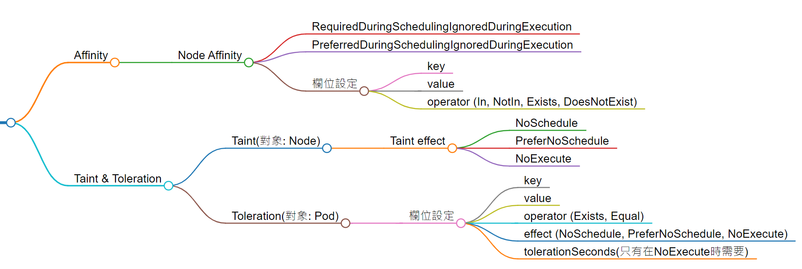

# *Day10 Scheduling* : `Affinity`與`Taint`

> Using nodeName overrules using nodeSelector or affinity and anti-affinity rules.

如果你想用`label`的方式來限制`pod`的去向，前一章介紹的`nodeSelector`會是**最簡單**的方式。但如果你想在篩選`node`的條件中加入更多條件或邏輯，`nodeSelector`就無法達成了。

所以`k8s`提供了另一種更彈性的方式，也就是`Node affinity`

## Node affinity的類型
與`nodeSelecotr`相同，`Node affinity`使用`label`作為篩選方式。你可以將`Node affinity`理解為更彈性的`nodeSelector`，而它又因為**強制性**的不同，分為以下兩種類型:

**RequiredDuringSchedulingIgnoredDuringExecution**

在`pod`被安排到`node`時，強制要求`node`必須符合篩選條件(Require During Scheduling)。但這個條件並不影響已在運行的`pod`(Ingnored During Execution)

**PreferredDuringSchedulingIgnoredDuringExecution**

在`pod`被安排到`node`時，`scheduler`會**盡力**找出符合篩選條件的`node`，但如果找不到合適的`node`，仍會安排`pod`到其他`node`上。(Preferred During Scheduling)。但這個條件並不影響已在運行的`pod`(Ingnored During Execution)

當你依照你對**強制性**的需求選擇需要的類別後，接著還有以下欄位需要設定:

   * **key**: 就是`node label`的`key`
   * **value**: 就是`node label`的`value`。一個`key`可能對應到`value`，所以在這個欄位中可以填入一個或多個`value`
   * **operator**: 可以是`In`、`NotIn`、`Exists`、`DoesNotExist`，代表含意如下表:

| Operator | Description | 
| -------- | ----------- |
| In | `node label`的`value`等於**values**欄位中的其中一個 |
| NotIn | `node label`的`value`不等於**values**欄位中的任何一個 |
| Exists | **key**欄位指定的`key`必須存在 |
| DoesNotExist | **key**欄位指定的`key`必須不存在 |

> 需要注意的是，如果operator是Exists或DoesNotExist，就不用填寫values欄位，因為這兩個operator是以key是否存在為判斷依據，而不是value!

### Node affinity的設定格式

篩選條件的設定格式如下:
```yaml
# affinity是寫在spec底下的
spec:
  affinity:
    nodeAffinity:
      requiredDuringSchedulingIgnoredDuringExecution:
        nodeSelectorTerms:
        - matchExpressions:
          - key: <node-label-key>
            operator: In # operator可以是In、NotIn、Exists、DoesNotExist
            values: # operator是Exists或DoesNotExist，就不用填寫values欄位
            - <node-label-value1>
            - <node-label-value2> # 可以填入一個或多個value
      preferredDuringSchedulingIgnoredDuringExecution:
        preference:
          matchExpressions:
          - key: <node-label-key>
            operator: Exists
```
我們來看看一個例子:
```yaml
...(省略)
spec:
  affinity:
    nodeAffinity:
      requiredDuringSchedulingIgnoredDuringExecution:
        nodeSelectorTerms:
        - matchExpressions:
          - key: tier
            operator: In
            values:
            - frontend
            - backend
      preferredDuringSchedulingIgnoredDuringExecution:
      - weight: 1
        preference:
          matchExpressions:
          - key: developer
            operator: Exists
  containers:
  - name: with-node-affinity
    image: registry.k8s.io/pause:2.0
```

上面的例子中，設定了兩個`node affinity`條件:

1. `requiredDuringSchedulingIgnoredDuringExecution`:

   `node label`的**key**必須等於`tier`，且**value**必須是`frontend`或`backend`


2. `preferredDuringSchedulingIgnoredDuringExecution`:

   希望`node label`的**key**是`developer`，但**value**不限制。但如果找不到符合的`node`，仍會安排`pod`到其他`node`上。

以上就是`node affinity`的基本觀念與設定方式，接下來我們來看看今天的另一個主題: `Taint`

## Taint & Tolerations

`node affinity`是讓pod經由篩選label的方式指定pod的去向，而`Taint & Tolerations`則是讓`node`可以避免不符條件的`pod`被安排到自己身上。怎麼說呢? 我們用一個「疫苗」的比喻來說明:

> 疫苗的作用是讓人體產生抗體，來抵抗病毒的入侵。但通常一種疫苗只能防範特定的病毒，而非讓我們百毒不侵。例如小明施打了A疫苗來抵抗A病毒，站在A病毒的視角而言，小明被A疫苗「汙染(Taint)」了，所以它不會來找麻煩。不過另外的X病毒有可能找上小明，這是因為A疫苗不能抵抗X病毒，那站在X病毒的視角而言，它能夠「容忍(Toleration)」A疫苗。

所以`Taint & Tolerations`的概念就是:
我們為一個`node`(小明)設定`taint`(疫苗)後，只有能夠`tolerate`(容忍)這個`taint`的`pod`(病毒)才能被安排到這個`node`上。

> 注意: taint的設定對象是node，而toleration的設定對象是pod

以上就是大致關於`tiant & toleration`的概念，那該如何設定呢? 我們來看看設定方式。

### taint的設定方式

`taint`的設定對象是`node`，那如果某個`pod`並沒有相對應的`toleration`，會發生什麼事情呢? 這裡就要談談`taint`的三種效果(effect)了:

1. **NoSchedule** : 除非`pod`有相對應的`toleration`，否則不會被安排到這個`node`上。但**不影響**已在該`node`上的`pod`。

2. **PreferNoSchedule** : 規則同上，只是前面多了一個**偏好**(prefer)，代表如果真的找不到符合的`node`，還是會安排`pod`到`node`上。

3. **NoExecute** : 
個效果**會影響**正在運行的`pod`，如果`pod`沒有相對應的`toleration`，會被驅逐出`node`; 如果有相對應的`toleration`，則會繼續留在`node`上執行。

> 至於會留下多久，則是由`toleration`的`tolerationSeconds`欄位決定。這個後面會說明。

了解了`taint`的效果後，我們來看看`taint`的設定方式:

```bash
# 設定taint
$ kubectl taint node <node-name> <key>=<value>:<effect>
# 移除taint
$ kubectl taint node <node-name> <key>=<value>:<effect>-
```
例如我要將`node01`設定一個`app=blue`的`taint`，效果是`NoSchedule`:
```bash
# 設定taint
$ kubectl taint node node01 app=blue:NoSchedule
# 移除taint
$ kubectl taint node node01 app=blue:NoSchedule-
```
如果你在一個`key`上設定了一堆的`taint`，那你可以用以下方是全部移除:
```bash
$ kubectl taint node <node-name> <key>-
```

如果想知道一個`node`上的所有`taint`，可以用`describe`指令:
```bash
$ kubectl describe node <node-name>
```

### toleration的設定方式
`toleration`的設定對象是`pod`，所以你可以在`yaml`中的**spec.tolerations[]**底加入以下欄位來設定:

* **key** : 目標`taint`的`key`

* **value** : 目標`taint`的`value`

* **operator** : 可以是`Exists`、`Equal`。沒有寫這個欄位的話，預設是`Equal`，如果寫的是`Exists`，則不用填寫`value`欄位

* **effect** : 目標`taint`的效果，也就是`NoSchedule`、`PreferNoSchedule`、`NoExecute`

* **tolerationSeconds** : 如果`effect`是`NoExecute`，才需要這個欄位，代表`pod`會留在`node`幾秒後才會被刪除。

假如我要幫一個名為`nginx`的`pod`加入一個`app=blue`的`toleration`，效果是`NoSchedule`:
```yaml
...(省略)
spec:
  containers:
  - name: nginx
    image: nginx
  tolerations:
  - key: "app"
    operator: "Equal"
    value: "blue"
    effect: "NoSchedule"
```


以上就是`taint & toleration`的基本觀念與設定方式，這裡我們來思考兩個問題:
> Q1: 如果一個 pod 能夠容忍一個 node 的 taint，這會保證 pod 一定會被安排到這個 node 上嗎?

當然不會，這只是保證`node`不會接納不合條件的`pod`，並不代表符合條件的`pod`一定會被安排`node`上。你可以這樣想想: 小明打了流感疫苗就代表他一定會得流感嗎? 當然不會嘛!

> Q2: 我們昨天介紹了`nodeSelector`，再加上今天的`node affinity`、`taint`與`toleration`，如果今天設置了互相衝突的規則，那究竟該聽誰的呢? 

答案是，`nodeName`最大，其次是taint，最後是affinity。

最後，以下用心智圖來整理`Affinity`與`Taint`的差異:


下面就是練習題了，不過環境會使用多個`worker node`，所以請先確認你的`cluster`有多個`node`。
> 如果懶得建置，可以前往[play with k8s](https://labs.play-with-k8s.com/)進行練習

### 練習1: 幫`node`加上`label`，並用`node affinity`讓`pod`被安排到`node`上

幫`node`加上`label`，需求如下:
   * `node name`: node01
   * `label`: app=nginx

創建一個`pod`，需求如下:
   * `pod name`: nginx
   * `image`: nginx
   * `node affinity`: 自行依照題目要求設定

> 提醒: 練習後別急著關閉環境，接下來的題目還會用到


### 練習2: 並用`toleration`與`affinity`的搭配，**確保**`pod`只能被安排指定的`node`上，且該`node`不會接受來路不明的`pod`

> 提醒: taint & toleration並不保證pod的去向! 想想上面最後小明的例子。

`node`的需求如下:
   * `node name`: node02
   * `label`: tier=backend
   * `taint`: tier=backend，效果是NoExecute

創建一個`pod`，需求如下:
   * `pod name`: backend
   * `image`: redis
   * `指定去向`: node02
   * `tolerations` or `node affinity`: 自行依照題目要求設定

## 今日小節
今天介紹了另外的手動scheduling方式: `node affinity`、`taint`與`toleration`。由於觀念上比較抽象，所以加入了「小明打疫苗」的比喻來說明taint & toleration的概念。今天的兩種方式都比前一章的方式能更彈性處理`pod`的去向。