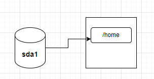
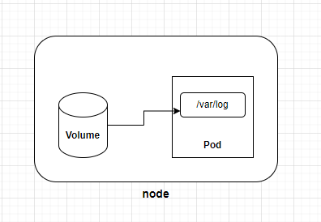
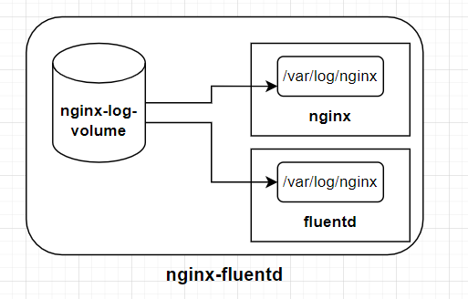
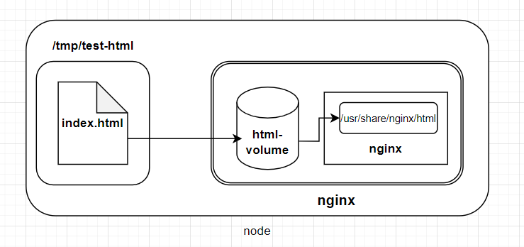
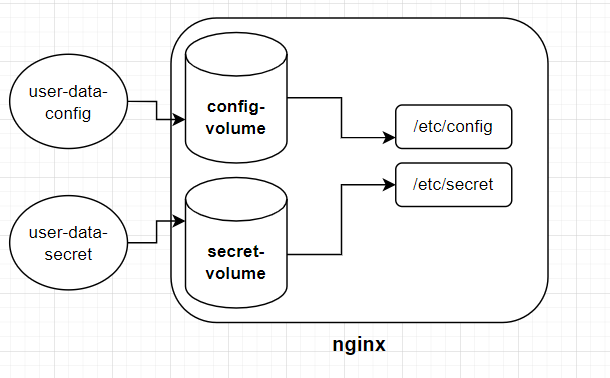

# storage -- Volumn

當pod的生命週期一結束，裡面的資料也會隨之消失。為了保存這些資料，我們將會使用一些k8s中的`storage`來保存，常見的為以下三種:

  * Volumn
  * PersistentVolume (PV) & PersistentVolumeClaim (PVC)
  * StorageClass

今天我們先來看看`Volumn`。

## Volumn

在一般的電腦中，我們會將某顆硬碟(或分割槽)「掛載」到某個目錄下，例如下圖:



在上圖中，「sda1」是一顆硬碟，用來保存「/home」中的資料，這種方式就稱為「掛載(mount)」，而/home就稱為「掛載點(mount point)」。

在pod中同樣有許多的目錄，假如我們想在pod消失後仍保留特定的資料，例如將pod中的「/var/log」目錄保存下來，這同樣也能通過「掛載」的方式來達成。

所以我們需要一顆「硬碟」來儲存資料，k8s提供了`volume`擔任「硬碟」的角色，讓我們可以將一個`volume`掛載到pod中的某個目錄下:


除了保存資料之外，`volume`還有另一個用途: 讓pod中的多個container共享資料。

> 例如在[Day 15](15-1-container-in-pod.md)的「sidecar container」範例中，pod裡有兩個`container`需共享log資料，因此我們使用了一個`volume`來存放log資料。

pod中使用`volume`的格式如下:
```yaml
apiVersion: v1
kind: Pod
metadata:
  name: <pod-name>
spec:
  containers:
  - name: <container-name>
    image: <image-name>
    volumeMounts: 
    - name: <volume-name>
      mountPath: <a path in container> # 就是「掛載點」
  volumes: 
  - name: <volume-name>
    <volume-type>: <volume-configuration>
```

在上面的格式中，可以注意到有<volume-type>需要設定，你可以依不同需求選擇`volume`類型，例如:

  * `emptyDir`
  * `hostPath`
  * `configMap` & `secret`

### emptyDir

顧名思義，`emptyDir`就是一個空的`volume`，當pod被刪除時，`emptyDir`中的資料也會被刪除，所以它的目的並不是保存資料，而是讓pod中的多個container**共享**資料。

**範例**

我們再看一次[Day 15](15-1-container-in-pod.md)「sidecar container」。範例中，我們使用了`emptyDir`來讓兩個`container`共享log資料:

```yaml
apiVersion: v1
kind: Pod
metadata:
  name: nginx-fluentd
  labels:
    app: nginx
spec:
  containers:
  - name: nginx
    image: nginx
    ports:
    - containerPort: 80
    volumeMounts:
    - name: nginx-log-volume
      mountPath: /var/log/nginx
  - name: fluentd
    image: fluentd
    volumeMounts:
    - name: nginx-log-volume
      mountPath: /var/log/nginx
  volumes:
  - name: nginx-log-volume
    emptyDir: {} # volume type 選用 emptyDir
```

在上面的yaml中，我們建立了一個名為「nginx-log-volume」的`volume`，並分別掛載到`nginx`和`fluentd`的`/var/log/nginx`目錄下:


如此一來，一旦`nginx`寫入log資料，`fluentd`就能透過讀取掛載在自己/var/log/nginx目錄下的`nginx-log-volume`，來收集`nginx`的log。
> 在[Day 15](15-1-container-in-pod.md)有使用curl測試過共享的效果，需要的話可以回去翻一下

**補充**

當多個容器掛載`emptyDir`時，「mountPath」不見得要和上面的範例一樣設定相同名字，可依需求自行設定。

### hostPath

這裡的「host」指的是運行pod的node，所以`hostPath`就是指定node上的某目錄掛載到pod中讓container存取。

**範例**

> 在這個範例中，我們使用`hostPath`來指定自訂的html來取代nginx的預設網頁

* 首先，在node上建立一個目錄:

```bash
mkdir /tmp/test-html
```

* 我們寫一個簡單的html，放在`/tmp/test-html`中:

```bash
cat <<EOF | sudo tee /tmp/test-html/index.html
<!DOCTYPE html>
<html lang="en">
<head>
    <meta charset="UTF-8">
    <meta name="viewport" content="width=device-width, initial-scale=1.0">
    <title>Testing HostPath</title>
</head>
<body>
    <h1>Testing HostPath</h1>
</body>
</html>
EOF

```

* 然後創建pod的yaml檔:

```yaml
apiVersion: v1
kind: Pod
metadata:
  creationTimestamp: null
  labels:
    run: nginx
  name: nginx
spec:
  containers:
  - image: nginx
    name: nginx
    ports:
    - containerPort: 80
    volumeMounts:
    - name: html-volume
      mountPath: /usr/share/nginx/html
  volumes:
  - name: html-volume
    hostPath:
      path: /tmp/test-html
```

> 如此一來，nginx容器中的「/usr/share/nginx/html」底下就會是「/tmp/test-html」中的「index.html」:




* 創建pod後，檢查狀態順便看一下ip:
```bash
$ kubectl apply -f nginx-hostpath.yaml
$ kubectl get po -o wide
NAME    READY   STATUS    RESTARTS   AGE   IP          NODE           NOMINATED NODE   READINESS GATES
nginx   1/1     Running   0          22s   10.42.0.9   controlplane   <none>           <none>
```

* 所以ip是「10.42.0.9」，最後透過curl來測試是不是有更新成我們自訂的html:
```bash
curl 10.42.0.9:80
```
輸出如下:
```txt
<!DOCTYPE html>
<html lang="en">
<head>
    <meta charset="UTF-8">
    <meta name="viewport" content="width=device-width, initial-scale=1.0">
    <title>Testing HostPath</title>
</head>
<body>
    <h1>Testing HostPath</h1>
</body>
</html>

```

> 可以看到標題是「Testing HostPath」，成功!

**提醒**

雖然`hostPath`用起來相當簡單，但是會有安全上的疑慮，例如不明寫入會直接影響到host。因此一般建議掛載成「read-only」模式:


```yaml
...省略...
...
  volumeMounts:
  - name: html-volume
    mountPath: /usr/share/nginx/html
    readOnly: true
...
...省略...
```

### configMap & secret

在前面的章節中，我們介紹過`configMap`和`secret`，用來存放「key-value」的資料，而這些資料也可以透過`volume`的方式掛載到pod中。

**範例**

* 首先，我們先建立一個`configMap`與`secret`:

```bash
kubectl create configmap user-data-config --from-literal=USER=michael
kubectl create secret generic user-data-secret --from-literal=PASSWORD=123456
```

* 同樣創建一個pod的yaml:

```yaml
apiVersion: v1
kind: Pod
metadata:
  creationTimestamp: null
  labels:
    run: nginx
  name: nginx
spec:
  containers:
  - image: nginx
    name: nginx
    ports:
    - containerPort: 80
    volumeMounts:
    - name: config-volume
      mountPath: /etc/config
    - name: secret-volume
      mountPath: /etc/secret
  volumes:
  - name: config-volume
    configMap:
      name: user-data-config
  - name: secret-volume
    secret:
      secretName: user-data-secret
  ```

  > 其實configMap和secret的使用方式很像。掛載後長這樣:

  


  * 建立pod後，透過`kubectl exec`來檢查是否有成功掛載:

```bash
$ kubectl exec -it nginx -- ls /etc/config/USER
michael

$ kubectl exec -it nginx -- ls /etc/secret/PASSWORD
123456
```

以上為Volumn的介紹，接下來會介紹`PersistentVolume`和`StorageClass。

# References

[volume](https://kubernetes.io/docs/concepts/storage/volumes/#hostpath)

[configmap as volume](https://kubernetes.io/docs/tasks/configure-pod-container/configure-pod-configmap/#add-configmap-data-to-a-volume)