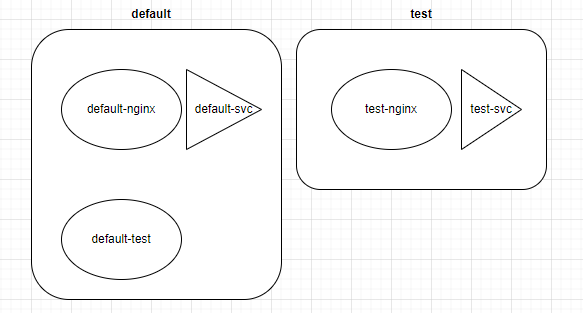

# network : CNI and CoreDNS

在前面使用kubeadm安裝cluster與介紹service時，我們多多少少都有提到`CNI`，當時給出的解釋是:

> 建立**虛擬網路**供`cluster`內部溝通使用

今天我們就來探討一下到底何謂`CNI`? 它與service的關係是什麼? 相關的設定檔在哪裡?

## What's CNI

`CNI`的全名是`Container Network Interface`，它的目的是搞定cluster中的**網路基本需求**。

所謂的「基本需求」k8s有明確的定義:

  * 讓整個cluser中的所有**pod**能不靠NAT即可互相溝通

  * 部署在每個node上的agent(例如:daemonset、kubelet)能與該node上的**pod**溝通


要滿足上述需求，cluster中就必須有「基本的」網路配置，例如:

  * pod的IP分配，這個IP必須要是獨立的，並且能與外界溝通

  * 虛擬網路卡設定

如果沒有`CNI`，那麼你就必須自己來處理這些問題，就像是在現實中處理多台電腦的網路連線問題一樣(配置網路卡、規劃網段、手動設定IP)，只不過這裡的「電腦」不是普通的多，一個cluster中的pod可能就有上百、上千個，而且又隨時會刪除或重啟，讓人工處理這樣的網路配置實在是強人所難。

不過，k8s並沒有提供預設的`CNI`，而是定義出`CNI`「該做甚麼、該如何做」，只要滿足這些規範，人人都可以按照這些規範來開發`CNI`，並且以「插件(**Plugins**)」的形式讓使用者依需求挑選，最終部署在cluster中。

常見的`CNI`例如:
  
  * `calico`

  * `flannel`

  * `weave`

  * `cilium`

> CNI是CNCF的一個開源專案，你可以在他們的[github](https://github.com/containernetworking/cni)上找到更多關於CNI的資訊。


## CNI 與 Service、kube-proxy的關係

目前為止的章節中，我們總共提到三種與網路相關的元件:

  * `CNI` : cluster中的**網路基礎**，注重的是「如何配置pod的基本網路」，例如IP分配、虛擬網路卡設定

  * `Service` : 提供了穩定的**統一介面**讓外界來訪問 Pod，注重的是「如何穩定的存取pod」，例如NodePort、ClusterIP

  * `kube-proxy` : 負責處理cluster中的**路由規則**，注重的是「如何轉發流量」，例如iptables、ipvs

當一個 Pod 被建立並建立service後，會發生:

* `CNI` (Container Network Interface)：配置網絡接口，與分配一個 IP 給pod，再設定虛擬網路卡介面等**基礎**設定。

* `Service`: k8s並不會自動的建立service。如果使用者依需求自行幫pod建立`service`後，`kube-apiserver`會為這個service分配一個IP

* `kube-proxy`：隨時的觀察`service`的狀態，當有`service`被建立後，`kube-proxy`會配置相對應的路由規則，讓整個cluster都能夠存取這個`service`。當`service`被刪除後，`kube-proxy`也會刪除相對應的路由規則。

> 至於建立service的介紹這裡就不再贅述，可以參考之前的[Day06](06-1-svc.md)

**補充** 

kube-proxy的三種proxy mode:

* `iptables` 

* `ipvs`

* `kernelspace`

> 舊一點的文章可能會看到另一種proxy mode叫做`userspace`，但目前已經棄用了。

那系統預設的proxy mode是`iptables`，你可以透過以下指令查看:

```bash
kubectl -n kube-system logs kube-proxy-85drq
```
```text            
I0325 09:25:49.947640       1 server_others.go:72] "Using iptables proxy"
```
## 相關設定

* 支援的cni執行檔會在`/opt/cni/bin/`目錄
```bash
ls /opt/cni/bin/
```
輸出:
```text
andwidth  calico       dhcp   firewall  host-device  install  loopback  portmap  sbr     tap     vlan
bridge     calico-ipam  dummy  flannel   host-local   ipvlan   macvlan   ptp      static  tuning  vrf
```

* 正在使用的`cni`設定檔會在`/etc/cni/net.d/`目錄
```bash
ls /etc/cni/net.d/
```
輸出:
```text
10-canal.conflist  calico-kubeconfig
```

來看一下10-canal.conflist設定檔:
```yaml
{
  "name": "k8s-pod-network",
  "cniVersion": "0.3.1",
  "plugins": [
    {
      "type": "calico", # 使用calico作為cni
      "log_level": "info",
      "log_file_path": "/var/log/calico/cni/cni.log", # log檔位置
      "datastore_type": "kubernetes",
      "nodename": "controlplane",
      "mtu": 0,
      "ipam": { # pod的ip範圍，等一下會解釋
          "type": "host-local",
          "subnet": "usePodCidr"
      },
      "policy": {
          "type": "k8s"
      },
      "kubernetes": {
          "kubeconfig": "/etc/cni/net.d/calico-kubeconfig"
      }
    },
    {
      "type": "portmap",
      "snat": true,
      "capabilities": {"portMappings": true}
    },
    {
      "type": "bandwidth",
...
...(省略)
```

為了更有效率的管理每個node上的網路工作，以及node之間的封包傳遞，每個node都會有一個cni的`agent`，通常以`daemonset`的方式部署:

```bash
kubectl get daemonset -n kube-system
NAME         DESIRED   CURRENT   READY   UP-TO-DATE   AVAILABLE   NODE SELECTOR            AGE
canal        2         2         2       2            2           kubernetes.io/os=linux   18d
kube-proxy   2         2         2       2            2           kubernetes.io/os=linux   18d
```


## IP範圍

當pod被建立後，`CNI`會為這個pod分配一個IP，而這個IP要從哪個「網段」中取得呢? 我們再來看一下`CNI`的設定檔:

```bash
cat /etc/cni/net.d/10-canal.conflist | grep -A 3 -i ipam
```
通常長這樣:
```
"ipam":{"ranges":[[{"subnet":"10.5.0.0/24"}]],"type":"host-local"}
```
> 所以IP的範圍就是從10.5.0.0.1 ~ 10.5.0.0.254

但設定檔的ipam欄位也有可能是這樣:
```text
      "ipam": {
          "type": "host-local",
          "subnet": "usePodCidr" 
      },
```
如果subnet設定為「usePodCidr」，代表cni使用的IP range 取決於k8s的設定，可以透過以下指令查看:

```bash
kubectl get node -o yaml | grep -i podcidr
```
```text
    podCIDR: 192.168.0.0/24
    podCIDRs:
    podCIDR: 192.168.1.0/24
    podCIDRs:
```


至於service的IP範圍則是由kube-apiserver決定:
```bash
cat /etc/kubernetes/manifests/kube-apiserver.yaml | grep -i range
```
```text
 - --service-cluster-ip-range=10.96.0.0/12
```

> 所以service的IP範圍是10.96.0.1 ~ 10.111.255.254

那下我們在這樣的IP範圍下做了一個簡單的範例:

**範例**

* 建立了一個pod叫做nginx，並幫它建立一個service:

```bash
kubectl run nginx --image nginx --port 80
kubectl expose pod nginx --port 80 --type NodePort
```

* 檢查一下:
```bash
kubectl get po,svc
```
```text
controlplane $ k get po,svc -o wide
NAME        READY   STATUS    RESTARTS   AGE   IP            NODE     NOMINATED NODE   READINESS GATES
pod/nginx   1/1     Running   0          22s   192.168.1.4   node01   <none>           <none>

NAME                 TYPE        CLUSTER-IP      EXTERNAL-IP   PORT(S)        AGE   SELECTOR
service/kubernetes   ClusterIP   10.96.0.1       <none>        443/TCP        21d   <none>
service/nginx-svc    NodePort    10.99.165.171   <none>        80:32455/TCP   8s    run=nginx
```

* 可以整理出以下資訊:
  * pod的IP: 192.168.1.4
  * pod所在的node: node01
  * service的IP: 10.99.165.171
  * nodePort: 32455

* 來查看一下路由規則
```bash
iptables -L -t nat | grep nginx
```
```text
KUBE-MARK-MASQ  all  --  anywhere             anywhere             /* masquerade traffic for default/nginx-svc external destinations */

KUBE-EXT-HL5LMXD5JFHQZ6LN  tcp  --  anywhere             anywhere             /* default/nginx-svc */ tcp dpt:32455

KUBE-MARK-MASQ  all  --  192.168.1.4          anywhere             /* default/nginx-svc */

DNAT       tcp  --  anywhere             anywhere             /* default/nginx-svc */ tcp to:192.168.1.4:80

KUBE-SVC-HL5LMXD5JFHQZ6LN  tcp  --  anywhere             10.99.165.171        /* default/nginx-svc cluster IP */ tcp dpt:http

KUBE-MARK-MASQ  tcp  -- !192.168.0.0/16       10.99.165.171        /* default/nginx-svc cluster IP */ tcp dpt:http

KUBE-SEP-IDDE442HC73W6UQJ  all  --  anywhere             anywhere             /* default/nginx-svc -> 192.168.1.4:80 */
```
**解釋**

當流量打到nodePort(`32455`)時，，流量首先會被導向`nginx-svc`。然後，**kube-proxy**再將流量重新導到`nginx` 開放的port上(192.168.1.4:80)


## CoreDNS

如果想要使用fackbook的網頁，我們不需要知道fackbook server的IP，而是輸入`www.google.com`就可以了，這是因為`DNS server`幫我們將這個網址轉換成IP。

 * 想知道某個URL的IP: host <URL>
```bash
host www.google.com
```
```text
www.google.com has address 142.250.185.132
www.google.com has IPv6 address 2a00:1450:4001:810::2004
```

 * 想知道某URL的IP以及列出DNS的IP: nslookup <URL>
```bash
nslookup www.google.com
```
```text
Server:         8.8.8.8
Address:        8.8.8.8#53

Non-authoritative answer:
Name:   www.google.com
Address: 142.250.70.100
Name:   www.google.com
Address: 2404:6800:4009:830::2004
```

  * 通常系統預設的DNS server寫在`/etc/resolv.conf`中:
```bash
cat /etc/resolv.conf
```
```text

nameserver 8.8.8.8
nameserver 1.1.1.1
```

> 簡而言之，「DNS」的任務就是「完成domain name與IP的對應」

在k8s中，也有`DNS server`來完成相同的任務。我們不需要知道service的IP，只要知道service的「domain name」即可存取，而k8s預設的`DNS server`就是`CoreDNS`。

`CoreDNS`是一個用Go語言寫的DNS server，靈活性使它能在多種環境中部署，例如k8s cluster。

`CoreDNS`以deployment的方式部署在cluster中，會不斷的透過master node來取得service的資訊，並依照這些資訊建立DNS的對應。pod可以透過存取`CoreDNS`的service來取得DNS對應。

  * 安裝完cluster後，可以查看一下`CoreDNS`的狀況:

```bash
kubectl get deployments.apps -n kube-system coredns
```
```text
NAME      READY   UP-TO-DATE   AVAILABLE   AGE
coredns   2/2     2            2           23d
```

  * 在cluster中，可以透過service來存取`CoreDNS`:
```bash
kubectl get svc -n kube-system
```
```text
NAME       TYPE        CLUSTER-IP   EXTERNAL-IP   PORT(S)                  AGE
kube-dns   ClusterIP   10.96.0.10   <none>        53/UDP,53/TCP,9153/TCP   23d
```

所以，如果有一pod想要存取`CoreDNS`，示意圖如下:


  * 查看一下`CoreDNS`的設定檔相關訊息:

```bash 
kubectl describe deploy -n kube-system coredns
```
```yaml
    Args:
      -conf
      /etc/coredns/Corefile # 設定檔位置
...(略過)...
    Mounts:
      /etc/coredns from config-volume (ro)
  Volumes: # 透過configMap導入設定檔
   config-volume:
    Type:               ConfigMap (a volume populated by a ConfigMap)
    Name:               coredns
    Optional:           false
```


## k8s中的domain name

前面提過，`CoreDNS`的任務是將service的domain name轉換成IP，那在k8s中，domain name的格式是怎樣的呢?

**格式**
```text
<service-name>.<namespace>.svc.cluster.local
```

我們用實際例子來測試一下。

**實例: 測試service的domain name**

首先，我們先布置好測試的情境:

  * 需要兩個不同的namespace
    1. `default`
    2. `test`

```bash
kubectl create ns test
```
```bash
kubectl get ns default test
```
```text
NAME      STATUS   AGE
default   Active   23d
test      Active   7s
```

  * 在`default namespace`建立一個pod，並且幫它建立一個service:
```bash
kubectl run default-nginx --image nginx --port 80
kubectl expose pod default-nginx --port 80 --type NodePort --name default-svc
```

  * 同樣在`default namespace`建立一個pod，不過不用建立service:
```bash
kubectl run default-test --image nginx
```

  * 在`test namespace`建立一個pod，並且幫它建立一個service:
```bash
kubectl -n test run test-nginx --image nginx --port 80
kubectl -n test expose pod test-nginx --port 80 --type NodePort --name test-svc
```

建好之後，列出目前的資源來整理一下:
> 共建立了3個pod，2個service:


> 兩個service的clusterIP如下:

```bash
kubectl get svc default-svc && kubectl -n test get svc test-svc 
```
```text
NAME          TYPE       CLUSTER-IP      EXTERNAL-IP   PORT(S)        AGE
default-svc   NodePort   10.110.186.57   <none>        80:31415/TCP   32m
NAME       TYPE       CLUSTER-IP    EXTERNAL-IP   PORT(S)        AGE
test-svc   NodePort   10.99.2.146   <none>        80:31938/TCP   30m
```

service | clusterIP 
--- | ---
default-svc | 10.110.186.57
test-svc | 10.99.2.146

> CoreDNS的service:
```bash
kubectl get svc -n kube-system
```
```text
NAME       TYPE        CLUSTER-IP   EXTERNAL-IP   PORT(S)                  AGE
kube-dns   ClusterIP   10.96.0.10   <none>        53/UDP,53/TCP,9153/TCP   23d
```

接下來，我們來測試一下這service的domain name:

* 進入`default-test`中:
```bash
kubectl exec -it default-test -- sh
```

* 進入Pod後安裝nslookup:
```bash
apt update
apt install -y dnsutils
```

* 我們來嘗試存取**相同**namespace的service:

```bash
nslookup default-svc.default.svc.cluster.local
```
```text
Server:         10.96.0.10
Address:        10.96.0.10#53

Name:   default-svc.default.svc.cluster.local
Address: 10.110.186.57
# 沒錯，這是default-svc的IP!
```
* 再來試試存取**不同**namespace的service:
```bash
nslookup test-svc.test.svc.cluster.local
```
```text
Server:         10.96.0.10
Address:        10.96.0.10#53

Name:   test-svc.test.svc.cluster.local
Address: 10.99.2.146
# 沒錯，這是test-svc的IP!
```

* 我們換成比較簡短的寫法:「只寫service-name」來測試看看:
```bash
nslookup default-svc
```
```text
Server:         10.96.0.10
Address:        10.96.0.10#53

Name:   default-svc.default.svc.cluster.local
Address: 10.110.186.57
# 一樣存取的到default-svc
```

```bash
nslookup test-svc
```
```text
Server:         10.96.0.10
Address:        10.96.0.10#53

** server can't find test-svc: NXDOMAIN
# 找不到test-svc!
```

* 可以發現，跨namespace就不能只寫「service-name」，至少要寫到「<service-name>.<namespace>」:
```bash
nslookup test-svc.test
```
```text
Server:         10.96.0.10
Address:        10.96.0.10#53

Name:   test-svc.test.svc.cluster.local
Address: 10.99.2.146
```

其實從輸出結果來看，就算使用簡寫，DNS仍然會還原出全名來查找，這可以在容器中的`/etc/resolv.conf`中看到:

```bash
cat /etc/resolv.conf
```
```text
search default.svc.cluster.local svc.cluster.local cluster.local
nameserver 10.96.0.10
options ndots:5
```

> 這裡的`search`就是告訴DNS server，如果找不到domain name，就自動加上這些後綴來查找。


## coredns ref

https://weng-albert.medium.com/coredns%E7%B0%A1%E5%96%AE%E9%99%A4%E9%8C%AF-%E8%A7%A3%E6%B1%BA%E4%BD%A0%E9%81%87%E5%88%B0%E7%9A%84%E4%B8%80%E8%88%AC%E5%95%8F%E9%A1%8C-71d255e39548

https://medium.com/k8s%E7%AD%86%E8%A8%98/kubernetes-k8s-service%E4%B9%8B%E9%96%93%E4%BA%92%E7%9B%B8%E6%BA%9D%E9%80%9A-namespace%E5%92%8C%E4%BB%8B%E7%B4%B9kube-dns-b2fff7757900

https://www.cnblogs.com/liugp/p/16387457.html

https://ithelp.ithome.com.tw/articles/10195786?sc=pt


# ref

[Network Plugins](https://kubernetes.io/docs/concepts/extend-kubernetes/compute-storage-net/network-plugins/)

[The Kubernetes network model](https://kubernetes.io/docs/concepts/services-networking/#the-kubernetes-network-model)

[kube-proxy](https://kubernetes.io/docs/reference/command-line-tools-reference/kube-proxy/)

[k8s 網路原理](https://www.cnblogs.com/BradMiller/p/12228264.html)

[整合 CNI 的常見問題 — 坑就是挖給人踩的！](https://medium.com/starbugs/%E6%95%B4%E5%90%88-cni-%E7%9A%84%E5%B8%B8%E8%A6%8B%E5%95%8F%E9%A1%8C-%E5%9D%91%E5%B0%B1%E6%98%AF%E6%8C%96%E7%B5%A6%E4%BA%BA%E8%B8%A9%E7%9A%84-fd5d42b2ff2d)


