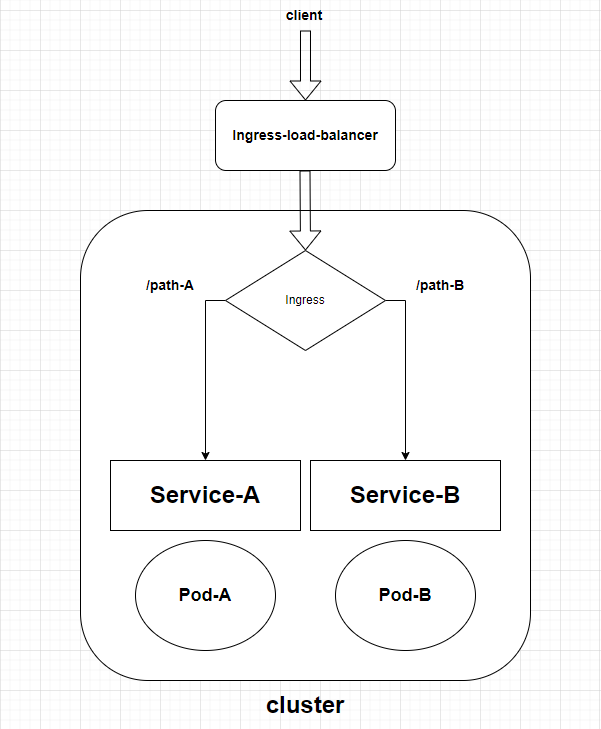

# ingress

建立service後，我們可以透過`ClusterIP`、`NodePort`、`LoadBalancer`來存取`Pod`。但是這些方式都是透過`IP`或`Port`來存取，對於使用者來說不太友好，而且當service的數量增加時，管理成本會越來越高，例如為了達到負載平衡而在每個service前面加上一個`LoadBalancer`，相當耗費金錢與資源。

如果說，我們能在nodec或cluster上建立一個**統一的入口**，並設定好**路由**規則，當使用者使用URL存取時就能將流量導向正確的service，這樣使用者只需要知道URL就能存取到服務。

這樣「各個service的統一入口」，就是`Ingress`。

除此之外，`Ingress`還有以下幾個功能:

 * **load balancing** : 將流量分散到不同的service上

  * **SSL termination** : 支援SSL，這樣使用者就能透過`https`存取服務，並且對於憑證的管理也會更加統一且方便。

我們用一張圖來看看「`Ingress`搭配load balancing功能，再轉發流量給service」的概念:

## Ingress controller

不過，`Ingress`只是一個抽象的規則，要讓`Ingress`生效，我們還需要一個`Ingress controller`。

`Ingress`制定的規則如果沒有`Ingress controller`來執行與控制，其實有跟沒有一樣(規則不會生效)。為了達成`Ingress`的目的，`Ingress controller`會透過kube-apiserver來監聽service與pod的變化，這樣才能根據`Ingress`的規則來做流量的轉發。

而`Ingress controller`有很多種，可以參考[官方文件](https://kubernetes.io/docs/concepts/services-networking/ingress-controllers/#additional-controllers)

## Ingress 實作

底下將透過實作來說明`Ingress`的設定方式，本次實作的目的如下:

 * 
https://kubernetes.io/docs/concepts/services-networking/ingress/

Now, in k8s version 1.20+ we can create an Ingress resource from the imperative way like this:-

Format - kubectl create ingress <ingress-name> --rule="host/path=service:port"

Example - kubectl create ingress ingress-test --rule="wear.my-online-store.com/wear*=wear-service:80"

Find more information and examples in the below reference link:-

https://kubernetes.io/docs/reference/generated/kubectl/kubectl-commands#-em-ingress-em-

References:-

https://kubernetes.io/docs/concepts/services-networking/ingress

https://kubernetes.io/docs/concepts/services-networking/ingress/#path-types

https://tsunghsien.gitbooks.io/kubenetes/content/ingresspei-zhi.html

## Ingress controller :
https://www.udemy.com/course/certified-kubernetes-administrator-with-practice-tests/learn/lecture/21738990#overview

## Ingress - Annotations and rewrite-target

解釋:
https://www.udemy.com/course/certified-kubernetes-administrator-with-practice-tests/learn/lecture/16827080#overview

controlplane ~ ➜  k logs -n critical-space services/pay-service 
 * Serving Flask app 'app' (lazy loading)
 * Environment: production
   WARNING: This is a development server. Do not use it in a production deployment.
   Use a production WSGI server instead.
 * Debug mode: off
 * Running on all addresses.
   WARNING: This is a development server. Do not use it in a production deployment.
 * Running on http://10.244.0.11:8080/ (Press CTRL+C to quit)
10.244.0.9 - - [27/Mar/2024 06:00:55] "GET /pay HTTP/1.1" 404 - # 沒加annotations
10.244.0.9 - - [27/Mar/2024 06:03:45] "GET / HTTP/1.1" 200 - # 加了annotations