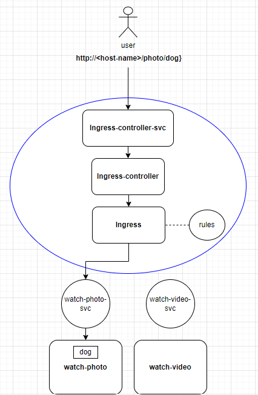

# ingress

建立service後，我們就可以透過`ClusterIP`、`NodePort`、`LoadBalancer`等方式來存取`Pod`。以下為一個簡單的例子:

* 目前總共有兩個deployments，負責提供圖片或影片讓使用者觀賞:
  1. `watch-photo`: 可以觀賞圖片
  2. `watch-video`: 可以觀賞影片

* 為了讓使用者能夠存取，並希望每個deployment的pod達到附載平衡，因此我們在每個deployment上都配置了一個load balancer的service:
  1. `watch-photo-svc`: 10.0.0.1:80
  2. `watch-video-svc`: 10.0.0.2:80

如果使用者想要「看dog的圖片」，情況如下圖:


這樣的配置有以下缺點:

  * **造成使用者的不便**: 如上圖所示，使用者需知道service的IP與Port才能存取服務。如果未來service的數量增加，就等於要求使用者記住更多的IP與Port，強人所難。

  * **load balancer成本問題**: 每個service前面都要加上一個load balancer，而load balancer是需要花錢的，如果service的數量增加，成本也會增加。

要改善上面的缺點，我們設計出以下路由規則:

看圖片: 
  * **/watch-photo**: watch-photo的首頁(index.html)
  * **/watch-photo/\<file-path>**: watch-photo提供的圖片 (ex. /watch-photo/dog)

看影片:
  * **/watch-video**: watch-video的首頁(index.html)
  * **/watch-video/\<file-path>**: watch-video提供的影片 (ex. /watch-video/movie)   


而**設定路由規則**，就是`Ingress`的主要功能。

不過，如果要讓`Ingress`生效，我們還需要`Ingress controller`。

## Ingress controller

`Ingress controller`有很多種，每種各有其特色與功能，可以參考[官方文件](https://kubernetes.io/docs/concepts/services-networking/ingress-controllers/#additional-controllers)的列表進行選擇。

在一個cluster中可以同時存在多種`Ingress controller`，每種`Ingress controller`都有所屬的`Ingress class`與自己的service，兩者的功能如下:

* **Ingress class**

  前面提到，`Ingress`制定需要`Ingress controller`來執行才能生效，所以我們在設定`Ingress`時必須透過設定`Ingress class`來指定要使用哪一個`Ingress controller`。所以當哪天想要換其他的`Ingress controller`來執行相同的路由規則時，只需修改`Ingress`的`Ingress class`即可。

* **Ingress controller的service**

  當Ingress與Ingress controller建立起連繫後，使用者要透過domain name存取pod時，流程如下:
  
  1. 先經過`Ingress controller`的service抵達`Ingress controller`
  
  2. `Ingress controller`查找相對應的`Ingress`路由規則
  
  3. 流量從路由規則來到正確的service，最終到達提供服務的pod。

而為了達成`Ingress`所制定的規則，`Ingress controller`會透過kube-apiserver來監聽service與pod的變化，這樣才能根據`Ingress`的規則來做流量轉發。

> 因為需要與kube-apiserver溝通，所以在安裝Ingress controller時通常會設定RBAC (等下的安裝過程中可以自行留意一下)

除了讓`Ingress`生效外，`Ingress controller`還有其他的功能，常見的有:

  * load balancing : 附載平衡(解決了開頭提到的「load balancer成本問題」)
  * SSL termination : 支援SSL，這樣使用者就能透過https存取服務，並且對於憑證的管理也會更加統一且方便。

一下講了這麼多名詞，這裡一樣用「使用者想看圖片」的圖示來說明一下整個流程:


> 藍色的圓圈即ingress class

接著，我們來實際安裝`Ingress controller`。

### 安裝Ingress controller

> 以下選用「[Ingress-Nginx Controller](https://kubernetes.github.io/ingress-nginx/deploy/#quick-start)」作為範例

* 安裝Ingress-Nginx Controller:
```bash
kubectl apply -f https://raw.githubusercontent.com/kubernetes/ingress-nginx/controller-v1.10.0/deploy/static/provider/cloud/deploy.yaml
```

* 確認一下是否有成功安裝並執行:
```bash
kubectl get pods --namespace=ingress-nginx
```
```bash
# 應該要看到以下的輸出:
NAME                                        READY   STATUS      RESTARTS   AGE
ingress-nginx-admission-create-httbh        0/1     Completed   0          17m
ingress-nginx-admission-patch-ztmmr         0/1     Completed   1          17m
ingress-nginx-controller-7dcdbcff84-wl484   1/1     Running     0          17m
```

> 重點是`ingress-nginx-controller`這個pod有跑起來就好。

* 最後，將「default ingress class」設定為`nginx`:
```bash
kubectl edit ingressclass nginx
```
```yaml
# 修改如下:
apiVersion: networking.k8s.io/v1
kind: IngressClass
metadata:
  annotations:
    ingressclass.kubernetes.io/is-default-class: "true" # 加入這個annotation
...
...(省略)...
```

> 上面的操作是將「nginx」設定為預設的Ingress class，若設定ingress時沒有指定ingress class，就會使用預設。

---

**補充: 關於ingress-nginx-admission**

上面的輸出中那兩個completed的pod，他們的任務是建立`ingress-admission`。

admission是nginx-ingress-controller的一個webhook插件，每當有新的ingress被創建或更新時，會交由admission會檢查ingress的規則是否符合規則，整個流程如下

`ingress創建or更新`  --> `admission檢查`  -->  `符合規則`  -->  `controller執行`

* `admission`是以service的方式存在於cluster中，我們可以從下面指令的輸出中看到admission與contrller的關係:

```bash
kubectl describe svc -n ingress-nginx ingress-nginx-controller-admission | grep -i endpoint
# output: Endpoints:         192.168.1.6:8443
# 表示該service連結到的pod的IP為192.168.1.6
```
```bash
kubectl get po -n ingress-nginx ingress-nginx-controller-7dcdbcff84-wl484 -o wide | awk '{print $6}' 
# output:
# IP
# 192.168.1.6
```
> 其他關於admission與整個ingress-nginx-controller的運作原理，可參考[官方文件](https://kubernetes.github.io/ingress-nginx/how-it-works/)

***

## Ingress 實作-1

底下將透過實作來說明`Ingress`的設定方式，本次實作的目的如下:

> 嘗試實做上面情境中的「watch」業務，不過我們先嘗試最簡單的Ingress設定(不設定host-name)，熟練後再設定較複雜的。

  * 首先，建立一個pod來模擬使用者:
```bash
kubectl run user --image=nginx
```

  * 然後再建立兩個提供「watch」業務的pod與它們的service:
```bash
kubectl run watch-photo --image=nginx --port=80
kubectl run watch-video --image=nginx --port=80
kubectl expose pod watch-photo --port=80 --name=watch-photo-svc
kubectl expose pod watch-video --port=80 --name=watch-video-svc
```

  * 自訂一下index.html，這樣測試`Ingress`時比較好看出效果:
```bash
echo "Home page of watch-photo" > watch-photo.html
echo "Home page of watch-video" > watch-video.html
kubectl cp watch-photo.html watch-photo:/usr/share/nginx/html/index.html
kubectl cp watch-video.html watch-video:/usr/share/nginx/html/index.html
```

  * 查看一下pod的IP，等一下檢查`Ingress`的狀態時會用到:
```bash
kubectl get po watch-photo watch-video -o wide
```
```bash
# 輸出如下
NAME          READY   STATUS    RESTARTS   AGE   IP            NODE     NOMINATED NODE   READINESS GATES
watch-photo   1/1     Running   0          61s   192.168.1.8   node01   <none>           <none>
watch-video   1/1     Running   0          61s   192.168.1.9   node01   <none>           <none>
```

  * 接著，我們建立`Ingress`:
```yaml
apiVersion: networking.k8s.io/v1
kind: Ingress
metadata:
  name: ingress-watch
  annotations:
    nginx.ingress.kubernetes.io/rewrite-target: /
spec:
  rules:
  - http:
      paths:
      - path: /photo
        pathType: Prefix
        backend:
          service:
            name: watch-photo-svc
            port:
              number: 80
      - path: /video
        pathType: Prefix
        backend:
          service:
            name: watch-video-svc
            port: 
              number: 80
```
**重要欄位說明**

* `annotations`: 這裡加入了`nginx.ingress.kubernetes.io/rewrite-target: /`，作用稍後會說明。

* `spec.rules`: 設定了兩個http路由規則:
  1. /watch-photo: 導向`watch-photo-svc`的80 port
  2. /watch-video: 導向`watch-video-svc`的80 port

* `pathType`: 有三種選項 
  1. Exact: 比對path是否**完全**相同(ex. /foo 不匹配 /foo/)
  2. Prefix: 比對path的前綴(ex. /aaa/bbb 匹配 /aaa/bbb/ccc)
  3. ImplementationSpecific: 由Ingress controller自行決定要選Exact或Prefix


> 我們也可以透過kubectl來建立相同的`Ingress`:
>>```bash
>>kubectl create ingress ingress-watch --rule='/watch-photo=watch-photo-svc:80' --rule='/watch-video=watch-video-svc:80' --annotation='nginx.ingress.kubernetes.io/rewrite-target=/'
>>```

  * 部署`Ingress`後查看一下情況:
```bash
kubectl apply -f ingress-watch.yaml
kubectl describe ingress ingress-watch
```
```bash
# 輸出如下
Name:             ingress-watch
Labels:           <none>
Namespace:        default
Address:          
Ingress Class:    nginx # 上面沒指定ingress class，所以使用預設
Default backend:  <default>
Rules:
  Host        Path  Backends
  ----        ----  --------
  *           
              /watch-photo   watch-photo-svc:80 (192.168.1.8:80) # 對應到watch-photo的pod
              /watch-video   watch-video-svc:80 (192.168.1.9:80) # 對應到watch-video的pod
Annotations:  nginx.ingress.kubernetes.io/rewrite-target: /
Events:
  Type    Reason  Age   From                      Message
  ----    ------  ----  ----                      -------
  Normal  Sync    7s    nginx-ingress-controller  Scheduled for sync
```

---
**測試Ingress效果**

  * 如果還記得上面的圖片，user必須透過`Ingress controller`的service來存取`Ingress`，所以我們先來查看一下:

```bash
kubectl get svc -n ingress-nginx ingress-nginx-controller
```
```bash
NAME                       TYPE           CLUSTER-IP      EXTERNAL-IP   PORT(S)                      AGE
ingress-nginx-controller   LoadBalancer   10.96.149.113   <pending>     80:32176/TCP,443:31588/TCP   5m58s
```
> 可以看到cluster IP為10.96.149.113，但你看到的clusterIP可能會不一樣，為了等下方便測試，先將clusterIP存放於變數中:

```bash
export clusterIP=$(kubectl get svc -n ingress-nginx ingress-nginx-controller -o jsonpath='{.spec.clusterIP}')
```

  * 接著我們模擬user嘗試存取兩個服務的首頁(index.html):
```bash
kubectl exec -it user -- curl http://${clusterIP}/photo && curl http://${clusterIP}/video
```
```bash
# 成功的輸出如下:
Home page of watch-photo
Home page of watch-video
```

  * 以上的存取紀錄也可以在各自service的log中看到，例如:
```bash
kubectl logs svc/watch-video-svc | grep "GET"
```
```bash
# 輸出如下
192.168.1.6 - - [25/Apr/2024:09:52:19 +0000] "GET / HTTP/1.1" 200 25 "-" "curl/7.68.0" "192.168.0.0"
```

***

以上就是相當簡單的`Ingress`測試，等下我們再來試試不同的`Ingress`功能。不過在此之前，先來填坑: 到底「nginx.ingress.kubernetes.io/rewrite-target: /」這個annotation是什麼意思?

### Annotation: Rewrite-target
---
  * 我們直接註解掉這個annotation，看看沒有它會有甚麼區別:
```bash
vim ingress-watch.yaml
```
```yaml
apiVersion: networking.k8s.io/v1
kind: Ingress
metadata:
  name: ingress-nginx
  # annotations:
    # nginx.ingress.kubernetes.io/rewrite-target: /
...
...(省略)...
```

  * 部署後我們再次測試一下:
```bash
kubectl apply -f ingress-watch.yaml
kubectl exec -it user -- curl http://${clusterIP}/photo && curl http://${clusterIP}/video
# 結果系統丟回來「404 Not Found」!
```

  * 我們找找service的log，看看是什麼原因:
```bash
kubectl logs svc/watch-photo-svc | grep "error"
```
```text
2024/04/25 11:54:12 [error] 28#28: *2 open() "/usr/share/nginx/html/photo" failed (2: No such file or directory), client: 192.168.1.6, server: localhost, request: "GET /photo HTTP/1.1", host: "10.103.62.152"
```
> 上述的錯誤主要是因為找不到`/usr/share/nginx/html/watch-photo`這個檔案(No such file or directory)

在解釋為何傳回404之前，這裡先補充一下URL的結構:
```text
[Protocol]://[host]/[file-path]
```
以我們的例子「http://localhost:30906/watch-photo」來說:
  * **Protocol**: `傳輸協定`，這裡走http
  * **host**: 可以是主機的`IP`或`domain name`，這裡是localhost(本機的domain name)，最後加上port 30906
  * **file-path**: 想要存取的`檔案路徑`，這裡是watch-photo

所以當我們沒有加上rewrite-target的annotation時，user在curl中的URL會被轉換成以下URL:

  ( 原本的URL --> 經ingress轉到的service --> service的pod )

* `http://${clusterIP}/photo` -> `http://watch-photo-svc:80/photo` -> http://192.168.1.8:80/photo

由於提供服務的pod都基於nginx，所以pod會預設你想存取的檔案路徑位於`/usr/share/nginx/html/`之下，所以它會去找`/usr/share/nginx/html/photo`這個檔案路徑，但這個檔案並不存在，所以才會丟出404。

* 先暫時不要修改ingress，我們來驗證一下上面的說法:

```bash
kubectl exec -it watch-photo -- mv /usr/share/nginx/html/index.html /usr/share/nginx/html/photo
kubectl exec -it user -- curl http://${clusterIP}/photo
# output: Home page of watch-photo
```
> 我們將watch-photo的index.html改名為watch-photo，這樣pod才找的到「/usr/share/nginx/html/watch-photo」，才能丟出正確的回應。

不過這樣的設定方式並不正統，我們還是希望使用index.html作為預設首頁。

因此，我們希望user輸入URL中的**file-path**會被「改寫」成 **"/"**，這樣當pod收到流量時就會認為使用者並沒有指定任何路徑，所以預設會去找/usr/share/nginx/html/index.html:

  ( 原本的URL --> 經ingress轉到的service --> service的pod )

* `http://${clusterIP}/photo` -> `http://watch-photo-svc:80/` -> http://192.168.1.7:80/ 

>　所以「`nginx.ingress.kubernetes.io/rewrite-target: /`」的作用就是將ingress定義的rule.paths.path改寫成「/」，

我們將ingress重新加回annotation，並且再次測試一下:

* 先復原剛才watch-photo的index.html
```bash
kubectl exec -it watch-photo -- mv /usr/share/nginx/html/photo /usr/share/nginx/html/index.html
```

* 修改ingress，把annotation的註解拿掉
```bash
vim ingress-watch.yaml
```
```yaml
apiVersion: networking.k8s.io/v1
kind: Ingress
metadata:
  name: ingress-nginx
  annotations:
    nginx.ingress.kubernetes.io/rewrite-target: /
...
...(省略)...
```

* 部署ingress後再次測試:
```bash
kubectl apply -f ingress-watch.yaml
kubectl exec -it user -- curl http://${clusterIP}/photo && curl http://${clusterIP}/video
# output: Home page of watch-photo
#         Home page of watch-video
```

另外，ingress規則中path的設定與rewrite-target可以搭配**正規表達式(Regular Expressionr)**，我們來看一個例子:

---

**情境**

> watch-photo與watch-video的路徑配置，讓user可以造訪首頁或其他內容:

1. watch-photo:
    * 首頁: /usr/share/nginx/html/index.html
    * 圖片: /usr/share/nginx/html/dog

2. watch-video:
    * 首頁: /usr/share/nginx/html/index.html
    * 影片: /usr/share/nginx/html/movie
***

* 來重新設計一下ingress的規則:
```bash
vim ingress-watch.yaml
```

```yaml
apiVersion: networking.k8s.io/v1
kind: Ingress
metadata:
  name: ingress-watch
  annotations:
    nginx.ingress.kubernetes.io/rewrite-target: /$2
spec:
  rules:
  - http:
      paths:
      - path: /photo(/|$)(.*)
        pathType: ImplementationSpecific
        backend:
          service:
            name: watch-photo-svc
            port:
              number: 80
      - path: /video(/|$)(.*)
        pathType: ImplementationSpecific
        backend:
          service:
            name: watch-video-svc
            port: 
              number: 80
```
---
**解釋**

> 如果不熟悉正規表達式(regex)，可先自行了解一下，或參考[這裡](https://blog.jiatool.com/posts/vscode_regex/)


我們以`/photo(/|$)(.*)`為例來解釋:

  * /watch-photo(/|$)(.*) 設定了三個regex群組:

    1. (/|$): 代表「/photo」後面可以直接接「/」或是直接結束
    2. (.*) : 代表「/photo/」後面可以接任何字元

在rewrite-target中的`/$2`，代表將path中的第二個regex群組的字元取出來，例如當user輸入:

    (  原本的URL   ->   經ingress轉到的service  )
  * 造訪首頁: http://${clusterIP}/photo -> http://watch-photo-svc:80/
  * 造訪內容: http://${clusterIP}/photo/dog -> http://watch-photo-svc:80/dog
***

* 配置好ingress後，我們先將兩個服務的內容準備好:

```bash
kubectl apply -f ingress-watch.yaml
echo "dog" > dog.txt
echo "movie" > movie.txt
kubectl cp dog.txt watch-photo:/usr/share/nginx/html/dog
kubectl cp movie.txt watch-video:/usr/share/nginx/html/movie
```

* 測試一下首頁:
```bash
kubectl exec -it user -- curl http://${clusterIP}/photo && curl http://${clusterIP}/video
```
成功的輸出如下:
```text
Home page of watch-photo
Home page of watch-video
```

* 測試一下內容:
```bash
kubectl exec -it user -- curl http://${clusterIP}/photo/dog && curl http://${clusterIP}/video/movie
```
成功的輸出如下:
```text
dog
movie
```

> 這樣是否能比較清楚rewirte-target的作用呢? 可以試著自己使用其他的regex來設定ingress的path，看看效果如何。

## Ingress 實作-2

不過上面ingress的設定還是有問題，例如:

以我們的角度來說，ingress controller的service就是提供服務的host，但因為沒有設定host name，所以使用者需要知道該host的IP才能存取服務，這樣的設計根本沒有解決在文章開頭提到的問題。

所以較為理想的情況是使用者用DNS就可以存取到host，我們來嘗試模擬一下:

> 假設host的domain name為`watch-photo-n-video.com`:

 * 我們用user的/etc/hosts來模擬DNS，設定好後測試是否連得到首頁:
```bash
# 10.100.51.11為ingress controller的service ClusterIP
kubectl exec -it user -- echo "${clusterIP}  watch-photo-n-video.com" >> /etc/hosts && curl http://watch-photo-n-video.com/photo
# 成功: Home page of watch-photo
```

雖然這樣成功解決了user的不便，但是還有一個問題:

* 假設今天有另一個domain name指定到相同的ingress controller service:
```bash
kubectl exec -it user -- echo "${clusterIP}  just-photo-only.com" >> /etc/hosts && curl http://just-photo-only.com/photo
# 成功: Home page of watch-photo
```

可以發先依然存取的到watch-photo的首頁，這樣就會造成不同的domain name存取到相同的服務，這樣的設計是顯然是不合理的。

要修正這個問題，我們得在ingress中加入「host」的設定，告訴ingress controller**只有**這個domain name就是我們的host:

```bash
apiVersion: networking.k8s.io/v1
kind: Ingress
metadata:
  name: ingress-watch
  annotations:
    nginx.ingress.kubernetes.io/rewrite-target: /$2
spec:
  rules:
  - host: "watch-photo-n-video.com" # 加入host欄位，設定domain name
    http:
      paths:
      - path: /watch-photo(/|$)(.*)
        pathType: ImplementationSpecific
        backend:
          service:
            name: watch-photo-svc
            port:
              number: 80
      - path: /watch-video(/|$)(.*)
        pathType: ImplementationSpecific
        backend:
          service:
            name: watch-video-svc
            port: 
              number: 80
```

部署ingress後，測試一下正確的domain name:
```bash
kubectl apply -f ingress-watch.yaml
kubectl exec -it user -- echo "${clusterIP}  watch-photo-n-video.com" >> /etc/hosts && curl http://watch-photo-n-video.com/photo
# 成功: Home page of watch-photo
```

再次測試錯誤的domain name:
```bash
kubectl exec -it user -- echo "${clusterIP}  just-photo-only.com" >> /etc/hosts && curl http://just-photo-only.com/photo
# 失敗: 404 Not Found
```

以上就是ingress的介紹，假如今天我們多了另一些業務，例如buy-clothes與buy-shoes，該如何設定ingress呢? 可以自行嘗試看看。