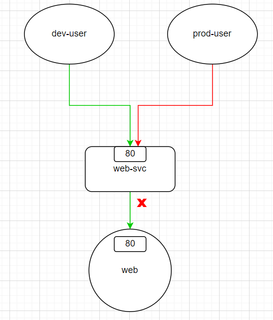
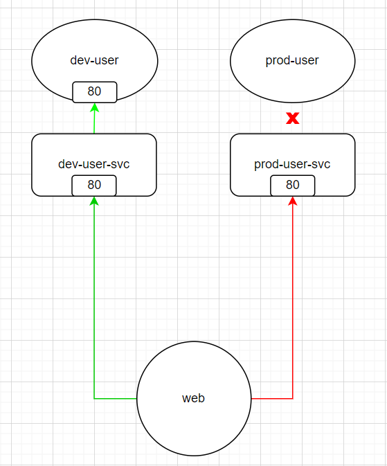

# Network Policy

前面介紹了k8s是如何實作cluster的內部網路，讓cluster中的pod可以互相通訊。不過這樣的設計在某些情況下可能會有安全上的疑慮或是效能上的問題，那麼今天就來講講該如何透過`Network Policy`來管理這些網路流量。

## Network Policy的基本概念

你有一個資料庫以pod的形式跑在cluster中，裡面存放了一些敏感資料，但是由於預設上pod會對所有網路流量開放，這樣的設計就有可能讓資料庫受到攻擊，或是因為收到太多的存取而導致效能下降。

於是你可能就會想制定一些規則，例如「只有特定的pod才能存取資料庫」、「資料庫只能提供資料給特定的pod」等等。

而這就是`Network Policy`的用途: 「針對**pod**流量的進出進行管理」。

`Network Policy`可以針對以下三種傳輸協定(Protocol)來設定規則:
  
  * TCP
  * UDP
  * SCTP

`Network Policy`可設定的規則分為兩大類:

  * **egress**: 控制pod對外的網路流量 (可以出去連到誰?)
    
    預設上，pod可以對外連到任何地方，在`network policy`中設定`egress`清單後，pod只能連到清單中指定的對象。
    
  * **ingress**: 控制外部對pod的網路流量 (誰可以連進來?)

    預設上，任何pod都可以連進來，在`network policy`中設定`ingress`清單後，只有清單中指定的對象可以連到你的pod。

而這些規則適用的「對象」有:

  * **Pod**: 使用`podSelector`指定

  * **Namespace**: 使用`namespaceSelector`指定，意指「對該namespace下的所有pod生效」

  * **IP Block**: 使用`ipBlock`指定，意指「對特定的IP範圍(CIDR)生效」。(通常會設定為cluster**外部**的IP，因為pod的IP是短暫與隨機的)

最後，要讓`Network Policy`生效，需要在cluster中安裝支援`Network Policy`的CNI。

> 支援`Network Policy`的CNI有很多，例如`Calico`、`Cilium`、`Weave Net`等等。不支援的CNI則例如`Flannel`。

---
**問題**

**Q**: 假設我設定了egress或ingress，需要為該流量的response設定相對應的規則嗎? 例如我設定了「pod A」能連進來「資料庫」(ingress)，那麼「資料庫」對「pod A」response的流量是否需要設定egress?

**A**: 不需要。不論是egress或ingress，k8s會自動幫你處理這些response的流量，不需要另外設定規則。

**Q**: 假設「pod A」設定了到資料庫的egress，但是資料庫沒有設定對「pod A」的ingress，這樣「pod A」的請求會成功嗎?

**A**: 不會。`Network Policy`是雙向的，如果你設定了egress，那麼對應的ingress也要設定，不然就不要設定ingress(開放所有流量近來。)
***

## 範例 - Ingess

在開始範例之前，我們先布置一個簡單的環境:

  * 建立兩個namespace: `dev`與`prod`
```bash
kubectl create ns dev
kubectl label ns dev env=dev
kubectl create ns prod
kubectl label ns prod env=prod
```

  * 在`dev`與`prod`各建立一個pod，做為測試用的「使用者」
```bash
kubectl run dev-user --namespace=dev --image=nginx --labels="role=dev-user" --port=80
kubectl expose pod dev-user --namespace=dev --port=80 --name=dev-user-svc
kubectl run prod-user --namespace=prod --image=nginx --labels="role=prod-user" --port=80
kubectl expose pod prod-user --namespace=prod --port=80 --name=prod-user-svc
```

  * 等`dev-user`與`prod-user` pod建立完成後，自訂一下index.html，讓測試效果明顯一點:
```bash
echo "Hello, this is dev-user" > index.html
kubectl cp -n dev index.html dev-user:/usr/share/nginx/html/index.html 
echo "Hello, this is prod-user" > index.html
kubectl cp -n prod index.html prod-user:/usr/share/nginx/html/index.html
```

  * 在`default` namespace建立一個pod，做為測試用的「網站」:
```bash
kubectl run web --image=nginx --port=80 --labels="role=web"
kubectl expose pod web --port=80 --name=web-svc
```

  * 等web pod建立完成後，同樣自訂一下index.html:
```bash
echo "Hello, this is web" > index.html
kubectl cp index.html web:/usr/share/nginx/html/index.html
```

這樣事前準備就建置好了。我們先測試一下在沒有`Network Policy`的情況下，`dev-user`與`prod-user`是否可以連到`web` pod:

* dev-user:
```bash
kubectl exec -it dev-user --namespace=dev -- curl web-svc.default --max-time 1
```

* prod-user:
```bash
kubectl exec -it prod-user --namespace=prod -- curl web-svc.default --max-time 1
```

兩者都存取的到`web` :
```yaml
# output
Hello, this is web
```

而`web`也可以連到`dev-user`與`prod-user`:

* 連到dev-user:
```bash
kubectl exec -it web -- curl dev-user-svc.dev --max-time 1
```
```yaml
# output
Hello, this is dev-user
```

* 連到prod-user:
```bash
kubectl exec -it web -- curl prod-user-svc.prod --max-time 1
```
```yaml
# output
Hello, this is prod-user
```

而我們的目標是: 只有`dev-user`可以走TCP的80 port連到`web`，而`prod-user`不行，如下圖:



因此我們設計了以下的`Network Policy`:
```yaml
apiVersion: networking.k8s.io/v1
kind: NetworkPolicy
metadata:
  name: web-policy
  namespace: default
spec:
  podSelector:
    matchLabels:
      role: web
  policyTypes:
  - Ingress
  ingress:
  - from:
    - podSelector:
        matchLabels:
          role: dev-user
      namespaceSelector:
        matchLabels:
          env: dev
    ports:
    - protocol: TCP
      port: 80
```

---
**重點欄位解釋**

* metadata:
  * **namespace**: 設定`Network Policy`生效的namespace

* spec:
  * **podSelector**: 設定`Network Policy`生效的**對象**，這裡是label為`role=web`的pod。所以結合上面的metadata.namespace，這個`Network Policy`會對「`default` namespace之下，所有label為`role=web`的pod」生效。

  * **policyTypes**: 指定`Network Policy`的規則類型，可設定為`Ingress`或`Egress`。


  * **ingress**:
    * **from**: 列出「誰可以連進來(**白名單**)」，這裡是「在label為`env=dev`的namespace之下，所有label為`role:dev-user`的pod」可以連進來。
    
    * **ports**: 允許「**白名單**」內的pod經由TCP的80 port連到「`default` namespace之下，所有label為`role=web`的pod」
  
---
**注意**

在上面範例中，若spec.ingress.from設定為:

```yaml
...
  ingress:
  - from:
    - podSelector:
        matchLabels:
          role: dev-user
    - namespaceSelector:
        matchLabels:
          env: dev
    ports:
    - protocol: TCP
      port: 80
...
```
這裡的設定與上面的範例看起來很像，但是意義卻截然不同:
  * **範例設定**: 只有「在label為`env=dev`的namespace之下，所有label為`role:dev-user`的pod」可以連進來。 (只有一個陣列元素)

  * **這裡的設定**: 只有「在`default` namespace之下，所有label為`role:dev-user`的pod」**或**「在label為`env=dev`之下的所有pod」可以連進來。 (有兩個陣列元素)

***

設定好`Network Policy`後，我們來測試一下`dev-user`與`prod-user`是否可以連到`web`:


* 部署`Network Policy`:
```bash
kubectl apply -f web-policy.yaml
```

* 查看一下`Network Policy`的設定情況:
```bash
kubectl describe networkpolicy web-policy
```
```text
Name:         web-policy
Namespace:    default
Created on:   2024-04-30 08:18:08 +0000 UTC
Labels:       <none>
Annotations:  <none>
Spec:
  PodSelector:     role=web
  Allowing ingress traffic:
    To Port: 80/TCP
    From:
      NamespaceSelector: env=dev
      PodSelector: role=dev-user
  Not affecting egress traffic
  Policy Types: Ingress
```
> 用describe看Network Policy的設定會清楚許多。

* 來測試一下`dev-user`是否可以連到`web`:
```bash
kubectl exec -it dev-user --namespace=dev -- curl web-svc.default --max-time 1
```

```yaml
# output
Hello, this is web
```

* 再來測試一下`prod-user`:
```bash
kubectl exec -it prod-user --namespace=prod -- curl web-svc.default --max-time 1
```
```yaml
# output
curl: (28) Connection timed out after 1000 milliseconds
command terminated with exit code 28
```
`prod-user`執行curl後，卻無法連到`web`，符合上面`Network Policy`的設定。

## 範例 - Egress

接下來我們來看看`Egress`的例子:

保留原本ingress的設定，並且讓`web`只**能對**外走 80/TCP 連到`prod-user`，但不能連到`dev-user`，如下圖:



* 修改一下剛才的`Network Policy`:
```yaml
apiVersion: networking.k8s.io/v1
kind: NetworkPolicy
metadata:
  name: web-policy
  namespace: default
spec:
  podSelector:
    matchLabels:
      role: web
  policyTypes:
  - Ingress
  - Egress
  ingress:
  - from:
    - podSelector:
        matchLabels:
          role: dev-user
      namespaceSelector:
        matchLabels:
          env: dev
    ports:
    - protocol: TCP
      port: 80
  egress:
  - to:
    - podSelector:
        matchLabels:
          role: prod-user
      namespaceSelector:
        matchLabels:
          env: prod
    ports:
    - protocol: TCP
      port: 80
```

> 其實設定起來和`Ingress`差不多，不過要把`from`換成`to`，同樣在底下設定「白名單」。

* 部署修改後的`Network Policy`:
```bash
kubectl apply -f web-policy.yaml
```

* 查看一下`Network Policy`的設定情況:
```bash
kubectl describe networkpolicy web-policy
```
```text
Name:         web-policy
Namespace:    default
Created on:   2024-04-30 11:25:53 +0000 UTC
Labels:       <none>
Annotations:  <none>
Spec:
  PodSelector:     role=web
  Allowing ingress traffic:
    To Port: 80/TCP
    From:
      NamespaceSelector: env=dev
      PodSelector: role=dev-user
  Allowing egress traffic:
    To Port: 80/TCP
    To:
      NamespaceSelector: env=prod
      PodSelector: role=prod-user
  Policy Types: Ingress, Egress
```

* 來測試一下`web`是否可以連到`prod-user`:
```bash
kubectl exec -it web -- curl prod-user-svc.prod --max-time 1
```
```yaml
# output
curl: (28) Resolving timed out after 1000 milliseconds
command terminated with exit code 28
```
> 竟然行不通! 為甚麼呢?

原因是，我們在curl中用prod-user-svc的**domain name**去呼叫服務，要使用domain name則需要cluster中的coreDNS來解析，而coreDNS位於`kube-system` namespace下，但我們的`Network Policy`並沒有設定允許`web` pod連到`kube-system` namespace，所以才會測試失敗。

* 既然無法解析domain name，我們改用prod-user-svc的**IP**去嘗試看看:
```bash
prod_svc_ip=$(kubectl get svc prod-user-svc -o jsonpath="{.spec.clusterIP}" -n prod)
kubectl exec -it web -- curl $prod_svc_ip --max-time 1
```
```yaml
# output
Hello, this is prod-user
```

另外，我們也可以將`Network Policy`修改一下，讓`web`可以連到`kube-system` namespace下的所有pod，藉此來解決coreDNS的問題:

* 查看一下kube-system namespace的label:
```bash
kubectl get ns kube-system --show-labels
```
```text
NAME          STATUS   AGE   LABELS
kube-system   Active   18d   kubernetes.io/metadata.name=kube-system
```

* 查看kube-dns走的port與protocol:
```bash
kubectl get svc kube-dns -n kube-system
```
```text
NAME       TYPE        CLUSTER-IP   EXTERNAL-IP   PORT(S)                  AGE
kube-dns   ClusterIP   10.96.0.10   <none>        53/UDP,53/TCP,9153/TCP   18d
```

* 將`Network Policy`修改一下，允許「`web` pod經由 53/UDP 連到`kube-system` namespace的所有pod」:

```yaml
apiVersion: networking.k8s.io/v1
kind: NetworkPolicy
metadata:
  name: web-policy
  namespace: default
spec:
  podSelector:
    matchLabels:
      role: web
  policyTypes:
  - Ingress
  - Egress
  ingress:
  - from:
    - podSelector:
        matchLabels:
          role: dev-user
      namespaceSelector:
        matchLabels:
          env: dev
    ports:
    - protocol: TCP
      port: 80
  egress:
  - to:
    - podSelector:
        matchLabels:
          role: prod-user
      namespaceSelector:
        matchLabels:
          env: prod
    - namespaceSelector: 
        matchLabels:
          kubernetes.io/metadata.name: kube-system
    ports:
    - protocol: TCP
      port: 80
    - protocol: UDP
      port: 53
```

* 重新部署修改後的`Network Policy`:
```bash
kubectl apply -f web-policy.yaml
```

* 再次測試`web`是否可以連到`prod-user`:
```bash
kubectl exec -it web -- curl prod-user-svc.prod --max-time 1
```
```yaml
# 成功!
Hello, this is prod-user
```

* 測試看看`web`是否可以連到`dev-user`:
```bash
kubectl exec -it web -- curl dev-user-svc.dev --max-time 1
```
```text
curl: (28) Connection timed out after 1000 milliseconds
command terminated with exit code 2
```

果然連不到，和我們在`Network Policy`中設定的一樣。

## 範例 - matchExpressions

如果今天我們想讓`web` pod可以對外走 80/TCP 連到`prod`與`dev` namespace下的所有pod，在設定規則時可以用兩個`namespaceSelector`來達成，不過這樣的設定會讓`Network Policy`變得冗長且沒彈性。

這時候可以使用`matchExpressions`來簡化設定:

* 刪掉`Ingress`的規則，並且修改`Egress`，讓`web` pod可以對外走 80/TCP 與 53/UDP 連到`prod`、`dev`、`kube-system` namespace下的所有pod

```yaml
apiVersion: networking.k8s.io/v1
kind: NetworkPolicy
metadata:
  name: web-policy
  namespace: default
spec:
  podSelector:
    matchLabels:
      role: web
  policyTypes:
  - Egress
  egress:
  - to:
    - namespaceSelector:
        matchExpressions:
        - key: env
          operator: In
          values: ["dev", "prod"]
    - namespaceSelector:
        matchExpressions:
        - key: kubernetes.io/metadata.name
          operator: In
          values: ["kube-system"]
    ports:
    - protocol: TCP
      port: 80
    - protocol: UDP
      port: 53
```

* 重新部署修改後的`Network Policy`:
```bash
kubectl apply -f web-policy.yaml
```

* 測試一下`web`是否可以連到`prod-user`:
```bash
kubectl exec -it web -- curl prod-user-svc.prod --max-time 1
```
```yaml
# output
Hello, this is prod-user
```

* 再來測試一下`web`是否可以連到`dev-user`:
```bash
kubectl exec -it web -- curl dev-user-svc.dev --max-time 1
```
```yaml
# output
Hello, this is dev-user
```

## 範例 - Default Policy

我們可以為某個namespace設定預設的`Network Policy`，我們直接看[官網](https://kubernetes.io/docs/concepts/services-networking/network-policies/#default-policies)的yaml範例:


### Ingress: 

* 預設**拒絕**所有進來的流量:

```yaml
apiVersion: networking.k8s.io/v1
kind: NetworkPolicy
metadata:
  name: default-deny-ingress
spec:
  podSelector: {}
  policyTypes:
  - Ingress
```
> {}表示「所有」

* 預設**允許**所有進來的流量:
```yaml
apiVersion: networking.k8s.io/v1
kind: NetworkPolicy
metadata:
  name: allow-all-ingress
spec:
  podSelector: {}
  ingress:
  - {}
  policyTypes:
  - Ingress
```
### Egress:

* 預設**拒絕**所有出去的流量

```yaml
apiVersion: networking.k8s.io/v1
kind: NetworkPolicy
metadata:
  name: default-deny-egress
spec:
  podSelector: {}
  policyTypes:
  - Egress
```

* 預設**允許**所有出去的流量

```yaml
apiVersion: networking.k8s.io/v1
kind: NetworkPolicy
metadata:
  name: allow-all-egress
spec:
  podSelector: {}
  egress:
  - {}
  policyTypes:
  - Egress
  ```

## 補充: Network Policy會彼此衝突嗎?

Network Policy並不會彼此衝突，而是會將「白名單」相加形成「白名單**聯集**」，我們來實驗看看:

* 建立三個看似彼此衝突的`Network Policy` yaml:

1. 允許所有流量進到`default` namespace下的所有pod:
```yaml
apiVersion: networking.k8s.io/v1
kind: NetworkPolicy
metadata:
  name: allow-all-ingress
  namespace: default
spec:
  podSelector: {}
  ingress:
  - {}
  policyTypes:
  - Ingress
  ```

2. 拒絕所有流量進到`default` namespace下的所有pod:
```yaml
apiVersion: networking.k8s.io/v1
kind: NetworkPolicy
metadata:
  name: default-deny-ingress
  namespace: default
spec:
  podSelector: {}
  policyTypes:
  - Ingress
```

3. 只有`dev-user`可以走 80/TCP 連到`web` pod:
```yaml
apiVersion: networking.k8s.io/v1
kind: NetworkPolicy
metadata:
  name: web-policy
  namespace: default
spec:
  podSelector:
    matchLabels:
      role: web
  policyTypes:
  - Ingress
  ingress:
  - from:
    - podSelector:
        matchLabels:
          role: dev-user
      namespaceSelector:
        matchLabels:
          env: dev
    ports:
    - protocol: TCP
      port: 80
```
  
* 部署這三個`Network Policy`:
```bash
kubectl apply -f allow-all-ingress.yaml
kubectl apply -f default-deny-ingress.yaml
kubectl apply -f web-policy.yaml
```

所以這三個`Network Policy`的「白名單聯集」就是三者的效果:

* `allow-all-ingress` 白名單: 所有流量

* `default-deny-ingress` 白名單: {  }

* `web-policy` 白名單: dev-user

> **「白名單聯集」效果**: 允許所有流量進到`default` namespace下的所有pod

來驗證一下:

* `dev-user`連到`web`:
```bash
kubectl exec -it dev-user --namespace=dev -- curl web-svc.default --max-time 1
```
```text
Hello, this is web
```

* `prod-user`連到`web`:
```bash
kubectl exec -it prod-user --namespace=prod -- curl web-svc.default --max-time 1
```
```yaml
# output
Hello, this is web
```

然後，我們移除`allow-all-ingress`的`Network Policy`:
```bash
kubectl delete networkpolicy allow-all-ingress
```

此時的「白名單」就變成了:

* `default-deny-ingres`s 白名單: {  }

* `web-policy` 白名單: dev-user


> **「白名單聯集」效果**: 只有`dev-user`可以走TCP的80 port連到`web` pod

驗證一下:

* `dev-user`連到`web`:
```bash
kubectl exec -it dev-user --namespace=dev -- curl web-svc.default --max-time 1
```
```text
# output
Hello, this is web
```

* `prod-user`連到`web`:
```bash
kubectl exec -it prod-user --namespace=prod -- curl web-svc.default --max-time 1
```
```yaml
# output
curl: (28) Connection timed out after 1001 milliseconds
command terminated with exit code 28
```

這就是`Network Policy`的「白名單聯集」效果，所以不用擔心`Network Policy`會彼此衝突。

### 小結

以上為`Network Policy`的基本概念與範例，透過`Network Policy`可以更精細地控制pod之間的網路流量，讓cluster更安全、更有效率。

參考:

https://godleon.github.io/blog/Kubernetes/k8s-Network-Policy-Overview/

https://kubernetes.io/docs/concepts/services-networking/network-policies/

https://github.com/kubernetes/kubernetes/issues/75435