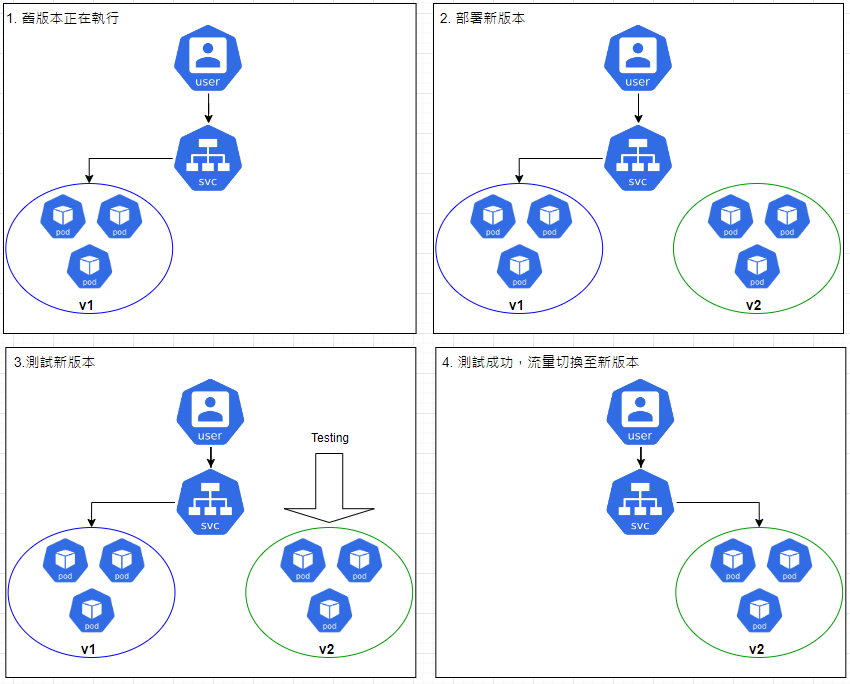
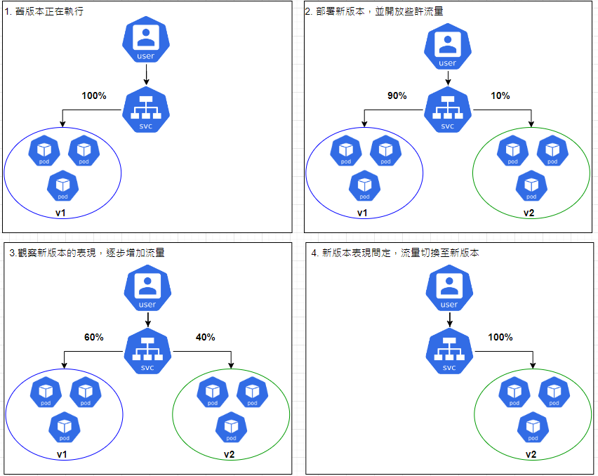

### 今日目標

* 進階部署策略：
    * Blue-Green Deployment 介紹 + 實作
    * Canary Deployment 初探

我們曾在 [Day 07](https://ithelp.ithome.com.tw/articles/10346223) 介紹過 Deployment 兩種基本的更新策略：Recreate 與 Rolling Update，不過這只是部署策略的冰山一角，在實務上還有許多其他的部署策略，我們今天就來看看較為經典的兩種部署策略：Blue-Green 與 Canary Deployment。

### Blue-Green deployment (藍綠部署)

在舊版本還在執行與對外開放服務的同時，將新版本也跑起來，經過測試後如果 OK，立即將所有的流量切換到新版本：



這樣的部署策略有以下優點：

* 比起 Rolling Update，Blue-Green 的升級速度更快，一旦測試好就馬上全面更新，而非逐步更新。

* 如果出錯，可以立刻回到舊版本，rollback 的速度也比 Rolling Update 快。

* 環境只存在單一版本，避免版本衝突。

不過 Blue-Green 也有缺點：

* 因為要同時部署兩個版本，所以需要雙倍的資源成本。

* 一旦有問題是在部署新版本之前沒測試到的，問題會立刻影響到**所有**的使用者。

### 實作：Blue-Green Deployment

我們就按照上面圖示中的四步驟來進行簡單的實作：
1. 部署 v1 版本，並用 Service 來 expose。
2. 部署 v2 版本，但不對外開放。
3. 測試 v2 版本。
4. 切換流量到 v2 版本。

先建立一個版本為 v1 的 Deployment 與對應的 Service：

```yaml
# blue-v1.yaml
apiVersion: apps/v1
kind: Deployment
metadata:
  labels:
    app: blue
  name: blue
spec:
  replicas: 3
  selector:
    matchLabels:
      app: blue
  template:
    metadata:
      labels:
        app: blue
    spec:
      containers:
      - image: michaelchenn1225/my-web:v1
        name: my-web
---
apiVersion: v1
kind: Service
metadata:
  name: blue-green-svc
spec:
  selector:
    app: blue
  ports:
    - protocol: TCP
      port: 80
      targetPort: 80
```
```bash
kubectl apply -f blue-v1.yaml
```

* 確認 Deployment 是否正確執行：
```bash
kubectl get deploy blue
```
```text
NAME                   READY   UP-TO-DATE   AVAILABLE   AGE
deployment.apps/blue   3/3     3            3           2m6s
```

* 然後開啟另一個終端，用無窮迴圈的方式存取 blue-green-svc 服務，來模擬使用者：
```bash
while true; do curl $(kubectl get svc blue-green-svc -o jsonpath='{.spec.clusterIP}'); echo -e "\n";sleep 1; done
```
> 不要關閉這個終端，讓它持續執行。

* 跳回原本的終端，建立 v2 版本的 Deployment：

```yaml
# green-v2.yaml
apiVersion: apps/v1
kind: Deployment
metadata:
  labels:
    app: green
  name: green
spec:
  replicas: 3
  selector:
    matchLabels:
      app: green
  template:
    metadata:
      labels:
        app: green
    spec:
      containers:
      - image: michaelchenn1225/my-web:v2
        name: my-web
```
```bash
kubectl apply -f green-v2.yaml
```

* 測試 v2 版本是否正確執行：
```bash
kubectl get deploy green
```
```text
NAME    READY   UP-TO-DATE   AVAILABLE   AGE
green   3/3     3            3           34s
```

* 看看是否能存取到 v2 版本：
```bash
curl $(kubectl get po -l app=green -o jsonpath='{.items[0].status.podIP}')
```
```text
Hello! This is v2.
```

* OK，v2 測試完畢，現在修改 blue-green-svc 的 selector，切換流量到 v2 版本：

```bash
kubectl edit svc blue-green-svc
```
```yaml
spec:
  selector:
    app: green # blue -> green
```

* 編輯好後儲存離開，然後跳到無限迴圈的終端，應該可以看到存取到的內容已經變成 v2 了：
```text
....
....
Hello! This is v1.

Hello! This is v1.

Hello! This is v1.

Hello! This is v1.

Hello! This is v2. 

Hello! This is v2.
```

以上就是一個簡單的 Blue-Green Deployment 實作。接下來我們來看另一個部署策略：Canary Deployment。

### Canary Deployment (金絲雀部署)

Canary Deployment 會先對**少量**的使用者開放新版本，並觀察新版本的表現，如果沒有問題再逐步擴大開放的範圍，直到所有的使用者都使用新版本：



這樣的部署策略有以下優點：

* 流量控制的百分比能由管理者精準控制，不像 Rolling Update 無法控制，也不像 Blue-Green 那麼「激進」。

* 精準控制流量讓使用者能夠有彈性的容錯空間，問題出錯時僅發生於少數使用者，除錯較快，反之 Rolling Update 如果新版本出錯沒有及時處理，會像癌細胞一樣擴散到整個環境。 

* 相比起 Blue-Green，Canary Deployment 對新版本的測試會更加完整，畢竟是直接開放給使用者使用，如果有良好的回饋機制，能夠提升開發效率與使用者體驗。

不過 Canary Deployment 也有缺點的：

* 與 Rolling Update 相同，Canary Deployment 的更新也較為緩慢。

* 需要額外的工具與設定來部署，例如：Istio、 ingress-nginx 等等，環境複雜度提高。

### 實作：Canary Deployment 

> 我們將使用 ingress-nginx 來實現 Canary Deployment，不過我們還沒介紹 Ingress 的相關概念，所以這部分會留到介紹 Ingress 的章節再來實作。

### 今日小結

今天我們介紹了兩種進階的部署策略：Blue-Green 與 Canary Deployment，總而言之，要速度選擇 Blue-Green，要精準控制更新過程就選 Canary Deployment，如果對以上兩者的需求不大，使用 Rolling Update 即可。

---

**參考資料**

[Blue-Green, Canary, and Other Kubernetes Deployment Strategies](https://traefik.io/glossary/kubernetes-deployment-strategies-blue-green-canary/)

[Ingress-Nginx Controller：Canary Deployment](https://kubernetes.github.io/ingress-nginx/examples/canary/)

[When to use canary vs. blue/green vs. rolling deployment](https://www.techtarget.com/searchitoperations/answer/When-to-use-canary-vs-blue-green-vs-rolling-deployment)

[The Difference Between Rolling and Blue-Green Deployments](https://www.split.io/blog/difference-between-rolling-and-blue-green-deployments/)

[圖例 icon 來源](https://github.com/kubernetes/community/tree/master/icons)

