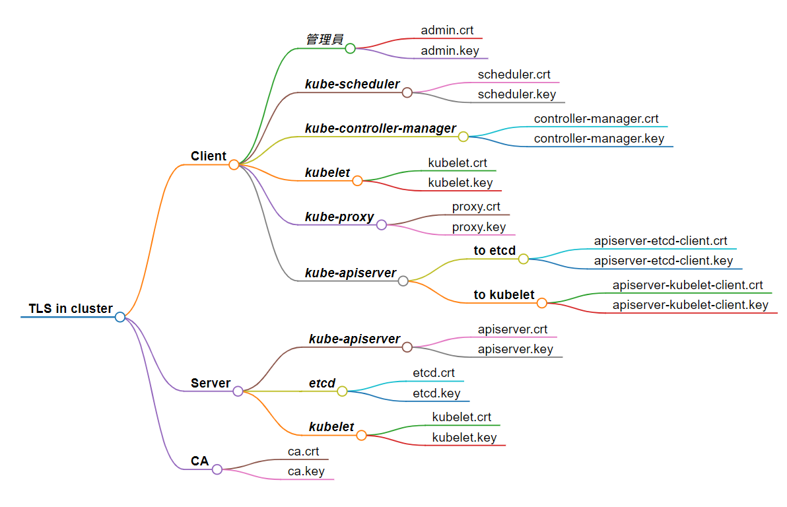

### 今日目標

* 了解 TLS/SSL 的基本概念
  * 憑證的用途

* 了解 k8s 中的 TLS 應用
  * k8s 的 PKI 架構
  * k8s 的重要憑證目錄
  * 檢視憑證內容

在 Kubernetes 中，幾乎所有訊息的傳遞都是透過 API 進行，而如何保障這些通訊的安全性尤為重要，我們今天就來談談 TLS/SSL 在 k8s 中的應用。

### 什麼是 TLS/SSL

* **SSL** (Secure Sockets Layer) : 一種通訊協定，用來保護網路通訊的安全性與隱私性。

* **TLS** (Transport Layer Security) : 新版的 SSL，不過術語上有時還是以 SSL 來稱呼。

> 總之，SSL/TLS 都是用來保護通訊安全與隱私的，只是版本新舊的差異而已。

### TLS/SSL 憑證

我們來思考一下：如果我今天正在登入一個銀行網站 www.myBank.com，有可能會遇到甚麼問題？

**問題1**

如果我與銀行網站之間的傳輸沒有任何安全防護，直接用明文傳密碼，其實與在大街上廣播自己的密碼沒什麼兩樣。因此，我和銀行採用「**非對稱式加密**」來保護密碼的傳輸。

非對稱加密的特性是：通訊雙方**各自**有一對金鑰。在一對金鑰中，一把是「Public key」，另一把是「Private key」。兩把金鑰皆可拿來加密，但解密時需另一隻金鑰才能解密。(不能拿同一把 key 加密再解密)

> 舉例而言，拿 Public key 加密只能用 Private key 解密，反之亦然。

如果以上面登入銀行帳號的情境為例，非對稱加密的傳輸流程如下：

  1. 我和銀行網站互相交換 Public key (交換後，雙方各持有對方的公鑰)
  2. 我用銀行的 Public key 加密我的密碼，再用我的 Private key「簽名」，然後傳給銀行。
  3. 銀行收到後，用我的 Public key 驗證我的簽名，然後用銀行自己的 Private key 解密我的密碼，完成驗證。

> 在這樣的傳輸過程中，假設有駭客可以截獲所有的封包，但是他只能拿到「我們雙方的 Public key」和「銀行 Public key 加密的密碼」，由於缺少 Private key，因此他什麼也解不開。
 
**問題2**

山不轉人轉，那麼駭客拿不到密碼時，會不會直接做一個釣魚網站，騙我說他是真正的 myBank.com？

對銀行網站來說，這個問題的重點是：如何向使用者證明「我就是 myBank.com 」。

這時候，「**憑證**」(certificate) 就派上用場了。銀行可以向權威的憑證簽發機構，也就是所謂的 **CA** (Certificate Authority) 申請憑證。

CA會對銀行的身份進行驗證，然後使用 CA 的 Private key 簽發一張具有公信力的憑證給銀行。

憑證的內容包括：
  * 憑證持有者的名稱
  * 憑證持有者的公開金鑰
  * 憑證簽發機構
  * 憑證簽發機構的數位簽章
  * 簽發日期
  * 到期日期
  * SSL/TLS 版本

有了這張憑證，銀行就可以向使用者證明「我就是 myBank.com」，而使用者則可以透過 CA 的 Public key (通常內建在瀏覽器裡) 來驗證這張憑證是不是真的由 CA 所簽發。

同樣，銀行也可以要求使用者出示憑證，以確保對方是「真正的」使用者。 

綜合以上，我們可以發現在 TLS 的通訊過程中，所有的角色(包括 CA 本身)都需要 Public key 和 Private key，以及一張證明自己的「憑證」。

而這整套關於 Public key、Private key 和「憑證」的通訊基礎，就是所謂的 **PKI** ( Public Key Infrastructure )，而 k8s 就是採用 PKI 來保障網路通訊的安全，因此在 cluster 中有關憑證(cert)或鑰匙(key)的檔案，通常都會放在「/etc/kubernetes/pki」目錄下。

---
**Tips**

> 1. 所有人都可以像 CA 一樣簽發證書給別人，只是「公信力」的區別而已。
> 2. 更詳細的 SSL/TLS 運作原理說明，可以參考[這篇文章](https://www.kawabangga.com/posts/5330)。

***

## TLS in Kubernetes

在 cluster 中，充滿各式各樣的「通訊」：管理者透過 kubectl 與 kube-apiserver 溝通、kube-apiserver 與 etcd 溝通、kube-apiserver 與 kubelet 溝通等等。這些通訊通通需要考慮安全性及隱私性的問題，因此大多數都使用了 TLS 來保障通訊安全，簡單來說：

> TLS is everwhere

既然如此， cluster 中的元件都會有自己的 cert 和 key ，而整個 cluster 也會有自己的 CA。

而憑證又依角色的不同分為兩種：client 憑證 和 server 憑證。

Client 與 server 在 k8s 中的例子：

- 管理員使用 kubectl 時，就是 client，而 kube-apiserver 就是 server

- 當 kube-apiserver 要和 etcd 要資料時，kube-apiserver 就是 client，而 etcd 就是 server。

> 「請求方」是 client，「回應方」則是 server，不會有哪個元件「一定是」 client 或 server。
> Client 會要求 Server 提供憑證，來證明它是「真正的」Server。反之，Server 也可以要求 client 提供憑證，以確保對方是「真正的」client。

而憑證、金鑰其實就是一個檔案，前面提到的 Public key，通常檔名的結為會是：

  * **.crt**
  * **.pem**

> 之所以「.crt」可以是 Public key，是因為憑證(cert)中就包含了憑證持有者的 Public key。

那 Private key 的檔名結尾會是:

  * **.key**
  * **-key.pem**
  

> 簡單的辨別方式：通常副檔名有「key」的就是 Private key，其餘的就是 Public key。

因此，有鑑於各種 client 與 server 的通訊都需要加密保護，k8s cluster 整體的 PKI 架構如下：




了解了 k8s 大概的 PKI 後，我們來看一個實際使用到這些憑證的例子：

* 使用 etcdctl 的備份 etcd 的指令如下：

```bash
etcdctl --endpoints=127.0.0.1:2379 \
  --cacert=/etc/kubernetes/pki/etcd/ca.crt \
  --cert=/etc/kubernetes/pki/etcd/server.crt \
  --key=/etc/kubernetes/pki/etcd/server.key \
  snapshot save /opt/etcd-backup.db
```

由於 etcd 的資料相當重要，因此當我們使用 etcdctl 與 etcd 進行 *client-server* 通訊時，就必須透過 TLS 來保護通訊的安全性，因此我們需要提供：

* **--cacert**：這裡沒有瀏覽器，所以必須先提供 CA 本身的憑證，用來驗證我們底下提供的 client 憑證

* **--cert**：CA 發給 client 端的「憑證」

* **--key**：client 的「私鑰」

所以當 client 向 etcd 發送請求時，需要使用 client 的「私鑰」來在請求上「簽名」。

Etcd 收到請求後，會使用 CA 的憑證來驗證 client 的憑證是否有效。

如果 client 憑證有效，會用憑證中的 Client Public Key 來驗證請求上的「client 簽名」，以此確認請求的來源。

### 檢視憑證內容

前面講了這麼久的憑證，我們以 kube-apiserver 的憑證為例，看看憑證到底長什麼樣子。

  * 查看 kube-apiserver 的 yaml：
```bash
 cat /etc/kubernetes/manifests/kube-apiserver.yaml | grep tls
 ```
 ```text
    - --tls-cert-file=/etc/kubernetes/pki/apiserver.crt <- 憑證
    - --tls-private-key-file=/etc/kubernetes/pki/apiserver.key
```

 * 不過無法直接看到憑證的內容：
```bash
cat /etc/kubernetes/pki/apiserver.crt
```
```text
-----BEGIN CERTIFICATE-----
MIIDjDCCAnSgAwIBAgIIZvmWk5Me+YEwDQYJKoZIhvcNAQELBQAwFTETMBEGA1UE
AxMKa3ViZXJuZXRlczAeFw0yNDAzMTMxMTQ5MzdaFw0yNTAzMTMxMTU0MzdaMBkx
(省略)
-----END CERTIFICATE-----

```

* 因此這裡使用 openssl 來檢視憑證的內容：
```bash
openssl x509 -in /etc/kubernetes/pki/apiserver.crt -text -noout
```
---
> 選項解釋
* **-text**：用文本方式顯示，我們才看得懂
* **-noout**：不輸出憑證的編碼版本。當你只對憑證的文本信息感興趣時蠻有用的
*** 

```bash
# 憑證內容
Certificate:
    Data:
        Version: 3 (0x2)
        Serial Number: 7420127421642242433 (0x66f99693931ef981)
        Signature Algorithm: sha256WithRSAEncryption
        Issuer: CN = kubernetes # 簽發者，也就是CA
        Validity
            Not Before: Mar 13 11:49:37 2024 GMT
            Not After : Mar 13 11:54:37 2025 GMT # 到期日
        Subject: CN = kube-apiserver  # Common Name，憑證擁有者
        Subject Public Key Info:
            Public Key Algorithm: rsaEncryption
                Public-Key: (2048 bit)
                Modulus:
                (省略)
                Exponent: 65537 (0x10001)
        X509v3 extensions:
            X509v3 Key Usage: critical
                Digital Signature, Key Encipherment
            X509v3 Extended Key Usage: 
                TLS Web Server Authentication
            X509v3 Basic Constraints: critical
                CA:FALSE
            X509v3 Authority Key Identifier: 
                3C:A8:9F:CD:4D:5B:DA:22:28:20:90:AD:66:19:90:3D:76:B4:7F:87
            X509v3 Subject Alternative Name:  # 憑證持有者的別名
                DNS:controlplane, DNS:kubernetes, DNS:kubernetes.default, DNS:kubernetes.default.svc, DNS:kubernetes.default.svc.cluster.local, IP Address:10.96.0.1, IP Address:192.26.13.6
                (省略)
```

> 需要注意憑證的到期日，過期的憑證是無法使用的！

* 我們再來查看一下 etcd 的憑證：
```bash
openssl x509 -in /etc/kubernetes/pki/etcd/server.crt -text -noout
```
```bash
Certificate:
    Data:
        Version: 3 (0x2)
        Serial Number: 1619366998176164672 (0x167925b47f47eb40)
        Signature Algorithm: sha256WithRSAEncryption
        Issuer: CN = etcd-ca # 簽發者
        Validity
            Not Before: Mar 13 12:30:30 2024 GMT
            Not After : Mar 13 12:35:30 2025 GMT
        Subject: CN = controlplane # 憑證擁有者
        Subject Public Key Info:
            Public Key Algorithm: rsaEncryption
                Public-Key: (2048 bit)
                Modulus:
                (省略)
                Exponent: 65537 (0x10001)
        X509v3 extensions:
            X509v3 Key Usage: critical
                Digital Signature, Key Encipherment
            X509v3 Extended Key Usage: 
                TLS Web Server Authentication, TLS Web Client Authentication
            X509v3 Basic Constraints: critical
                CA:FALSE
            X509v3 Authority Key Identifier: 
                7A:7E:6A:87:01:1C:64:83:FF:B0:79:EF:C1:05:57:BF:9A:A8:DE:BF
            X509v3 Subject Alternative Name: 
                DNS:controlplane, DNS:localhost, IP Address:192.27.223.3, IP Address:127.0.0.1, IP Address:0:0:0:0:0:0:0:1

```

### 重要的憑證目錄

從上面的範例中可以看到，etcd 憑證與 kube-apiserver 憑證中的「Issuer」是不同的(etcd-ca vs. kubernetes)，也就是有兩家不同的 CA。所以 k8s 中重要憑證的目錄如下：

  * **etcd相關**：/etc/kubernetes/pki/etcd
   
  * **kube-apiserver相關**：/etc/kubernetes/pki

  * **kubelet相關**：/var/lib/kubelet/pki
  
有的時候如果發現 etcd 掛掉，有可能是在設定時，誤以為所有憑證都在 /etc/kubernetes/pki 
下，例如：

* 我們重新設定 etcd 的憑證相關訊息後，發現 api-server 連不上 etcd：

```bash
kubectl logs -n kube-system kube-apiserver-controlplane -f
```
```text
W0916 14:19:44.771920       1 clientconn.go:1331] [core] grpc: addrConn.createTransport failed to connect to {127.0.0.1:2379 127.0.0.1 <nil> 0 <nil>}. Err: connection error: desc = "transport: authentication handshake failed: x509: certificate signed by unknown authority". Reconnecting...
```

原來是 etcd 的 CA 指定錯了：
```bash
cat /etc/kubernetes/manifests/kube-apiserver.yaml | grep etcd
```
```bash
    - --etcd-cafile=/etc/kubernetes/pki/ca.crt # 錯誤在這
    - --etcd-certfile=/etc/kubernetes/pki/apiserver-etcd-client.crt
    - --etcd-keyfile=/etc/kubernetes/pki/apiserver-etcd-client.key
    - --etcd-servers=https://127.0.0.1:2379

```

> 應該是「--etcd-cafile=/etc/kubernetes/pki/etcd/ca.crt」才對

### 今日小結

今天介紹了 TLS/SSL 在 k8s 中的應用，主要是用來保護 cluster 中各元件之間的通訊安全性，並且介紹了憑證的基本結構和檢視方式。如果是正在準備 CKA 的讀者，建議熟悉以下概念：

* 重要的憑證目錄放在哪裡。(例如 etcd, kube-apiserver, kubelet 的憑證)
* 使用「openssl」來檢視憑證的內容

----

**參考資料**

* [基礎密碼學(對稱式與非對稱式加密技術)](https://medium.com/@RiverChan/%E5%9F%BA%E7%A4%8E%E5%AF%86%E7%A2%BC%E5%AD%B8-%E5%B0%8D%E7%A8%B1%E5%BC%8F%E8%88%87%E9%9D%9E%E5%B0%8D%E7%A8%B1%E5%BC%8F%E5%8A%A0%E5%AF%86%E6%8A%80%E8%A1%93-de25fd5fa537)

* [什麼是SSL、TLS和HTTPS？](https://www.digicert.com/tw/what-is-ssl-tls-and-https)

* [有关 TLS/SSL 证书的一切](https://www.kawabangga.com/posts/5330)

* [簡介 SSL、TLS 協定](https://ithelp.ithome.com.tw/articles/10219106)

* [什麼是 SSL/TLS 憑證？](https://aws.amazon.com/tw/what-is/ssl-certificate/)

* [Securing and Accelerating Kubernetes with TLS: A Guide](https://overcast.blog/securing-and-accelerate-kubernetes-with-tls-a-guide-f58c4ca5cb7e)

