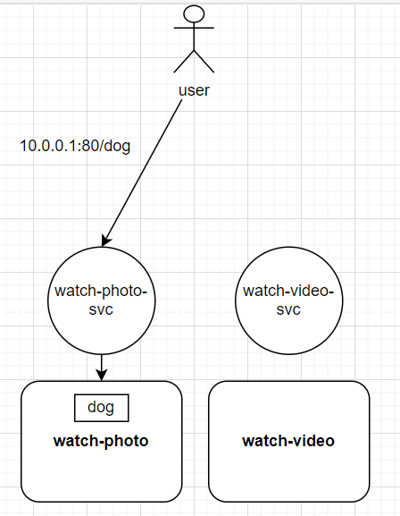
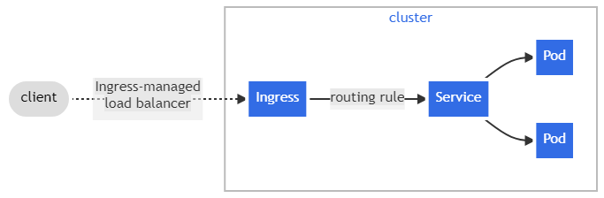
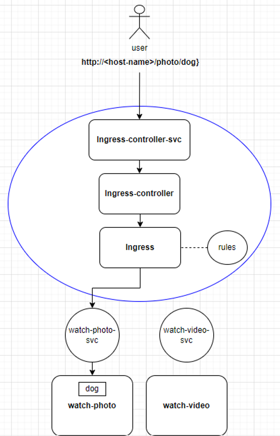

### 今日目標

* 了解 Ingress 的用途
* 安裝 Ingress 與 Ingress controller
* Ingress 實作
  * 最簡單的 Ingress 設定
  * Annotation：Rewrite-target
  * 正規表達式的應用
  * 設定 host name
  * Default backend
  * Canary Deployment 

---

為了讓 Pod 有一個「統一、穩定」的存取介面，因此我們建立了 Service。

建立 Service 後，就可以透過 ClusterIP、NodePort、LoadBalancer 等方式來存取 Pod 。以下為一個簡單的例子：

* 目前總共有兩個 Deployments，負責提供圖片或影片讓使用者觀賞：
  1. **watch-photo**：提供圖片
  2. **watch-video**：提供影片

* 為了讓使用者能夠存取，並希望每個 Deployment 的 Pod 達到附載平衡，因此我們在每個 Deployment 上都配置了一個 loadBalancer 的 service：
  1. **watch-photo-svc**：10.0.0.1:80
  2. **watch-video-svc**：10.0.0.2:80

假如使用者想要「看 dog 的圖片」，情況如下圖：



這樣的配置有以下缺點：

  * **造成使用者的不便**：
  
    如上圖所示，使用者需要知道 service 的 Port 才能存取服務。如果未來 service 的數量增加，使用者就得記住更多的 Port。

  * **Port 管理不便**

    如果 service 的數量增加，一堆的 Port number 會讓管理變得複雜。

  * **Load balancer成本問題**：
  
    為了流量附載，通常會在 service 前面加上一個 load balancer，而 load balancer 是需要花錢的，如果 service 的數量增加，成本也會增加。

要改善上面的缺點，我們可以使用「Ingress」。

### Ingress 的功能

以下為一張官網上的 [Ingress 圖示](https://kubernetes.io/docs/concepts/services-networking/ingress/)：



上面的圖示中，我們可以看到 Ingress 的功能有以下幾點：

**Routing Rules**

在 Ingress 的設定中將 URL path 與 service 對應起來，並統一開啟 http 的 80 port 或 https 的 443 port，這樣使用者就不需要記住 service 的 Port number，只需要知道 URL path 就可以存取服務。


**統一的 Load balancer**

Ingress 有提供 load balancer 的功能，可以掛在 service 的前面，這樣就不需要為每個 service 都配置一個 load balancer，可以節省成本。

**統一管理 TLS**

如果想讓 service 與 使用者之間的通訊有加密，在沒有 Ingress 的情況下，就需要每個 service 都配置TLS 憑證，這樣管理起來會很麻煩。

而 Ingress 有支援 TLS，不管 Ingress 背後有多少 service，只需要在 Ingress 上配置 TLS 憑證，就可以讓使用者透過 https 存取服務。

### Ingress controller

不過，上面講的 Ingress 設定沒有 Ingress controller 是無法生效的，因為 Ingress controller 才是這些設定的真正執行者。

Ingress controller 有很多種，每種各有其特色與功能，可以參考[官方文件](https://kubernetes.io/docs/concepts/services-networking/ingress-controllers/#additional-controllers)的列表進行選擇。

在一個 cluster 中可以同時存在多種 Ingress controller，每種 Ingress controller 都有所屬的 Ingress class 與自己的 service，兩者的功能如下：

---
* **Ingress class**
  
  Ingress class 的主要功能就是**區隔不同的 Ingress 資源**。

  前面提到，Ingress 需要 Ingress controller 才能生效，所以設定 Ingress 時需指定「Ingress class」，來說明要使用哪一個 Ingress controller。
  
  當哪天想要換其他的 controller 來執行相同的路由規則時，只需修改 Ingress 的「Ingress class」即可。

  > 簡單來說，「用 Ingress class 來分隔不同的 Ingress 資源」，有些類似 StorageClass 的概念，用來分隔不同的 Storage 資源。

* **Ingress controller 的 service**

  當 Ingress 透過 Ingress controller 生效，使用者存取 Ingress 背後提供的服務時，流程如下:
  
  1. 先經過 Ingress controller 的 service 抵達 Ingress controller
  
  2. Ingress controller 查找相對應的 Ingress URL 規則
  
  3. 流量從 URL 規則來到正確的 service，最終到達提供服務的 Pod。
***

而為了達成 Ingress 所制定的規則，Ingress controller 會透過 kube-apiserver 來監聽 service 與 Pod 的變化，這樣才能根據 Ingress 的規則做流量轉發。


一下講了這麼多名詞，這裡一樣用「使用者想看圖片」的圖示來說明一下整個流程:

> 我們改良了一開始的例子，用 Ingress 設定了以下 URL path：

* 想看圖片：

  * `/watch-photo`：watch-photo 的首頁

  * `/watch-photo/<file-path>`：watch-photo 提供的圖片 (ex. /watch-photo/dog)

* 想看影片:

  * `/watch-video`：watch-video 的首頁

  * `/watch-video/<file-path>`：watch-video 提供的影片 (ex. /watch-video/movie)



(藍色的圓圈即 ingress class)

接著，我們來實際安裝 Ingress controller。

### 安裝Ingress controller

> 以下選用 [Ingress-Nginx Controller](https://kubernetes.github.io/ingress-nginx/deploy/#quick-start) 作為範例

* 安裝 Ingress-Nginx Controller：
```bash
kubectl apply -f https://raw.githubusercontent.com/kubernetes/ingress-nginx/controller-v1.11.2/deploy/static/provider/cloud/deploy.yaml
```

* 確認一下是否有成功安裝並執行：
```bash
kubectl get pods --namespace=ingress-nginx -w
```
```text
NAME                                        READY   STATUS      RESTARTS   AGE
ingress-nginx-admission-create-httbh        0/1     Completed   0          17m
ingress-nginx-admission-patch-ztmmr         0/1     Completed   1          17m
ingress-nginx-controller-7dcdbcff84-wl484   1/1     Running     0          17m
```

> 重點是 ingress-nginx-controller-xxx 這個 Pod 有跑起來就好。

* 最後，將「default ingress class」設定為 nginx：
```bash
kubectl edit ingressclass nginx
```
```yaml
apiVersion：networking.k8s.io/v1
kind：IngressClass
metadata:
  annotations:
    ingressclass.kubernetes.io/is-default-class: "true" # 加入這個annotation
......
```

> 上面的操作是將「nginx」設定為預設的 Ingress class，之後若設定 ingress 時沒有指定「sepc.ingressClassName」，就會使用預設。

---

> **Tips：關於ingress-nginx-admission**

上面安裝過程中，不知道有沒有留意到兩個 completed 的 Pod，他們的任務是建立 ingress-admission。

admission 是 nginx-ingress-controller 的一個 webhook 插件，每當有新的 ingress 被創建或更新時，會交由 admission 檢查 ingress 是否符合規則，整個流程如下：

```
ingress創建/更新  --> admission 檢查  -->  符合規則  -->  controller 執行
```

> 其他關於 admission 與 ingress-nginx-controller 的運作原理，可參考[官方文件](https://kubernetes.github.io/ingress-nginx/how-it-works/)

***

### Ingress 實作：最簡單的Ingress設定

底下將透過實作來說明 Ingress 的設定方式，本次實作的目的如下：

> 嘗試實現上面例子中的「watch」業務(看圖片、看影片)，不過我們先嘗試最簡單的 Ingress 設定，熟練後再設定較複雜的。

* 首先，建立一個 Pod 來模擬使用者：
```bash
kubectl run user --image=nginx
```

* 然後再建立兩個提供「watch」業務的 Pod 與它們的 service：
```bash
kubectl run watch-photo --image=nginx --port=80
kubectl run watch-video --image=nginx --port=80
kubectl expose pod watch-photo --port=80 --name=watch-photo-svc
kubectl expose pod watch-video --port=80 --name=watch-video-svc
```

* 等 Pod 都成功 running 後，自訂一下 index.html，這樣測試時比較好看出效果:
```bash
echo "Home page of watch-photo" > watch-photo.html
echo "Home page of watch-video" > watch-video.html
kubectl cp watch-photo.html watch-photo:/usr/share/nginx/html/index.html
kubectl cp watch-video.html watch-video:/usr/share/nginx/html/index.html
```

  * 接著，我們建立 Ingress：
```yaml
# ingress-watch.yaml
apiVersion: networking.k8s.io/v1
kind: Ingress
metadata:
  name: ingress-watch
  annotations:
    nginx.ingress.kubernetes.io/rewrite-target: /
spec:
  rules:
  - http:
      paths:
      - path: /photo
        pathType: Prefix
        backend:
          service:
            name: watch-photo-svc
            port:
              number: 80
      - path: /video
        pathType: Prefix
        backend:
          service:
            name: watch-video-svc
            port:
              number: 80
```
```bash
kubectl apply -f ingress-watch.yaml
```
---
**重要欄位說明**

* **annotations**：這裡加入了「nginx.ingress.kubernetes.io/rewrite-target：/」，作用稍後會說明。

* **spec.rules**：設定了兩個 URL Path 規則：
  1. /photo：導向 watch-photo-svc 的 80 port
  2. /video：導向 watch-video-svc 的 80 port

* **pathType**：有三種選項 
  1. Exact：比對 path 是否**完全**相同(ex. /foo 不匹配 /foo/)
  2. Prefix：比對 path 的前綴(ex. /aaa/bbb 匹配 /aaa/bbb/ccc)
  3. ImplementationSpecific：由 Ingress controller 自行決定要選 Exact 或 Prefix

***

> 你也可以透過 kubectl 來建立相同的 Ingress：
```bash
kubectl create ingress ingress-watch --rule='/photo*=watch-photo-svc:80' --rule='/video*=watch-video-svc:80' --annotation='nginx.ingress.kubernetes.io/rewrite-target=/'
```

* 部署 Ingress 後查看一下情況:
```bash
kubectl describe ingress ingress-watch
```
```text
Name：            ingress-watch
Labels：          <none>
Namespace：       default
Address：         
Ingress Class：   nginx # 上面沒指定ingress class，所以使用預設
Default backend： <default>
Rules:
  Host        Path  Backends
  ----        ----  --------
  *           
              /photo   watch-photo-svc:80 (192.168.1.8:80) 
              /video   watch-video-svc:80 (192.168.1.9:80)
Annotations： nginx.ingress.kubernetes.io/rewrite-target：/
Events:
  Type    Reason  Age   From                      Message
  ----    ------  ----  ----                      -------
  Normal  Sync    7s    nginx-ingress-controller  Scheduled for sync
```

在 Rules 的 Backends 欄位中，可以看到對應到的 Pod IP:
  * 192.168.1.8:80：watch-photo 
  * 192.168.1.9:80：watch-video

---

**測試Ingress效果**

* 如果還記得上面的圖片，user 必須透過 Ingress controller 的 service 來存取 Ingress，所以先將 controller service 的 clusterIP 存在變數中，方便測試：

```bash
export ingressIP=$(kubectl get svc -n ingress-nginx ingress-nginx-controller -o jsonpath='{.spec.clusterIP}')
```

* 接著我們模擬 user 嘗試存取兩個服務的首頁(index.html)：
```bash
kubectl exec -it user -- curl http://${ingressIP}/photo && curl http://${ingressIP}/video
```
```text
Home page of watch-photo
Home page of watch-video
```

* user 的存取紀錄也可以在各自 service 的 log 中看到，例如：
```bash
kubectl logs svc/watch-video-svc | grep "GET"
```
```text
192.168.1.6 - - [25/Apr/2024:09:52:19 +0000] "GET / HTTP/1.1" 200 25 "-" "curl/7.68.0" "192.168.0.0"
```

***

以上就是相當簡單的 Ingress 測試，等下我們再來試試不同的 Ingress 功能。不過在此之前，先來填坑：到底「nginx.ingress.kubernetes.io/rewrite-target：/」這個 annotation是什麼意思 ?

### Annotation：Rewrite-target

---
* 我們直接註解掉這個 annotation，看看沒有它會有甚麼區別:
```bash
vim ingress-watch.yaml
```
```yaml
apiVersion: networking.k8s.io/v1
kind: Ingress
metadata:
  name: ingress-nginx
  # annotations:
    # nginx.ingress.kubernetes.io/rewrite-target: /
......
```
```bash
kubectl apply -f ingress-watch.yaml
```

* 再次測試一下:
```bash
kubectl exec -it user -- curl http://${ingressIP}/photo && curl http://${ingressIP}/video

```

結果系統丟回來「404 Not Found」!

* 找找 service 的 log，看看是什麼原因：
```bash
kubectl logs svc/watch-photo-svc | grep "error"
```
```text
2024/04/25 11:54:12 [error] 28#28：*2 open() "/usr/share/nginx/html/photo" failed (2：No such file or directory), client：192.168.1.6, server：localhost, request："GET /photo HTTP/1.1", host："10.103.62.152"
```
> 上述的錯誤主要是因為找不到 /usr/share/nginx/html/photo 這個檔案 (No such file or directory)

在解釋為何傳回 404 之前，這裡先補充一下 URL 的結構：

```text
[Protocol]://[host]/[file-path]
```

以我們的例子「http://localhost:30906/watch-photo」來說：

  * **Protocol**：傳輸協定，這裡走「http」

  * **host**：可以是主機的 IP 或 domain name，這裡是「localhost」(本機的 domain name )，最後加上「port 30906」

  * **file-path**：想要存取的檔案路徑，這裡是「watch-photo」

所以當我們沒有加上 rewrite-target 的 annotation 時，user 在 curl 中的 URL 會經過以下轉換：

|原本的 URL | 經 ingress 轉到的 service|
|-----------|-------------------------|
|http://${ingressIP}/photo |http://watch-photo-svc:80/photo| 

由於提供服務的 Pod 都基於 nginx，所以 Pod 會預設你想存取的檔案路徑位於 **/usr/share/nginx/html/** 之下，所以它會去找 /usr/share/nginx/html/photo 這個檔案路徑，但這個檔案並不存在，所以才會丟出 404。

先暫時不要修改 ingress，我們來驗證一下上面的說法：

* 把 watch-photo 的 index.html 改名為 photo：
```bash
kubectl exec -it watch-photo -- mv /usr/share/nginx/html/index.html /usr/share/nginx/html/photo
```

* 再次嘗試存取 watch-photo 的首頁：
```bash
kubectl exec -it user -- curl http://${ingressIP}/photo
```
```text
Home page of watch-photo
```

> 將 index.html 改名為 photo 後，這樣 Pod 才找的到「/usr/share/nginx/html/photo」，才能丟出正確的回應。

不過這樣的設定方式並不正統，我們還是希望使用 index.html 作為預設首頁。

因此，我們希望 user 輸入 URL 中的 **file-path** 會被「改寫」成 **"/"**，這樣當 Pod 收到流量時就會認為使用者並沒有指定任何路徑，所以預設會去找 /usr/share/nginx/html/index.html：

|原本的 URL | 經 ingress 轉到的 service|
|-----------|-------------------------|
|http://${ingressIP}/photo |http://watch-photo-svc:80/ | 


> 所以 **nginx.ingress.kubernetes.io/rewrite-target：/** 的作用就是將 ingress yaml 中的 rule.paths.path 改寫成「/」，

我們將 ingress 重新加回 annotation，並且再次測試一下：

* 先復原剛才 watch-photo 的 index.html：
```bash
kubectl exec -it watch-photo -- mv /usr/share/nginx/html/photo /usr/share/nginx/html/index.html
```

* 修改 ingress，把 annotation 的註解拿掉：
```bash
vim ingress-watch.yaml
```
```yaml
apiVersion: networking.k8s.io/v1
kind: Ingress
metadata:
  name: ingress-nginx
  annotations:
    nginx.ingress.kubernetes.io/rewrite-target: /
......
```
```bash
kubectl apply -f ingress-watch.yaml
```

* 部署ingress後再次測試：
```bash
kubectl exec -it user -- curl http://${ingressIP}/photo && curl http://${ingressIP}/video
```
```text
Home page of watch-photo
Home page of watch-video
```

另外，ingress 規則中的 path 設定與 rewrite-target 可以搭配**正規表達式( egular Expressionr)**，我們再來看一個實作：

---

### Ingresss 實作：正規表達式的應用

> 以下新的 watch-photo 與 watch-video 的檔案路徑配置，新增了「首頁」讓使用者造訪：

1. **watch-photo**：
    * 首頁：/usr/share/nginx/html/index.html
    * 圖片：/usr/share/nginx/html/dog

2. **watch-video**：
    * 首頁：/usr/share/nginx/html/index.html
    * 影片：/usr/share/nginx/html/movie
***

* 來重新設計一下 ingress 的規則：
```bash
vim ingress-watch.yaml
```
```yaml
apiVersion: networking.k8s.io/v1
kind: Ingress
metadata:
  name: ingress-watch
  annotations:
    nginx.ingress.kubernetes.io/rewrite-target: /$2
spec:
  rules:
  - http:
      paths:
      - path: /photo(/|$)(.*)
        pathType: ImplementationSpecific
        backend:
          service:
            name: watch-photo-svc
            port:
              number: 80
      - path: /video(/|$)(.*)
        pathType: ImplementationSpecific
        backend:
          service:
            name: watch-video-svc
            port:
              number: 80
```
```bash
kubectl apply -f ingress-watch.yaml
```
---
> **解釋**

如果不熟悉正規表達式(regex)，可先參考[這裡](https://blog.jiatool.com/posts/vscode_regex/)


我們以 **/photo(/|$)(.*)** 為例來解釋：

  * /watch-photo(/|$)(.*) 設定了 2 個 regex 群組：

    1. **(/|$)**：代表「/photo」後面可以直接接「/」或是直接結束
    2. **(.*)** ：代表「/photo/」後面可以接任何字元

在 rewrite-target 中的 `/$2`，代表將 path 中的第 **2** 個 regex 群組的字元取出來，例如當 user 輸入：

* 造訪首頁：
|原本的 URL | 經 ingress 轉到的 service|
|-----------|-------------------------|
|http://${ingressIP}/photo|http://watch-photo-svc:80/|

* 造訪內容：

|原本的 URL | 經 ingress 轉到的 service|
|-----------|-------------------------|
|http://${ingressIP}/photo/dog|http://watch-photo-svc:80/dog|

> 這樣就能實現造訪首頁的功能，且不影響造訪內容。

***

* 配置好 ingress 後，我們先將兩個服務的內容準備好：

```bash
echo "dog" > dog.txt
echo "movie" > movie.txt
kubectl cp dog.txt watch-photo:/usr/share/nginx/html/dog
kubectl cp movie.txt watch-video:/usr/share/nginx/html/movie
```

* 測試一下首頁:
```bash
kubectl exec -it user -- curl http://${ingressIP}/photo && curl http://${ingressIP}/video
```
```text
Home page of watch-photo
Home page of watch-video
```

* 測試一下內容:
```bash
kubectl exec -it user -- curl http://${ingressIP}/photo/dog && curl http://${ingressIP}/video/movie
```
```text
dog
movie
```

> 這樣是否能比較清楚 rewirte-target 的作用呢？可以試著自己使用其他的 regex 來設定 ingress 的 path，看看效果如何。

## Ingress 實作：設定 host name

不過剛剛實作的 ingress 設定還是有問題，例如：

以使用者的角度來說，ingress controller 的 service 就是提供服務的 host，但因為沒有設定 host name，所以使用者需要知道該 host 的 IP 才能存取服務，這樣的設計根本沒有解決在文章開頭提到的問題。

所以較為理想的情況是使用者用 DNS 就可以存取到 host，我們來嘗試模擬一下：

> 假設 host 的 domain name 為 watch-photo-n-video.com：

* 我們用 user 的 /etc/hosts 來模擬DNS，設定好後直接測試是否連得到首頁:
```bash
kubectl exec -it user -- echo "${ingressIP}  watch-photo-n-video.com" >> /etc/hosts && curl http://watch-photo-n-video.com/photo
```
```text
Home page of watch-photo
```

雖然這樣成功解決了 user 的不便，但是還有一個問題：

* 假設今天有「另一個」 domain name 指定到相同的 ingress controller service：
```bash
kubectl exec -it user -- echo "${ingressIP}  just-photo-only.com" >> /etc/hosts && curl http://just-photo-only.com/photo
```
```text
Home page of watch-photo
```

可以發現依然存取的到 watch-photo 的首頁，但兩個意義截然不同的 domain name 都能存取到相同服務，這樣的設計是不太合理的。

要修正這個問題，我們得在 ingress 中加入「host」的設定，告訴 ingress controller**只有**這個 domain name 才是我們的host：

```yaml
apiVersion: networking.k8s.io/v1
kind: Ingress
metadata:
  name: ingress-watch
  annotations:
    nginx.ingress.kubernetes.io/rewrite-target: /$2
spec:
  rules:
  - host: "watch-photo-n-video.com" # 加入host欄位，設定domain name
    http:
      paths:
      - path: /photo(/|$)(.*)
        pathType: ImplementationSpecific
        backend:
          service:
            name: watch-photo-svc
            port:
              number: 80
      - path: /video(/|$)(.*)
        pathType: ImplementationSpecific
        backend:
          service:
            name: watch-video-svc
            port: 
              number: 80
```
```bash
kubectl apply -f ingress-watch.yaml
```

部署 ingress 後，測試一下正確的 domain name:
```bash
kubectl exec -it user -- echo "${ingressIP}  watch-photo-n-video.com" >> /etc/hosts && curl http://watch-photo-n-video.com/photo
```
```text
Home page of watch-photo
```

再次測試錯誤的domain name：
```bash
kubectl exec -it user -- echo "${ingressIP}  just-photo-only.com" >> /etc/hosts && curl http://just-photo-only.com/photo
```
```text
404 Not Found
```

## #Ingress 實作：Default backend

當使用者輸入一個不存在的 Path 時，會得到 404 Not Found，不過這樣的回應對使用者來說並無實際幫助，我們可以透過 ingress 的 default backend 來解決這個問題。

* 建立 default backend 的 Pod 與 service:
```bash
kubectl run default-backend --image=nginx --port=80
kubectl expose pod default-backend --port=80 --name=default-backend-svc
```

* 自訂 default backend 的提示訊息:
```bash
echo "Do you mean /photo or /video？" > default-backend.txt
kubectl cp default-backend.txt default-backend:/usr/share/nginx/html/index.html
```

* 在 ingress 中加入 default backend 的設定:
```yaml
apiVersion: networking.k8s.io/v1
kind: Ingress
metadata:
  name: ingress-watch
  annotations:
    nginx.ingress.kubernetes.io/rewrite-target: /$2
spec:
  defaultBackend:
    service:
      name: default-backend-svc
      port: 
        number: 80
  rules:
......
```
```bash
kubectl apply -f ingress-watch.yaml
```

* 部署ingress後，測試一下不存在的 Path：
```bash
kubectl exec -it user -- echo "${ingressIP}  watch-photo-n-video.com" >> /etc/hosts && curl http://watch-photo-n-video.com/watch
```
```text
Do you mean /photo or /video?
```
> 提示使用者他們輸入的 Path 不存在，並且知道該輸入哪些 Path。

### Canary Deployment 的實作

我們曾在 [Day 18](https://ithelp.ithome.com.tw/articles/10348066) 介紹過 Canary Deployment，並挖了一個實作的坑，因為那時候我們還沒有學過 Ingress，不過今天礙於篇幅關係，實作的部分可以參考[這裡](https://kubernetes.github.io/ingress-nginx/examples/canary/)。


### 今日小結

Ingress 其實就是一個「路由器」，可以讓使用者透過 URL path 存取服務，並且可以透過 host name 來區分不同的服務。其中 rewrite-target、正規表達式、default backend 等功能都可以讓 Ingress 更加靈活。

-----
**參考資料**

[Ingress](https://kubernetes.io/docs/concepts/services-networking/ingress/#the-ingress-resource)

[Ingress Controllers](https://kubernetes.io/docs/concepts/services-networking/ingress-controllers/)

[Ingress-Nginx Controller](https://kubernetes.github.io/ingress-nginx/deploy/#quick-start)

