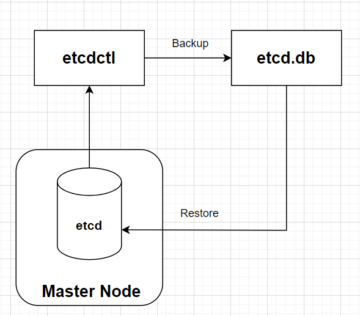

### 今日目標

* 備份 etcd
* 還原 etcd

除了升級 cluster 之外，為了避免意外情況而造成資料遺失，「備份」也是一個相當重要的工作。養成定期備份的習慣，可以在資料遺失快速的透過「還原」來恢拯救系統。

在 cluster 中，需要重點備份的資料有：

  * 資源設定檔
  * etcd

### 資源設定檔

在過去的操作中，不外乎就是透過以下兩種方式來建立資源：

  * **指令**：例如 kubectl create、kubectl run
  * **yaml檔案**：透過 kubectl apply -f 或 kubectl create -f 來建立

在 [Day 04](https://ithelp.ithome.com.tw/articles/10345796) 中曾經提到過，使用 yaml 雖然速度不像「直接使用指令」那麼迅速，但是在做「版本控制」時會輕鬆許多，畢竟我們很難掌握到底是誰、什麼時候、用什麼指令建立的資源。透過版控系統，例如 git，可以讓我們清楚的知道每一次的變更，也能在資遺失時快速的復原。

但是有時我們仍會使用指令來建立資源，所以在備份時，我們可以透過以下方式將資源設定檔備份下來：

```bash
kubectl get all --all-namespaces -o yaml > all-resources.yaml
```
> 需要注意的是，這樣的備份方式較為簡略，並不能做到「全面」的備份。

## etcd

要做到較為全面的備份，就必須備份 etcd。

etcd 是 k8s 的資料庫，使用 key-value 的方式來儲存 k8s 的重要資料和關鍵訊息，例如: 現有資源、 cluster 狀態等等。

備份 etcd 的方式有很多種，這裡介紹一種簡單且迅速的方式：snapshot。

透過 etcd 的「command line client」--- **etcdctl**，我們可以用 snapshot(快照) 將 etcd 的資料備份下來，在日後以這張快照還原 etcd。

備份與還原的基本流程圖如下:


### 備份 etcd

為了實測備份後還原的效果，這裡先建立一個 Deployment：
```bash
kubectl create deployment nginx --image nginx --replicas 3
```

要使用「etcdctl」，需要先將環境變數設定好:
```bash
export ETCDCTL_API=3
```

現在就可以來準備備份 etcd 了。而建立 snapshot 的指令**格式**如下：
```bash
 etcdctl --endpoints=<listen-client-urls> \
  --cacert=<trusted-ca-file> --cert=<cert-file> --key=<key-file> \
  snapshot save <backup-file-location>
```

因此，我們需要找出 etcdctl snaptshot 所需的資料：

* listen-client-urls：
```bash
cat /etc/kubernetes/manifests/etcd.yaml | grep listen-client
```
```text
    - --listen-client-urls=https://127.0.0.1:2379,https://172.30.1.2:2379
```

* cert-file、key-file、trusted-ca-file：
```bash
cat /etc/kubernetes/manifests/etcd.yaml | grep file
```
```bash
    - --cert-file=/etc/kubernetes/pki/etcd/server.crt # 需要這行
    - --key-file=/etc/kubernetes/pki/etcd/server.key # 需要這行
    - --peer-cert-file=/etc/kubernetes/pki/etcd/peer.crt
    - --peer-key-file=/etc/kubernetes/pki/etcd/peer.key
    - --peer-trusted-ca-file=/etc/kubernetes/pki/etcd/ca.crt
    - --trusted-ca-file=/etc/kubernetes/pki/etcd/ca.crt # 需要這行
```
---

我們所需的資料有：

  * 127.0.0.1:2379 (--listen-client-urls)
  * /etc/kubernetes/pki/etcd/server.crt (--cert-file)
  * /etc/kubernetes/pki/etcd/server.key (--key-file)
  * /etc/kubernetes/pki/etcd/ca.crt (--cacet)

***

* 將剛剛蒐集的資料帶入「etcdctl snapshot」中備份 etcd，並將 snapshot 儲存到 `/opt/etcd-backup.db`：
```bash
etcdctl --endpoints=127.0.0.1:2379 \
  --cacert=/etc/kubernetes/pki/etcd/ca.crt \
  --cert=/etc/kubernetes/pki/etcd/server.crt \
  --key=/etc/kubernetes/pki/etcd/server.key \
  snapshot save /opt/etcd-backup.db
```

* 備份完成後，查看一下 snapshot 的詳細資訊：
```bash
etcdctl snapshot status /opt/etcd-backup.db
```

* 輸出的四格值依序代表 snapshot 的：\<hash>, \<revision>, \<total-keys>, \<total-size?
```
c08eb2c6, 2129, 2145, 5.6 MB
```


### 還原 etcd

備份完成後，我們來看看如何透過 snapshot 還原 etcd。

* 刪掉 nginx 的 Deployment，等等還原的時候看看會不會重新出現：
```bash
kubectl delete deploy nginx
```

* 將 etcd 的 snapshot 還原到一個新的目錄「/var/lib/etcd-restore」：
```bash
etcdctl snapshot restore --data-dir /var/lib/etcd-restore /opt/etcd-backup.db
```

* 然後先將所有 Master Node 上的重要元件暫停：
```bash
mv /etc/kubernetes/manifests/* /root
```

由於我們將 etcd 資料還原在一個新目錄「/var/lib/etcd-restore」，所以我們需要修改 etcd 的 manifest，把 etcd 的資料讀取路徑改到新的目錄，這樣還原才會生效：

* 修改 etcd 的 manifest：
```bash
vim /root/etcd.yaml
```
```yaml
# 通常在 etcd.yaml 中的最下面
  volumes:
  - hostPath:
      path: /etc/kubernetes/pki/etcd
      type: DirectoryOrCreate
    name: etcd-certs
  - hostPath:
      path: /var/lib/etcd-restore # 改這裡(原本這裡是/var/lib/etcd)
      type: DirectoryOrCreate
    name: etcd-data 
status: {}
```

* 修改後，把所有重要元件放回「/etc/kubernetes/manifests」，等待它們重啟：
```bash
mv /root/kube* /etc/kubernetes/manifests
mv /root/etcd.yaml /etc/kubernetes/manifests
```

* 查看所有重要元件的 static pod 是否都重啟成功：
```bash
kubectl get po -n kube-system
```
```text
NAME                                       READY   STATUS    RESTARTS      AGE
calico-kube-controllers-75bdb5b75d-zhhrq   1/1     Running   5 (92s ago)   2d17h
canal-fzfpm                                2/2     Running   2 (18m ago)   2d17h
canal-szcfj                                2/2     Running   2 (18m ago)   2d17h
coredns-5c69dbb7bd-298pn                   1/1     Running   1 (18m ago)   2d17h
coredns-5c69dbb7bd-f6vzw                   1/1     Running   1 (18m ago)   2d17h
etcd-controlplane                          0/1     Pending   0             62s
kube-apiserver-controlplane                1/1     Running   0             2d17h
kube-controller-manager-controlplane       1/1     Running   0             2d17h
kube-proxy-ffdml                           1/1     Running   1 (18m ago)   2d17h
kube-proxy-mvqrk                           1/1     Running   2 (18m ago)   2d17h
kube-scheduler-controlplane                1/1     Running   0             2d17h
```

OK，已經都成功啟動了，現在來檢查一下剛剛刪掉的 nginx deployment 是否有被還原回來：

```bash
kubectl get deploy nginx
```
```text
NAME    READY   UP-TO-DATE   AVAILABLE   AGE
nginx   3/3     3            3           7m15s
```
> 還原成功！

---
**Tips**

在等待 etcd 重啟的過程中，我們可以透過以下指令來確認 etcd 的狀態：
```bash
crictl ps -a
```
or
```bash
docker ps -a
```

etcd 成功回來的畫面如下:
```bash
crictl ps -a | grep etcd
```
```text
f01e04b99dbc1       a0eed15eed449       45 seconds ago       Running             etcd                      0                   c500b94347239       etcd-controlplane                a26
```

如果 etcd 不斷地重啟失敗，可能是上面有某部分的操作失敗了，建議用「crictl ps -a」與「 crictl logs 」來除錯。

***

### 今日小結

今天示範了如何備份 etcd 與還原，如果是正在準備 CKA 考試的讀者，這部分也是考試的重點之一，需盡量的熟悉今天的操作。

----

**參考資料**

[Operating etcd clusters for Kubernetes](https://kubernetes.io/docs/tasks/administer-cluster/configure-upgrade-etcd/)

