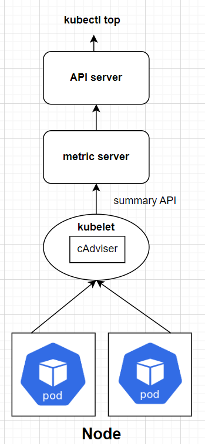

### 今日目標

---
* 了解 Pod 的生命週期
  * 設定 initContainer、Lifecycle hooks、Restart Policy、Probe

* Monitoring
  * 安裝 metrics-server
  * 使用 metrics-server 查詢 Node 與 Pod 的資源使用情況
***

今天我們進入本次鐵人賽的最後一個章節：【Troubleshooting & Monitoring】，不過在講 Troubleshooting 之前，我們先來談談「Monitoring」，也就是**監控**。因為只有透過有效的**監控**，我們才能即時的了解 Pod 的狀況，然後再運用 Troubleshooting 的技巧來解決問題。

那麼今天我們先從「Pod 的生命週期」開始談起。

## Pod 的生命周期

Pod 的生命週期被分為以下幾個「階段( **Phase** )」，這些階段皆有明確的數量與定義：

> Phase 可以在 `kubectl get pod` 指令中的 **STATUS** 欄位看到

| Phase | 意義 |
| --- | --- |
| Pending | Pod 已被提交給 k8s，正在等待調度或下載映像檔 |
| Running | Pod 已經被調度到 Node 上，且所有容器皆已建立，並至少有一個容器正在執行中 |
| Succeeded | Pod 中所有容器皆已成功執行並終止，且不再重啟 |
| Failed | Pod 中所有容器皆已終止，且至少有一個容器因為錯誤而終止 |
| Unknown | 可能因為與 kubelet 通訊失敗，導致無法取得 Pod 的狀態 |

不難發現 Pod Phase 的變化很多都取決於「Pod 中的容器狀態」，關於容器的狀態也有明確的定義：

> Container State 可以在 `kubectl describe pod` 指令中，於 Containers 欄位底下的 **State** 看到：

| Container State | 意義 |
| --- | --- |
| Waiting | 容器還沒準備好開始執行，例如正在 pull image |
| Running | 容器已經準備好並在執行中 |
| Terminated | 容器因為某些原因而中止，原因可能是正常結束或錯誤所致 |

在 Pod 與容器的不同狀態中，我們能安插一些特定的操作或檢查，常見的有：initContainer、Lifecycle hooks、restart policy、Probe 等等，底下分別來看看這些設定該如何使用。

### initContainer

在 Pod 中「最先開始」執行的容器，如果 initContainers 還沒執行完，其餘的 containers 就不會啟動。通常應用在主容器啟動前的初始化工作。

> 關於 initContainer 的使用方式在 [Day 04](https://ithelp.ithome.com.tw/articles/10345796) 已經介紹過了，有需要可以往前翻翻看。

### Lifecycle hooks

有兩種 lifecycle hooks 可以使用：

* **PostStart**：在 initContainer 執行之後，PostStart hook 會在「主容器開始建立時」同時啟動。通常進行一些簡單的前置作業。

* **PreStop**：在容器進入 Terminating (「正在」終止，還沒完全終止) 狀態時，PreStop hook 可用來進行一些善後工作，例如關閉連線、確認資料寫入等等。

> lifecycle hooks 於 Pod yaml 中的 `spec.containers[].lifecycle` 欄位設定，底下為一個簡單的範例：

```yaml
apiVersion: v1
kind: Pod
metadata:
  name: lifecycle-demo
spec:
  containers:
  - name: lifecycle-demo-container
    image: nginx
    lifecycle:
      postStart:
        exec:
          command: ["/bin/sh", "-c", "echo Hello from the postStart handler > /usr/share/message"]
      preStop:
        exec:
          command: ["/bin/sh","-c","nginx -s quit; while killall -0 nginx; do sleep 1; done"]
```
> [範例來源](https://kubernetes.io/docs/tasks/configure-pod-container/attach-handler-lifecycle-event/)

### Restart Policy

用來處理 Pod 終止後的該如何重啟，有三種選項：

* **Always**：只要 Pod 終止就會重啟。(預設值)
* **OnFailure**：只有在容器因為錯誤而終止時才會重啟。
* **Never**：永遠不會重啟。

Restart Policy 可以在 Pod yaml 中的 `spec.restartPolicy` 欄位設定，例如：

```yaml
apiVersion: v1
kind: Pod
metadata:
  name: test
spec:
  containers:
  - image: busybox
    name: test
    command: ["sh", "-c", "echo 'Hello Kubernetes!'"]
  restartPolicy: Never
```

### Probe

Probe 就像是容器的「健康檢查」，可以用來確認容器是否正常運作。

「健康檢查」總共有三種類型：

* **livenessProbe**：檢查容器是否「正在執行」。如果檢查失敗則容器會被殺掉，並根據 Restart Policy 來決定是否重啟。

* **readinessProbe**：檢查容器是否已經「READY」，也就是準備好「回應 request」。如果檢查失敗，則會將 Pod 的 IP 從 Service 的 Endpoints 移除。

* **startupProbe**：檢查「容器內的應用是否啟動」。如果檢查失敗，則容器會被殺掉，並根據 Restart Policy 來決定是否重啟。另外，如果 Pod 有設定 startupProbe，則其他的 Probe 會等到 startupProbe 檢查**成功後**才會開始執行。

> 三種 Probe 皆可以自由挑選要不要設定，如果沒有設定 Probe 則預設「檢康檢查」通過。

而 Probe 則有四種「檢查方式」：

* **exec**：執行一個命令，如果命令回傳 0 則檢查成功。
* **grpc**：對特定 port 發送 gRPC request，如果回傳成功則檢查成功。
* **httpGet**：對容器 IP 上的特定 port 與路徑發送 HTTP request，若「狀態碼為 200 ~ 399」則檢查成功。
* **tcpSocket**：對容器 IP 上的特定 port 進行 TCP 連線，若連線成功則檢查成功。

以下為一個簡單的範例：

---
> 建立兩個 Pod，與兩個 Service：

* **crucial**：一個 nginx 容器，設定 livenessProbe，使用「tcpSocket」檢查 80 port 是否有回應。

* **crucial-svc**：crucial Pod 的 Service。

* **waiter**：設定 readinessProbe，使用「exec」檢查 `crucial-svc` 是否有回應。

* **waiter-svc**：waiter Pod 的 Service。

***

首先，建立 crucial-svc (沒錯，單純先建立 Service)：

```yaml
# crucial-svc.yaml
apiVersion: v1
kind: Service
metadata:
  name: crucial-svc
spec:
  selector:
    app: crucial
  ports:
  - protocol: TCP
    port: 80
    targetPort: 80        
```
```bash
kubectl apply -f crucial-svc.yaml
```

然後建立 waiter 與 waiter-svc：

```yaml
# waiter.yaml
apiVersion: v1
kind: Pod
metadata:
  labels:
    run: waiter
  name: waiter
spec:
  containers:
  - image: nginx:1.16.1-alpine
    name: waiter
    ports:
    - containerPort: 80
    readinessProbe:
      exec:
        command:
        - sh
        - -c
        - 'wget -T2 -O- http://crucial-svc:80'
---
apiVersion: v1
kind: Service
metadata:
  name: waiter-svc
spec:
  selector:
    run: waiter
  ports:
  - protocol: TCP
    port: 80
    targetPort: 80
```
```bash
kubectl apply -f waiter.yaml
```

因為還沒有建立 crucial Pod，導致 crucial-svc 沒有任何 endpoint，所以 waiter 的 readinessProbe 會一直失敗。可以看到 waiter 雖然已經 running 了，但不會進入 ready：

```bash
kubectl get pod waiter
```
```text
NAME     READY   STATUS    RESTARTS   AGE
waiter   0/1     Running   0          6s
```
> READY 欄位為 0/1，表示 Pod 還沒 ready，無法接收 request。

也因為 waiter 沒有 ready，所以 waiter-svc 的 endpoint 也會是空的：

```bash
kubectl get ep waiter-svc
```
```text
NAME         ENDPOINTS   AGE
waiter-svc               67s
```

現在我們把 crucial Pod 建起來：

```yaml
# crucial.yaml
apiVersion: v1
kind: Pod
metadata:
  name: crucial
  labels:
    app: crucial
spec:
  containers:
  - name: crucial
    image: nginx
    ports:
    - containerPort: 80
    livenessProbe:
      tcpSocket:
        port: 80
```
```bash
kubectl apply -f crucial.yaml
```

透過 `kubectl get po` 可以發現，crucial 通過了 livenessProbe，所以 Pod 的狀態是 Running。另外，因為 crucial-svc 有了 endpoint，所以 waiter 的 readinessProbe 也通過了，讓 waiter 進入了 ready 狀態：

```bash
kubectl get po 
``` 
```text
NAME      READY   STATUS    RESTARTS   AGE
crucial   1/1     Running   0          16s
waiter    1/1     Running   0          2m12s
```

因為 waiter 已經 ready，代表 waiter 已經可以接收 request，所以 waiter-svc 終於抓到了 endpoint：

```bash
kubectl get ep waiter-svc
``` 
```text
NAME         ENDPOINTS        AGE
waiter-svc   192.168.1.4:80   4m51s
```

看完各種關於容器狀態的檢查與設定後，就像走過了一個 Pod 的生命週期，接下來我們來看看究竟 Pod 是如何被終止的。

### Termination of Pod

我們用 `kubectl delete pod` 來說明 Pod 的終止過程：

1. 我們使用指令來刪除 Pod，預設會給予 Pod 30 秒的時間來善後，這個 30 秒就是所謂的「**Grace Period**」。

> 因此強制刪除 Pod 時，可以使用 `kubectl delete pod --grace-period=0 --force` 來立即終止。

2. 這時 Pod 會進入「Terminating」狀態， kubelet 則會開始執行 PreStop hook，Endpoints controller 也會將 Pod 從 Service 的 Endpoints 移除。

3. 當 PreStop hook 執行完畢，kubelet 會向容器發送 TERM 信號。

4. Grace Period 結束後，如果還有容器沒有結束，kubelet 會向容器發送 KILL 信號。

5. kubelet 將 Pod 的狀態設定為「Terminated」，視終止原因將 Pod Phase 設定為「Succeeded」或「Failed」。

6. kube-api-server 將 Pod 刪除，我們就無法用指令看到 Pod 了。

到這裡，關於 Pod 的生命週期就告一段落了。這裡用一張圖來總結一下：


> 圖片來源：[Red Hat Blog：Kubernetes: A Pod's Life](https://www.redhat.com/en/blog/kubernetes-pods-life)

## Monitoring

了解了 Pod 的生命週期後，我們來談談「Monitoring」，也就是監控。

監控的有效程度，取決於管理者對於整體 cluster 資訊的掌握，基本的 monitoring 可以用「資源使用情況」來做簡單的衡量，例如：

  * Node 的數量
  * Pod 的數量
  * CPU、Memory 使用情況


目前有許多第三方的監控工具，例如 Prometheus、Grafana、metrics-server 等，這些工具能夠幫助管理者監控 cluster 的狀態。底下我們將以 matirc server 為例。

> Prometheus 與 Grafana 皆為相當主流的監控工具，但礙於篇幅就不在這裡介紹了，不過還是建議有空可以去接觸一下，可參考[這篇文章](https://blog.amis.com/kubernetes-operators-prometheus-3584edd72275)

### Metrics-server 的運作原理

在 [Day 02](https://ithelp.ithome.com.tw/articles/10345505) 中，提到每個 Node 上都有一個 kubelet，扮演「船長」的角色。而 kubelet 底下還有一個子元件: cAdvisor。

cAdvisor 是一個 container 的監控工具，監控著 container 的資源使用情況，例如 CPU、Memory、網路等。

當我們在 Node 上部署 metrics-server 後，cAdvisor 會以 summary API 的形式將蒐集到的資訊傳送給 metrics-server，metrics-server 再將資訊儲存在 **memory** 中供使用者透過 API 來查詢，
metrics-server 運作原理圖示如下：



### 部署 metrics-server

* 下載從官方[github](https://github.com/kubernetes-sigs/metrics-server)上找到的 yaml 檔：

```bash
wget https://github.com/kubernetes-sigs/metrics-server/releases/latest/download/components.yaml
```

* 修改 components.yaml 檔案，加入 `--kubelet-insecure-tls`：

```yaml
# 位於 metrics-server deployment 底下
......
    spec:
      containers:
      - args:
        - --cert-dir=/tmp
        - --secure-port=10250
        - --kubelet-preferred-address-types=InternalIP,ExternalIP,Hostname
        - --kubelet-use-node-status-port
        - --metric-resolution=15s
        - --kubelet-insecure-tls # 加入這行
......
```

* 部署 metrics-server：

```bash
kubectl apply -f components.yaml
```

* 確認 metrics-server 是否正常運作，可能需要等待一段時間：

```bash
kubectl get deploy -n kube-system metrics-server 
```
```
NAME             READY   UP-TO-DATE   AVAILABLE   AGE
metrics-server   1/1     1            1           6m19s
```
> **CKA Tips**：考試時不用擔心會考怎麼安裝，只需掌握如何使用相關指令操作 metrics-server 即可。

### 使用 Metrics-server 

部署後，基礎的 monitoring 方式如下：

* 查詢 Node 的資源使用情況：
```bash
kubectl top node
```
```text
NAME           CPU(cores)   CPU%   MEMORY(bytes)   MEMORY%   
controlplane   110m         11%    1235Mi          65%       
node01         38m          3%     830Mi           44%
```

* 指定要查詢的 Node：
```bash
kubectl top node node01
```
```text
NAME     CPU(cores)   CPU%   MEMORY(bytes)   MEMORY%   
node01   35m          3%     829Mi           44% 
```

* 查詢 Pod 的資源使用情況：
```bash
kubectl top pod -n kube-system
```
```text
NAME                                      CPU(cores)   MEMORY(bytes)   
calico-kube-controllers-9d57d8f49-b9jhf   2m           24Mi            
canal-8654b                               12m          84Mi            
canal-jc5bj                               13m          115Mi           
......(省略)
```

* 指定要查詢的 Pod：
```bash
kubectl top pod -n kube-system kube-apiserver-controlplane
```
```text
NAME                          CPU(cores)   MEMORY(bytes)   
kube-apiserver-controlplane   36m          239Mi
```

* 依照 CPU 或 Memory 使用量進行排序 (由高到低)
```bash
kubectl top pod -n kube-system --sort-by=cpu
```
```bash
kubectl top pod -n kube-system --sort-by=memory
```

> 由於 metrics-server 是將資訊儲存在**memory**中，所以 Node 重啟後資料就會消失。
> 另外，metrics-server 提供的是「觀察資源使用情況」，如果是「資源管理」的部分，可以參考 [Day 19](https://ithelp.ithome.com.tw/articles/10348214)

### 今日小結

今天從 Pod 的生命週期出發，先了解 Pod 的階段與容器狀態，再來看如何設定 initContainer、Lifecycle hooks、Restart Policy、Probe 等等，最後介紹了 Pod 的終止過程。

了解 Pod 的生命週期後，我們介紹了相當基礎的 Monitoring 方式，也就是透過 metrics-server 來查詢 Node 與 Pod 的資源使用情況。

明天將進入最後一篇文章，會來介紹一些 Troubleshooting 的小技巧。

---

**參考資料**：

* [Pod Lifecycle](https://kubernetes.io/docs/concepts/workloads/pods/pod-lifecycle/#pod-termination)

* [Container Lifecycle Hooks](https://kubernetes.io/docs/concepts/containers/container-lifecycle-hooks/)

* [Configure Liveness, Readiness and Startup Probes](https://kubernetes.io/docs/tasks/configure-pod-container/configure-liveness-readiness-startup-probes/)

* [An Introductory Guide to Managing the Kubernetes Pods Lifecycle](https://www.loft.sh/blog/an-introductory-guide-to-managing-the-kubernetes-pods-lifecycle)

* [Kubernetes核心指标监控——Metrics Server](https://www.cnblogs.com/zhangmingcheng/p/15770672.html)

* [metrics-server: GitHub](https://github.com/kubernetes-sigs/metrics-server)
