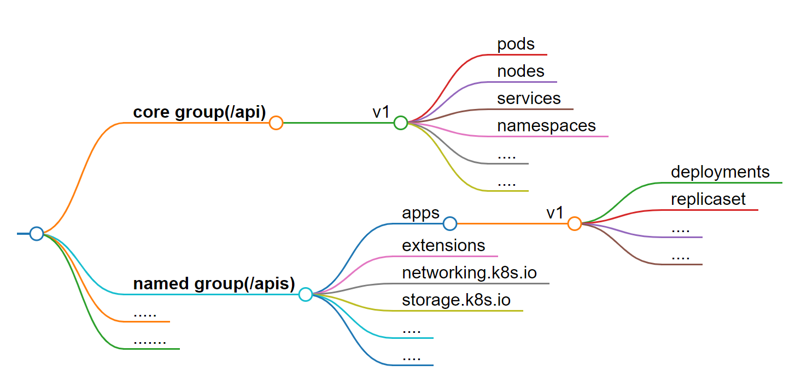

# RBAC 

前面介紹的`crt`、`key`和`kubeconfig`規定了「誰可以**進到**`cluster`」，例如我們幫Bob簽署了一張`crt`，讓他可以進入到`cluster`。這就是所謂的`Authentication`(認證)。

不過，為了不讓Bob亂來，我們透過**RBAC**的設定讓Bob只能操作`default namespace`的`pod`，而`RBAC`就是`k8s`中的`Authorization`(授權)機制。

在`k8s`中，`Authorization`的常見模式有以下幾種:

 * **Node**: 對`kubelet`能進行的API操作進行控制。

 * **ABAC**: Attribute-based access control (ABAC)。在一份`policy`檔中，針對不同使用者(或群組)「個別」設定權限。

 * **RBAC**: Role-based access control (RBAC)。先設定好「`role`物件」的權限，再將使用者(或群組)與這個「`role`物件」綁定起來。

 * **Webhook**: 使用第三方的授權機制，透過HTTP POST的方式來進行授權。

 > 關於授權的更多細節，可以參考[官方文件](https://kubernetes.io/docs/reference/access-authn-authz/authorization/#authorization-modules)。

與`ABAC`相比，`RBAC`更加的方便與靈活，舉例來說:

 * 有三個使用者，都只能對`pod`進行操作:

   * `ABAC`: 需要再`policy`檔中設寫**3**條規則，一人一條。
   * `RBAC`: 需要**1**個「只能操作`pod`」的`role`物件，再將三個使用者綁定到這個`role`物件上即可

> 如果後續須變更規則時，`RBAC`這種規則數量上的優勢就會更加明顯。

要查看目前`cluster`的授權模式，可以使用以下指令:
```bash
$ kubectl -n kube-system describe po kube-apiserver-controlplane | grep auth
      --authorization-mode=Node,RBAC
      --enable-bootstrap-token-auth=true
```
> 如果要修改就到/etc/kubernetes/manifests/kube-apiserver.yaml中修改`--authorization-mode`的參數即可


那今天的主題就是`RBAC`，不過在此之前，我們得先了解`k8s`中的`API group`。

## API Group

其實這個概念在我們建立`pod`與`deployment`時就已經碰過了。如果看`yaml`檔的話，會發現`pod`的`apiVersion`是`v1`，而`deployment`的`apiVersion`是`apps/v1`。

在`k8s`中，所有物件都有屬於自己的`API group`，而這樣的分類讓`k8s`的`API`更加容易管理或擴充。

這裡介紹兩種常見的`API group`:

* **core group**: `cluster`中的核心物件，例如`pod`、`service`、`namespace`等等。
* **named group**: `cluster`中的擴充物件，例如`deployment`、`replicasete`等等。

以下是兩者的比較關係:

API group | RESTful API路徑 | yaml檔的apiVersion
--- | --- | ---
core group(/api) | /api/v1 | v1
named group(/apis) | /apis/$GROUP_NAME/$VERSION | $GROUP_NAME/$VERSION

例如:
  * `pod`屬於**core group**，所以RESTful API路徑是「/api/v1」，而yaml檔中的`apiVersion`是「v1」。

  * `deployment`屬於**named group**中的「apps群組」，所以RESTful API路徑是「/apis/apps/v1」，而yaml檔中的`apiVersion`是「apps/v1」。

`k8s`的`API group`架構如下圖:


> 詳細的`API group`列表，可以參考[官方文件](https://kubernetes.io/docs/reference/generated/kubernetes-api/v1.29/#api-overview)

我們可以用以下方法找到所有物件的`API group`:

```bash
kubectl api-resources
# 在輸出結果的APIVERSION欄位
```

如果要找到特定物件的`API group`，可以用以下方法:
```bash
kubectl api-resources | grep <object-name>
```

例如:
```bash
$ kubectl api-resources | grep deployments
deployments                       deploy       apps/v1                           true         Deployment
```
> apiVersion是「apps/v1」，所以`deployment`屬於`apps`群組。

而每個物件都有相對應的`verbs`，常見的有:
  * **get**: 取得物件的資訊
  * **list**: 取得物件清單
  * **create**: 建立物件
  * **delete**: 刪除物件
  * **update**: 更新物件

每個物件對應的`verbs`或多或少會有些差異，可以透過以下方法查看特定物件的`verbs`:
```bash
kubectl api-resources -o wide | grep <object-name>
```

## RBAC: role & rolebinding

設定`RBAC`的步驟如下:

### Step 1: 建立`role`物件

我們來看一個`role`物件的yaml範例:
```yaml
apiVersion: rbac.authorization.k8s.io/v1
kind: Role
metadata:
  namespace: default # 底下的設定在default namespace生效
  name: pod-reader
rules:
- apiGroups: [""] # 甚麼都沒有，代表是core group
  resources: ["pods"]
  verbs: ["get", "watch", "list"]
```

> 這個`role`物件的名稱是`pod-reader`，只能對`pods`進行`get`、`watch`、`list`的操作。

我們可以用指令建立一個一模一樣的`role`物件:
```bash
kubectl create role pod-reader --verb=get,watch,list --resource=pods
```

> 不過使用`kubectl create`就只能設定一個`rule`，如果設定多個`rule`可以先使用「--dry-run=client -o yaml」將`yaml`檔輸出，再進行編輯。

`role`的其他常用設定整理如下:

* 如果要在同一個`apiGroup`底下指定多個`resource`，可以用逗號分隔:
```yaml
apiVersion: rbac.authorization.k8s.io/v1
kind: Role
metadata:
  namespace: default
  name: reader
rules:
- apiGroups: [""]
  resources: ["pods", "configmaps"]
  verbs: ["get", "watch", "list"]
```

* 可以善用「*」來指定「所有」，例如:
```yaml
rules:
- apiGroups: [""]
  resources: ["*"]
  verbs: ["get", "watch", "list"]
```

> 可以對`core gruop`中的所有`resource`進行`get`、`watch`、`list`的操作。

* 還可以指定要哪個特定的物件名稱，例如:
```yaml
rules:
- apiGroups: [""]
  resources: ["pods"]
  resourceNames: ["nginx"]
  verbs: ["get", "watch", "list"]
``` 

> 只能對`nginx`這個`pod`進行`get`、`watch`、`list`的操作，而非該`namespace`中的所有`pod`。


設定好`role`的權限後，建立之後來查看一下:
```bash
$ kubectl apply -f reader.yaml
$ kubectl describe role reader
Name:         reader
Labels:       <none>
Annotations:  <none>
PolicyRule:
  Resources   Non-Resource URLs  Resource Names  Verbs
  ---------   -----------------  --------------  -----
  configmaps  []                 []              [get watch list]
  pods        []                 []              [get watch list]
```

**補充**: yaml中的「apiGroups」欄位設定

如果我們使用`kubectl api-resources`查看`deployment`的`apiGroup`:
```bash
$ kubectl api-resources | grep deployments
deployments                       deploy       apps/v1                           true         Deployment
```

會發現是`apps/v1`，這是「ApiVersion」的寫法，格式為「$GROUP_NAME/$VERSION」。

> 所以在`yaml`中的`apiGroups`欄位只需填入`$GROUP_NAME`即可:
```yaml
rules:
- apiGroups: ["apps"]
  resources: ["deployments"]
  verbs: ["get", "watch", "list"]
```

### Step 2: 建立`rolebinding`

建立好`role`物件後，我們需要將使用者(或群組)綁定到這個`role`物件上，這個動作稱為`role-binding`。

例如我們剛創建了一個`role`物件叫`pod-reader`，現在我們要將使用者`jane`綁定到這個`role`物件上:

```yaml
apiVersion: rbac.authorization.k8s.io/v1
kind: RoleBinding
metadata:
  name: read-pods
  namespace: default
subjects:
- kind: User
  name: jane # user的名稱
  apiGroup: rbac.authorization.k8s.io
roleRef:
  kind: Role
  name: pod-reader # 剛剛創建的role物件
  apiGroup: rbac.authorization.k8s.io

```

> 這樣一來，jane就能在`default namespace`中對`pods`進行`get`、`watch`、`list`的操作。

我們同樣能用指令來建立`rolebinding`:
```bash
kubectl create rolebinding read-pods --role=pod-reader --user=jane
```

如果要一次綁定多個使用者，可以在`subjects`底下加入多個`kind: User`:
```yaml
subjects:
- kind: User
  name: jane 
  apiGroup: rbac.authorization.k8s.io
- kind: User
  name: bob
  apiGroup: rbac.authorization.k8s.io
```

用指令綁定多個使用者:
```bash
kubectl create rolebinding read-pods --role=pod-reader --user=jane --user=bob
```

**提醒**

當沒有設定`crt`、`key`與`kubeconfig`時，RBAC仍然能設定成功。(不過沒有甚麼實質作用就是了)

### RBAC: ClusterRole & ClusterRoleBinding

在上面建立的`role`與`rolebinding`的yaml中都需要指定`namespace`，代表只能在特定的`namespace`中生效，例如上面的例子中，jane只能在`default namespace`中對`pods`進行`get`、`watch`、`list`的操作。

假如今天我要讓jane在整個`cluster`都能對`pods`進行相同的操作，難到需要到每個`namespace`中都建立一次`role`與`rolebinding`?

另外，有些物件不能用`namespace`來區分，例如`namespace`本身、`node`、`storageclass`等等，這些物件的`role`與`rolebinding`又該如何設定?

> 補充: 哪些物件屬於(or 不屬於)`namespace`範圍可以用以下指令查看:
```bash
kubectl api-resources --namespaced=true
```
or
```bash
kubectl api-resources --namespaced=false
```

這時候就可以用`ClusterRole`與`ClusterRoleBinding`來設定。兩者的概念與`role`與`rolebinding`是一樣的，只是作用的範圍涵蓋了整個`cluster`。

我們直接拿上面的`pod-reader`來修改一下:
```yaml
apiVersion: rbac.authorization.k8s.io/v1
kind: ClusterRole # role --> ClusterRole
metadata: # 把namespace拿掉，代表整個cluster都生效
  name: pod-reader
rules:
- apiGroups: [""] 
  resources: ["pods"]
  verbs: ["get", "watch", "list"]
```

建立之後一樣與使用者綁定:
```yaml
apiVersion: rbac.authorization.k8s.io/v1
kind: ClusterRoleBinding # rolebinding --> ClusterRoleBinding
metadata: # 同樣沒有namespace
  name: read-pods
subjects:
- kind: User
  name: jane # user的名稱
  apiGroup: rbac.authorization.k8s.io
roleRef:
  kind: ClusterRole # role --> ClusterRole
  name: pod-reader 
  apiGroup: rbac.authorization.k8s.io
```

同樣也可以用指令來建立:
```bash
kubectl create clusterrole pod-reader --verb=get,watch,list --resource=pods
kubectl create clusterrolebinding read-pods --clusterrole=pod-reader --user=jane
```

## 補充: 檢查權限

以上就是`RBAC`的基本設定，但隨著規則增加，我們不可能記得每個使用者的權限設定，這時可以這樣檢查:

* 查自己的權限:
```bash
kubectl auth can-i <verb> <resource>
```

例如:
```bash
$ kubectl auth can-i get pods
yes
```

* 查特定使用者的權限:
```bash
kubectl auth can-i <verb> <resource> --as <user>
```

例如:
```bash
$ kubectl auth can-i get pods --as jane
yes
```

> 以上只會檢查`RBAC`設定的權限，不會檢查你是否將`crt`、`key`與`kubeconfig`設定好。