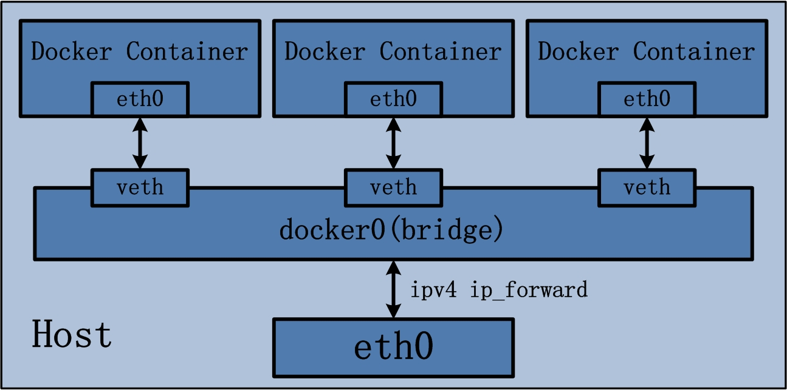
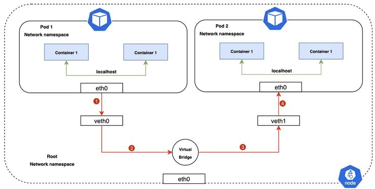
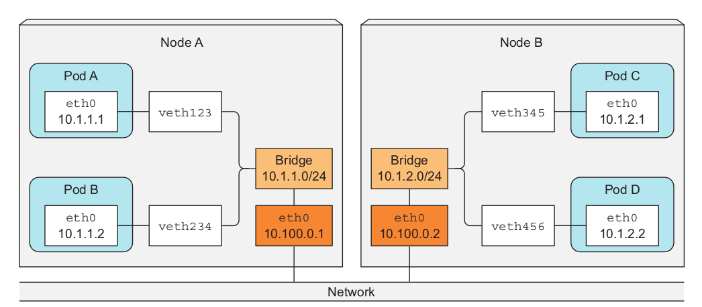

# 容器網路原理

## Linux network namespace

在 Linux 中，namespace 可以做到資源區隔，機制是：

> 讓 process 只能看到系統中的部份資源

而 namespace 的種類有：

| Namespace | Description |
| --------- | ----------- |
| Cgroup | Cgroup root directory |
| IPC | System V IPC, POSIX message queues |
| Network | Network devices, stacks, ports, etc. |
| Mount | Mount points |
| PID | Process IDs |
| User | User and group IDs |
| UTS | Hostname and NIS domain name |

其中的「Network namespace」可以讓我們能在一台 Linux 中建立多個「獨立」的網路環境，每個網路環境都有自己的網路設定、網路設備、路由表等等：

```plaintext
+---------------------------------------------------------------------------------------+
|                                       Linux Host                                      |
|                                                                                       |
|  +--------------------------------------+   +--------------------------------------+  |
|  |  network namespace1                  |   |  network namespace1                  |  |
|  | +---------------+  +---------------+ |   | +---------------+  +---------------+ |  |
|  | |network devices|  |  route table  | |   | |network devices|  |  route table  | |  |
|  | +---------------+  +---------------+ |   | +---------------+  +---------------+ |  |
|  | +---------------+  +---------------+ |   | +---------------+  +---------------+ |  |
|  | |    iptables   |  |protocol stack | |   | |    iptables   |  |protocol stack | |  |
|  | +---------------+  +---------------+ |   | +---------------+  +---------------+ |  |
|  +--------------------------------------+   +--------------------------------------+  |
|                                                                                       |
|                       +--------------------------------------+                        |
|                       |        default network namespace     |                        |
|                       | +---------------+  +---------------+ |                        |
|                       | |network devices|  |  route table  | |                        |
|                       | +---------------+  +---------------+ |                        |
|                       | +---------------+  +---------------+ |                        |
|                       | |    iptables   |  |protocol stack | |                        |
|                       | +---------------+  +---------------+ |                        |
|                       +--------------------------------------+                        |
|                                                                                       |
+---------------------------------------------------------------------------------------+
```

有關 network namespace 的操作都可以透過 `ip netns` 這個指令來完成：

```bash
man ip netns 
```

## Veth pair

兩台電腦要能用網路互連，必須要有網卡。而虛擬出來的 network namespace 要互連也需要網卡，只不過是虛擬的，也就是「virtual ethernet pair」，簡稱 veth pair。

> veth 不同於傳統的網路虛擬介面(tap/tun)，通常都是成對出現

## Bridge

簡單來說，你可以將 Bridge 理解為 switch，因為兩者都是透過 MAC 位址來轉送封包(Layer 2)。

從網路歷史的演進來講，switch 是從 bridge 演進而來的，現在 bridge 的使用場景多用於虛擬化環境中，用**軟體模擬**出的「bridge interface」，例如 VM、容器的通訊。



## Overlay network

用於跨主機互聯


## K8s network

Pod to Pod：



node to node:

